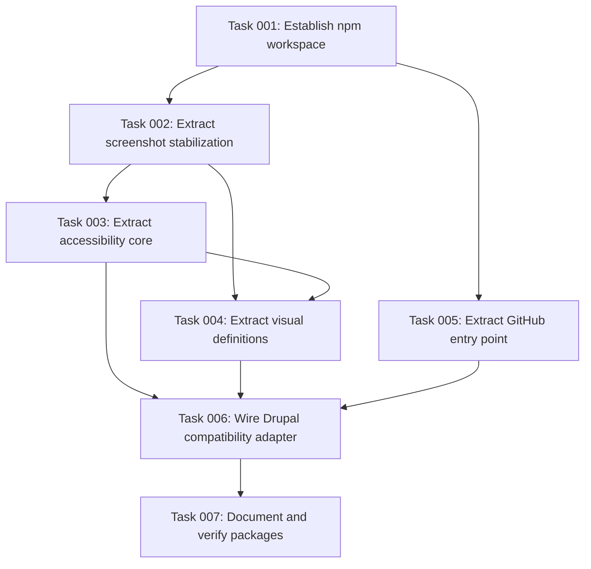

# Plan: Split Generic Playwright Testing Package

## Original Work Order

> Implement splitting into a separate package based on the following - let's do the monorepo as suggested.
>
> The supplied findings identify accessibility scans and baselines, highlighted violation screenshots, screenshot stabilization, URL-driven visual tests, and GitHub summaries and attachment handling as framework-independent capabilities. They recommend a generic `@lullabot/playwright-testing` package, an optional GitHub reporting surface, and a Drupal adapter that preserves existing imports while applying Drupal-specific behavior. Drupal-only Drush, database, login, form/AJAX, entity, managed-file, Gin, module, media-library, status-report, DDEV, and isolation helpers are to remain in `@lullabot/playwright-drupal`. The recommendation also calls for generic canonical documentation and Drupal-focused adapter documentation.
>
> Clarification: "Let's do it as a second entry point - no one is going to use the github bits on their own for now."

## Plan Clarifications

| Question | Answer |
| --- | --- |
| Is backward compatibility required? | Yes. The supplied work order requires `@lullabot/playwright-drupal` to depend on and initially re-export the generic APIs so existing imports continue to work. |
| Should GitHub reporting be its own npm package or part of the generic package? | Keep it in `@lullabot/playwright-testing` as a secondary entry point because it has no expected standalone consumers yet. |

## Executive Summary

This plan converts the repository into an npm workspace monorepo while retaining the existing repository-root package as `@lullabot/playwright-drupal`. A new `packages/playwright-testing` workspace will own the framework-independent Playwright capabilities: accessibility checks and waiver baselines, highlighted accessibility screenshots, deterministic screenshot preparation, URL-driven visual comparison definitions and mocks, and GitHub report/attachment processing exposed through a secondary `./github` entry point.

The Drupal package will become an adapter over that generic implementation. It will preserve the current public imports and command names while applying a Drupal preset for exclusions, toolbar settling, Drupal selector normalization, legacy naming, and other Drupal-specific defaults. Drupal operational helpers remain in the root package. This layout minimizes disruptive file movement, permits independent npm publication, keeps package boundaries enforceable through TypeScript builds and package manifests, and lets both packages evolve in one repository.

Canonical documentation for extracted behavior will move alongside the generic workspace. The Drupal documentation will retain Drupal-specific workflow material, explain the preset and compatibility surface, and link to the generic reference instead of maintaining duplicate descriptions.

## Context

### Current State vs Target State

| Current State | Target State | Why? |
| --- | --- | --- |
| Generic Playwright and Drupal integration code ship from one root package. | Generic behavior ships from `@lullabot/playwright-testing`; Drupal behavior remains in `@lullabot/playwright-drupal`. | Non-Drupal projects are already copying useful code and need a clean dependency. |
| Screenshot and accessibility helpers include Drupal selectors, toolbar delays, project names, internal symbols, and messages. | Generic helpers have neutral defaults; a Drupal preset or adapter restores current Drupal behavior. | Framework-independent consumers must not inherit Drupal assumptions. |
| GitHub helpers are exported from several Drupal-branded subpaths and commands. | Generic GitHub behavior is available through the generic package's `./github` entry point while the Drupal package preserves legacy subpaths and commands. | A secondary entry point keeps optional CI code discoverable without creating an unnecessary third package. |
| The repository is a single npm package. | The root manifest manages npm workspaces and both packages can build, test, pack, version, and publish independently. | This gives a real package boundary while allowing coordinated development. |
| Accessibility, visual-comparison, and CI screenshot documentation is Drupal-owned and partly Drupal-specific. | Generic documentation is canonical inside the new workspace; Drupal guides contain adapter-specific material and links. | Documentation ownership should follow implementation ownership and avoid drift. |
| All public generic APIs are implemented directly by the Drupal package. | The Drupal package depends on and re-exports or wraps generic APIs without breaking existing import paths. | Existing consumers need a migration path with no immediate source changes. |

### Background

The existing implementation combines axe-based scans, accepted-finding baselines with required reasons and tracking links, stale-waiver detection, Playwright annotations and attachments, highlighted screenshots, and strict CI baseline behavior. Its screenshot pipeline also waits for fonts, images, lazy frames, and deterministic video frames; clears incidental hover and focus; and restores video playback. These features are useful beyond Drupal and have no complete equivalent in the reviewed ecosystem.

Drupal coupling is concentrated in default accessibility exclusions, toolbar settling, selector normalization, browser-project naming, internal browser state names, and CI branding. Those concerns can be isolated behind the Drupal adapter. Drush, database isolation, Drupal login, forms and AJAX, entities, managed files, Gin, modules, media library, status reports, and related integration remain outside the generic package boundary.

## Architectural Approach

```mermaid
flowchart TD
  R[Repository npm workspace] --> G[@lullabot/playwright-testing]
  R --> D[@lullabot/playwright-drupal]
  G --> C[Core accessibility and visual APIs]
  G --> H[./github entry point]
  D --> P[Drupal preset and compatibility wrappers]
  D --> U[Drupal-only utilities]
  P --> C
  P --> H
```

### Workspace and Package Boundary

**Objective**: Establish a separately buildable and publishable generic package without moving the existing Drupal package away from the repository root.

The root npm manifest will declare the generic package workspace and coordinated build and test scripts. `packages/playwright-testing` will have its own manifest, TypeScript configuration, source tree, test configuration, package README, exports, files list, and release metadata. Runtime dependencies will be declared by the package that actually imports them. Release Please configuration and the release manifest will recognize both independently versioned packages.

The generic package will expose its ordinary APIs from the package root and aggregate CI reporting utilities under `@lullabot/playwright-testing/github`. Command-line reporting behavior may be owned by the generic package, while the Drupal package retains its existing executable names as compatibility shims.

### Generic Accessibility and Screenshot Core

**Objective**: Move the reusable accessibility and stable-screenshot implementation behind neutral public APIs.

The generic package will own axe scans, baseline definitions and files, known/new/stale violation classification, local baseline seeding and strict CI behavior, annotations, highlighted violation captures, image and lazy-frame loading, font readiness, deterministic video settling and restoration, hover clearing, focus blurring, interaction states, and forced pseudo-states.

Generic defaults and diagnostics will not mention Drupal, assume Drupal selectors, inspect Drupal toolbars, depend on a project named `desktop safari`, or use Drupal-branded browser state identifiers. The public options will provide only the configuration required to let an adapter add exclusions and page-settling behavior. State-changing image recovery remains explicit rather than an unavoidable generic default.

### Generic Visual Definitions and GitHub Entry Point

**Objective**: Give non-Drupal projects the complete reusable visual-test and reporting workflow through two coherent import surfaces.

URL-driven visual test definitions, masks, interaction and pseudo-state declarations, and framework-neutral mocks will use the generic screenshot core. The `./github` entry point will aggregate accessibility summaries, failure summaries, screenshot attachment discovery, and path remapping across host and container paths. Generic output, markers, and help text will use neutral package terminology.

The implementation will avoid importing any root-package or Drupal-only module from the generic workspace. Boundary checks through independent compilation, package packing, and consumer-style import probes will guard against accidental coupling.

### Drupal Preset and Compatibility Layer

**Objective**: Preserve existing Drupal consumers while making every Drupal-specific behavior explicit at the adapter boundary.

The root package will depend on `@lullabot/playwright-testing` and re-export the generic types and functions currently available from `@lullabot/playwright-drupal`. Where behavior historically included Drupal defaults, thin wrappers will invoke generic primitives with a Drupal preset. The preset will own default axe exclusions, Drupal toolbar settling, Drupal-compatible selector handling, and any legacy behavior that cannot be made generic without a breaking change.

Existing root imports, GitHub subpath imports, and Drupal-branded executable names will continue to resolve. Drupal-only modules and configuration stay in the root package. Compatibility tests will compare representative legacy calls with the preset-backed implementation and ensure the generic package remains neutral.

### Documentation and Release Integration

**Objective**: Align documentation and publishing workflows with the new ownership model.

Canonical accessibility, stable screenshot, visual definition, and GitHub reporting guidance will live with the generic package and use its package name and neutral examples. The existing Drupal guides will focus on installation through the Drupal adapter, Drupal-specific defaults and database fixtures, and migration or direct-import guidance, linking to generic reference material rather than duplicating it.

Repository README, contributor guidance, release configuration, and automation will describe the two-package workspace and commands. Generated package contents will include only the source, build output, commands, and documentation intended for each publication.

## Risk Considerations and Mitigation Strategies

<details>
<summary>Technical Risks</summary>

- **Hidden Drupal coupling in reusable helpers**: DOM selectors, timing workarounds, state keys, or messages may remain after files move.
    - **Mitigation**: Search the generic workspace for Drupal-specific identifiers and test generic defaults separately from the Drupal preset.
- **Circular or invalid package dependencies**: The generic workspace could accidentally import the root adapter or rely on root-only build paths.
    - **Mitigation**: Keep dependency direction strictly Drupal-to-generic and prove each package with an independent TypeScript build and packed-package import probe.
- **Public behavior drift**: Re-exporting moved functions may preserve types but lose Drupal defaults.
    - **Mitigation**: Use wrapper-level compatibility tests for behavior-bearing APIs and retain legacy exports, subpaths, and executables.
- **Screenshot nondeterminism during refactoring**: Moving settlement logic can change ordering or cleanup semantics.
    - **Mitigation**: Preserve integration-focused tests for image, frame, video, hover, focus, and accessibility orchestration, including playback restoration on failure paths.
</details>

<details>
<summary>Implementation Risks</summary>

- **Large mechanical move obscures semantic changes**: A broad relocation can make review difficult.
    - **Mitigation**: Keep the Drupal package at the root, add one workspace, and separate generic extraction from adapter wiring in the execution blueprint.
- **Documentation becomes duplicated or contradictory**: Parallel guides can drift immediately.
    - **Mitigation**: Assign canonical generic topics to workspace documentation and reduce Drupal pages to Drupal additions and explicit links.
- **Release automation publishes incomplete artifacts**: A workspace manifest or files list may omit compiled entry points or compatibility commands.
    - **Mitigation**: run `npm pack --dry-run` for each package and inspect exports and executable targets from temporary packed-package consumers.
</details>

## Success Criteria

### Primary Success Criteria

1. `@lullabot/playwright-testing` builds and tests independently and exposes generic root APIs plus a `./github` secondary entry point with no Drupal runtime dependency or Drupal-specific defaults.
2. `@lullabot/playwright-drupal` depends on the generic workspace and preserves its existing root exports, GitHub subpaths, executable names, and Drupal-specific behavior through a preset or compatibility wrappers.
3. Accessibility baselines, highlighted violation screenshots, screenshot stabilization, URL-driven visual definitions, mocks, GitHub summaries, attachment discovery, and container path remapping are owned by the generic workspace with meaningful integration coverage.
4. Drush, database isolation, login, form/AJAX, entity, managed-file, Gin, module, media-library, status-report, DDEV, and other Drupal integration remain in the Drupal package.
5. Root workspace scripts, package manifests, lockfile, TypeScript builds, test runners, and release configuration support both independently publishable packages.
6. Generic package documentation is canonical for extracted capabilities; Drupal documentation explains the adapter and Drupal additions without duplicating the generic reference.
7. Independent builds, the complete test suite, strict documentation build, package dry runs, and consumer-style import probes all complete successfully.

## Self Validation

1. Run the generic workspace build and tests directly, then inspect its generated declarations and JavaScript to confirm both the root and `./github` entry points resolve without reaching into the Drupal package.
2. Pack `@lullabot/playwright-testing` into a temporary directory, install the tarball with Playwright, and execute a Node import probe for representative accessibility, screenshot, visual-definition, and GitHub exports.
3. Pack `@lullabot/playwright-drupal` into a temporary directory with the generic tarball, install both, and execute import probes through the package root and each legacy GitHub subpath; invoke each legacy reporting executable with its help option.
4. Run focused integration tests that exercise neutral generic accessibility configuration and the Drupal preset, confirming Drupal exclusions and toolbar behavior appear only through the adapter.
5. Search all generic source, test, manifest, executable, and documentation files for Drupal package names, Drupal DOM selectors, Drupal-branded state keys, and Drupal-only project names; review any remaining matches as deliberate compatibility documentation or remove them.
6. Run the complete repository tests, TypeScript builds, strict MkDocs build, and both package dry runs, verifying all commands exit successfully and list the intended files.

## Documentation

- Add a generic package README and canonical guides for accessibility testing, screenshot stabilization and visual comparisons, and the GitHub reporting entry point.
- Update the repository README and contributor development/release guidance for npm workspaces and two independently published packages.
- Refocus Drupal accessibility, screenshots-in-CI, visual-comparison, and debugging guides on Drupal additions, legacy compatibility, and links to the generic documentation.
- Update navigation and examples so package names and import paths match their owning package.
- Document the Drupal preset, compatibility re-exports, and direct generic imports for consumers ready to decouple from Drupal.
- No `AGENTS.md` update is required because the repository's agent instructions and development conventions do not change; package-specific contributor commands belong in the human-facing development documentation.

## Resource Requirements

### Development Skills

- TypeScript package boundary and public API design
- npm workspaces, package exports, executable packaging, and Release Please configuration
- Playwright fixtures, screenshot behavior, and axe accessibility integration
- Vitest integration testing and package-consumer validation
- MkDocs and API migration documentation

### Technical Infrastructure

- Existing Node.js, npm, TypeScript, Vitest, Playwright, axe-core, Bats, and MkDocs toolchain
- Temporary local directories for packed-package consumer probes
- Existing repository CI and release configuration

## Integration Strategy

The root Drupal package remains the compatibility-facing installation during the initial split. Its dependency on the generic workspace makes the new implementation available without forcing current projects to change imports. Non-Drupal projects can install the generic package directly. Both packages use the same lockfile and coordinated repository checks, while release metadata allows their versions to advance independently.

## Notes

The GitHub functionality is intentionally a secondary entry point, not a third npm package. The package boundary should remain easy to split later if independent demand appears, but no additional abstraction or publication unit is part of this work.

## Execution Blueprint

**Validation Gates:**
- Reference: `/config/hooks/POST_PHASE.md`

### Dependency Diagram



### ✅ Phase 1: Workspace Foundation
**Parallel Tasks:**
- ✔️ Task 001: Establish the npm workspace and generic package shell

### ✅ Phase 2: Independent Generic Foundations
**Parallel Tasks:**
- ✔️ Task 002: Extract neutral screenshot stabilization (depends on: 001)
- ✔️ Task 005: Extract the GitHub reporting entry point (depends on: 001)

### ✅ Phase 3: Accessibility Core
**Parallel Tasks:**
- ✔️ Task 003: Extract the accessibility core and baselines (depends on: 002)

### ✅ Phase 4: Visual Definitions
**Parallel Tasks:**
- ✔️ Task 004: Extract visual test definitions and mocks (depends on: 002, 003)

### ✅ Phase 5: Drupal Integration
**Parallel Tasks:**
- ✔️ Task 006: Wire the Drupal preset and compatibility adapter (depends on: 003, 004, 005)

### Phase 6: Release Readiness
**Parallel Tasks:**
- Task 007: Document and verify both publishable packages (depends on: 006)

### Post-phase Actions

- Run each phase's configured verification and post-phase hook before unlocking dependent work.
- After Phase 6, run repository-wide execution validation, the independent code-review gate, and archival.

### Execution Summary
- Total Phases: 6
- Total Tasks: 7
