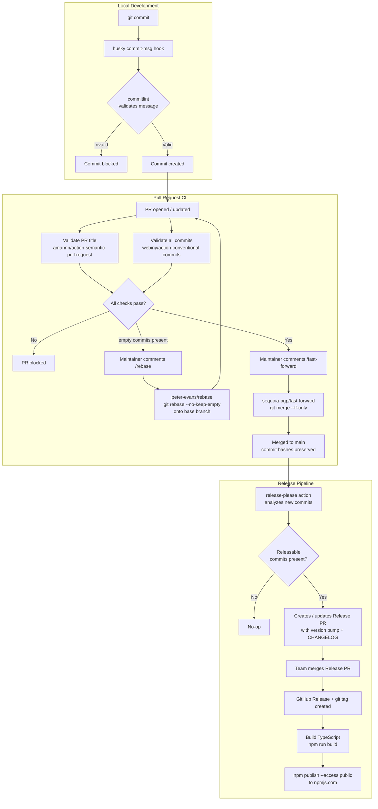

# Plan: Automated Release Pipeline with release-please and Conventional Commits

## Original Work Order

> I would like to use googleapis/release-please to deploy releases to npm. I would also like to require conventional commits and enforce them with github actions. You can use https://github.com/e0ipso/ai-task-manager for reference, though it uses a bit of a different stack for releases.
>
> The RELEASE_PLEASE_TOKEN secret should be attached to an environment called release-please.
>
> Investigate if there is a way we can have a CI job that will do actual fast forward merges of pull requests. GitHub's rebase action rewrites all of the commit hashes which is annoying.

## Plan Clarifications

| Question | Answer |
|---|---|
| How does your team merge PRs? | Both squash and rebase/merge commits depending on context — enforce both PR title and individual commits |
| Local enforcement? | Both local (commitlint + husky) and GitHub Actions |
| NPM registry? | Public npmjs.com (`@lullabot/playwright-drupal`) |
| Fast-forward merge trigger? | `/fast-forward` comment on the PR (using `sequoia-pgp/fast-forward`) |
| Allowed conventional commit types? | All standard types (feat, fix, docs, style, refactor, perf, test, build, ci, chore, revert) — no restriction |
| Branch cleanup after FF merge? | Enable GitHub "Automatically delete head branches" repo setting (already enabled) |
| Tag prefix convention? | No `v` prefix — configure `include-v-in-tag: false` to match existing tags (`1.0.7`, not `v1.0.7`) |
| Node.js version for CI? | Node.js 22 LTS (active LTS, supported through April 2027) |
| Token strategy for FF/rebase? | Separate `FF_MERGE_TOKEN` repo-level secret, independent from `RELEASE_PLEASE_TOKEN` for independent revocability |

## Executive Summary

This plan establishes an automated, conventional-commit-driven release pipeline for `@lullabot/playwright-drupal`. `googleapis/release-please` will analyze merged commits, manage versioning in `package.json`, generate changelogs, create GitHub releases, and trigger npm publishing — all without manual intervention.

Conventional commits are enforced at two layers: locally via `commitlint` + `husky` for immediate developer feedback, and in GitHub Actions via PR title validation and per-commit linting. Because the team uses both squash and rebase merge strategies, both enforcement points are needed.

To avoid the commit hash rewriting problem caused by GitHub's native rebase merge, a `/fast-forward` comment workflow using `sequoia-pgp/fast-forward` will perform true `git merge --ff-only` operations, preserving commit identity through the full history. A companion `/rebase` comment workflow using `peter-evans/rebase` will rebase the PR branch onto its base branch with `--no-keep-empty`, providing a clean way to strip auto-generated empty commits (such as those created by GitHub Copilot) before merging.

## Context

### Current State vs Target State

| Current State | Target State | Why? |
|---|---|---|
| Version bumped manually (`1.0.7`) | release-please automates versioning from commit history | Eliminate human error and manual release steps |
| No changelog maintained | `CHANGELOG.md` auto-generated by release-please | Transparent release history for consumers |
| npm publish is a manual `npm publish` command | GitHub Actions publishes to npmjs.com on release | Repeatable, auditable, credential-free for developers |
| No commit message standards enforced | Conventional commits required for all PRs | release-please requires them to determine version bump type |
| No local commit validation | `commitlint` + `husky` validates on every local commit | Fast feedback before code reaches CI |
| GitHub rebase merge rewrites commit hashes | True fast-forward merge via `/fast-forward` comment | Preserve commit SHAs through to main |
| Existing workflows (CodeQL, test, copilot) but no release or commit enforcement | Four new GitHub Actions workflows: release, commit linting, FF merge, rebase | Automate quality gates, release pipeline, and branch hygiene |
| No way to clean up auto-generated empty commits (e.g., GitHub Copilot) | `/rebase` comment triggers `peter-evans/rebase` with `--no-keep-empty` | Remove noise commits before merging without local git intervention |

### Background

The reference project (`e0ipso/ai-task-manager`) uses `semantic-release` for a similar outcome but with more configuration overhead. This plan uses `release-please` instead, which better suits the PR-centric GitHub workflow: release-please opens a "Release PR" that accumulates unreleased commits, which teams can review and merge when ready — giving explicit control over release timing.

The current git history contains a mix of conventional and non-conventional commits (e.g., `Bump version.`, `Fix docs`). Enforcement is prospective — existing history is not affected.

## Architectural Approach

### release-please Configuration

**Objective**: Configure release-please to track the package at the repository root and produce correct npm-compatible releases.

Two configuration files are added to the repository root: `release-please-config.json` declares this as a `node` release type targeting the repo root, and `.release-please-manifest.json` seeds the current version (`1.0.7`) so release-please does not re-release existing history.

The `release-please-config.json` must set `"include-v-in-tag": false` to match the existing tag convention. Existing tags (`1.0.0` through `1.0.7`) do not use a `v` prefix, and release-please defaults to `v`-prefixed tags. Without this setting, release-please would create `v1.0.8` instead of `1.0.8`, causing a mismatch with the existing tag history.

When release-please runs, it reads commits since the last release tag, determines the next semantic version (`feat` → minor, `fix`/`perf` → patch, breaking change footer → major), and opens a Release PR that updates `package.json` and `CHANGELOG.md`. When that PR is merged, it creates the GitHub release and tag. (No `package-lock.json` is present in this repository, so release-please will not attempt to update one.)

### Release GitHub Action

**Objective**: Run release-please on every push to `main`, and publish to npm when a release is created.

The workflow contains two jobs. The first job runs `googleapis/release-please-action@v4` using `RELEASE_PLEASE_TOKEN` from the `release-please` GitHub environment. This token must be a PAT (not `GITHUB_TOKEN`) so that the Release PR it creates and the git tag it pushes can themselves trigger subsequent workflows.

The second job runs only when the first job outputs `release_created: true`. It checks out the tagged commit, installs dependencies, compiles TypeScript (`npm run build`), then publishes with `npm publish --access public` using `NPM_TOKEN` from the same `release-please` environment. The `actions/setup-node` step must configure `registry-url: 'https://registry.npmjs.org'` so that Node sets up `.npmrc` correctly for the publish.

Required secrets in the `release-please` GitHub environment:
- `RELEASE_PLEASE_TOKEN` — PAT with `repo` and `workflow` scopes
- `NPM_TOKEN` — npm automation token with publish access to `@lullabot`

### Conventional Commits Enforcement (GitHub Actions)

**Objective**: Block PRs that contain a non-conventional title or any non-conventional commit, regardless of merge strategy.

A single workflow (`conventional-commits.yml`) triggers on `pull_request` events and runs two parallel jobs:

1. **PR title validation** using `amannn/action-semantic-pull-request`. This covers the squash-merge case where the PR title becomes the single commit message on `main`.

2. **Per-commit validation** using `webiny/action-conventional-commits`. This reads all commits in the PR and validates each against the full standard conventional commits spec (all types: feat, fix, docs, style, refactor, perf, test, build, ci, chore, revert — per clarification). The action requires no additional config files in the repository; it uses `GITHUB_TOKEN` to read PR commit data. Note: this action validates commits only, not the PR title — that remains the responsibility of job 1.

Both jobs must pass for the PR to be mergeable (enforced via branch protection rules). The branch protection rule must reference the exact GitHub check names, which are derived from the workflow job IDs. The intended job IDs are `lint-pr-title` (for `amannn/action-semantic-pull-request`) and `lint-commits` (for `webiny/action-conventional-commits`) — these must match exactly what is configured in the branch protection rule.

### Local Enforcement (commitlint + husky)

**Objective**: Give developers immediate feedback on commit messages before they push.

Three additions to the repository:

1. `commitlint.config.js` — extends `@commitlint/config-conventional`, enforcing the same standard type set used by `webiny/action-conventional-commits` in CI (`feat`, `fix`, `docs`, `chore`, `refactor`, `perf`, `test`, `ci`, `build`, `revert`, `style`). This file is only needed for local husky enforcement; the CI workflow does not read it.

2. `package.json` gains a `prepare` script that runs `husky` (installs git hooks on `npm install`), and adds `@commitlint/cli`, `@commitlint/config-conventional`, and `husky` as dev dependencies.

3. `.husky/commit-msg` — runs `npx commitlint --edit "$1"` to validate the commit message against the config.

After setup, running `npm install` in the repository automatically installs the git hook. The `prepare` script runs automatically on install.

### Fast-Forward Merge

**Objective**: Allow maintainers to merge PRs via true fast-forward without rewriting commit SHAs.

A workflow (`fast-forward.yml`) uses `sequoia-pgp/fast-forward@v1`. It triggers on `issue_comment` events where the comment body contains `/fast-forward` and the comment is on a PR. When triggered, it attempts `git merge --ff-only`; if the branch cannot be fast-forwarded (i.e., it has not been rebased on current `main`), the action posts a descriptive failure comment instructing the author to rebase and try again.

The action requires a PAT with push access to perform the merge. A dedicated `FF_MERGE_TOKEN` secret (repository-level, not tied to the `release-please` environment) should be used — separate from `RELEASE_PLEASE_TOKEN` so that the two concerns remain independently revocable.

A push made by this PAT will trigger the `release-please.yml` workflow (unlike a push made with `GITHUB_TOKEN`, which is blocked from triggering other workflows). Only users with push access to the repository can trigger the action — `sequoia-pgp/fast-forward` enforces this internally.

Branch cleanup is handled by the **"Automatically delete head branches"** repository setting, which is already enabled. This applies to all merge methods, including the fast-forward push, so no additional branch deletion step is needed in the workflow.

### Comment-Triggered Rebase

**Objective**: Allow maintainers to clean up a PR branch by rebasing it onto its base branch and dropping empty commits, via a PR comment.

A workflow (`rebase.yml`) uses `peter-evans/rebase`. It triggers on `issue_comment` events where the comment body contains `/rebase` and the comment is on a PR. When triggered, the action rebases the PR's head branch onto its base branch passing `--no-keep-empty` via the `rebase-options` input. This drops commits that were empty from the start (such as those auto-generated by GitHub Copilot), without affecting commits that have actual content.

Unlike `sequoia-pgp/fast-forward` which enforces push-access internally, `peter-evans/rebase` has no built-in permission guard. The workflow job must include an explicit `if:` condition restricting execution to users whose `author_association` is `OWNER`, `MEMBER`, or `COLLABORATOR`. Without this guard, any GitHub user could comment `/rebase` and force-push a branch.

After the rebase, the action force-pushes the cleaned branch, which triggers a fresh run of the `conventional-commits.yml` checks. This means `/rebase` and `/fast-forward` work naturally in sequence: rebase to clean up the branch, then fast-forward to merge once checks pass.

The same `FF_MERGE_TOKEN` PAT used by the fast-forward workflow is reused here — both operations are bot-initiated pushes that need to trigger downstream CI, and both require `repo` scope. Reusing the token avoids adding another credential to manage.

## Risk Considerations and Mitigation Strategies

Technical Risks

- **release-please version collision**: If a release tag already exists for the current version, release-please may skip or error. The `.release-please-manifest.json` file must accurately reflect the last published version (`1.0.7`).
    - **Mitigation**: Verified — npm registry shows `1.0.7` as latest, and git tags `1.0.0`–`1.0.7` exist without `v` prefix.

- **Tag prefix mismatch**: release-please defaults to `v`-prefixed tags (`v1.0.8`), but all 8 existing tags use no prefix (`1.0.7`). If `include-v-in-tag` is not set to `false`, release-please won't find the existing `1.0.7` tag and may produce incorrect versions.
    - **Mitigation**: Set `"include-v-in-tag": false` in `release-please-config.json` (confirmed via clarification).

- **`GITHUB_TOKEN` cannot trigger downstream workflows**: Using the default `GITHUB_TOKEN` for the release-please action means the Release PR merge and resulting tag push won't trigger other workflows (e.g., a subsequent test run).
    - **Mitigation**: Use a PAT (`RELEASE_PLEASE_TOKEN`) as specified by the user.

- **Fast-forward not possible if branch is stale**: If `main` has advanced since the PR branch was last rebased, `/fast-forward` will fail.
    - **Mitigation**: `sequoia-pgp/fast-forward` posts a clear failure comment explaining what to do (rebase and retry).

Implementation Risks

- **husky `prepare` script breaks CI environments**: `npm ci` in CI may fail if husky tries to install git hooks in an environment without a `.git` directory.
    - **Mitigation**: husky v9 auto-detects CI environments (checks `CI` env var) and skips hook installation. No extra configuration needed.

- **Existing commits don't follow conventional format**: Team members with in-progress branches may face friction from the new commitlint rules.
    - **Mitigation**: Enforcement is prospective only. Existing branches can be rebased or squash-merged with a conventional PR title.

- **Scoped npm package requires `--access public`**: Scoped packages default to private on first publish. Omitting `--access public` will cause the publish to fail.
    - **Mitigation**: Include `--access public` explicitly in the `npm publish` command in the release workflow.

- **Unauthorized `/rebase` triggering**: `peter-evans/rebase` has no built-in permission check. Any GitHub user who can comment on the PR could trigger a force-push.
    - **Mitigation**: The `rebase.yml` workflow job must include an `if:` condition gating on `author_association` being `OWNER`, `MEMBER`, or `COLLABORATOR`.

- **Renovate will rewrite action version pins**: `renovate.json` is configured with `helpers:pinGitHubActionDigests`. On the first Renovate PR after the workflows are merged, all `@v4`/`@v1` style version pins will be replaced with SHA digest pins.
    - **Mitigation**: Expected and desirable behaviour — no action required. Implementors should not manually revert Renovate's digest pins.

## Documentation

No documentation updates are required. The `CHANGELOG.md` file will be auto-generated by release-please. Conventional commit format is self-documenting via commitlint error messages and the `commitlint.config.js` file.

## Success Criteria

### Primary Success Criteria
1. A PR with a non-conventional title or any non-conventional commit is blocked from merging by GitHub status checks.
2. A local `git commit` with a non-conventional message is rejected with a clear error before the commit is created.
3. Merging a `feat:` commit to `main` causes release-please to open a Release PR proposing a minor version bump and updated `CHANGELOG.md`.
4. Merging the Release PR causes the package to be automatically published to npmjs.com under the new version.
5. Commenting `/fast-forward` on a rebased PR merges it to `main` without rewriting commit SHAs.
6. Commenting `/rebase` on a PR with empty commits produces a force-pushed branch with those empty commits removed and CI re-triggered.

## Resource Requirements

### Development Skills
- GitHub Actions YAML authoring
- npm publish workflow and scoped package configuration
- Git internals (fast-forward merges, reflog verification)

### Technical Infrastructure
- GitHub environment named `release-please` (does not exist yet — must be created manually) with:
  - `RELEASE_PLEASE_TOKEN` (PAT, `repo` + `workflow` scopes)
  - `NPM_TOKEN` (npm automation token with publish access to `@lullabot`)
- Repository-level secret `FF_MERGE_TOKEN` (PAT, `repo` scope) — does not exist yet, must be created manually. Kept separate from `RELEASE_PLEASE_TOKEN` for independent revocability
- GitHub branch protection on `main` (not currently configured) requiring the `lint-pr-title` and `lint-commits` status checks to pass (names derived from workflow job IDs)
- GitHub repo setting: **"Automatically delete head branches"** — already enabled
- Node.js 22 LTS in all GitHub Actions runners (active LTS, supported through April 2027)

### External Dependencies
- `googleapis/release-please-action@v4`
- `amannn/action-semantic-pull-request`
- `webiny/action-conventional-commits`
- `sequoia-pgp/fast-forward@v1`
- `peter-evans/rebase`
- `@commitlint/cli`, `@commitlint/config-conventional`, `husky` (dev dependencies)

## Execution Blueprint

**Validation Gates:**
- Reference: `/config/hooks/POST_PHASE.md`

### ✅ Phase 1: Full Implementation
**Parallel Tasks:**
- ✔️ Task 01: Create release-please configuration and release workflow
- ✔️ Task 02: Create conventional commits CI workflow
- ✔️ Task 03: Set up local commitlint + husky enforcement
- ✔️ Task 04: Create comment-triggered PR workflows (fast-forward + rebase)

### Post-phase Actions
- Verify all workflow files are syntactically valid YAML
- Verify `npm install` succeeds with new dev dependencies
- Verify commitlint hook is installed after `npm install`

### Execution Summary
- Total Phases: 1
- Total Tasks: 4
- Maximum Parallelism: 4 tasks (in Phase 1)
- Critical Path Length: 1 phase

## Notes

### Change Log
- 2026-03-04: Initial plan created — release-please, conventional commits (webiny + amannn), husky/commitlint, FF merge via sequoia-pgp/fast-forward
- 2026-03-04 (refinement): Replaced `wagoid/commitlint-github-action` with `webiny/action-conventional-commits`; decoupled `FF_MERGE_TOKEN` from `release-please` environment
- 2026-03-04 (refinement): Fixed incorrect `package-lock.json` mention (file not present in repo); clarified `commitlint.config.js` is local-only; specified all standard commit types (no restriction); added "Automatically delete head branches" repo setting; noted `webiny/action-conventional-commits` validates commits only (not PR title); pinned Node.js to 20 LTS
- 2026-03-04 (update): Added `peter-evans/rebase` workflow triggered by `/rebase` comment — rebases onto base branch with `--no-keep-empty` to strip Copilot auto-generated empty commits; reuses `FF_MERGE_TOKEN`
- 2026-03-04 (refinement): Added `author_association` permission guard requirement for rebase workflow; pinned branch protection check names to `lint-pr-title` / `lint-commits` job IDs; added Renovate digest-pinning note as expected behaviour
- 2026-03-09 (refinement): Added `include-v-in-tag: false` requirement — existing tags have no `v` prefix; updated Node.js from 20 to 22 LTS; fixed stale "no workflows directory" claim (3 workflows already exist); marked "delete head branches" as already enabled; added infrastructure prerequisite notes (environment/secrets don't exist yet); added tag prefix mismatch risk; added Documentation section
- 2026-03-09 (execution): All 4 tasks executed in parallel and completed successfully

## Execution Summary

**Status**: ✅ Completed Successfully
**Completed Date**: 2026-03-09

### Results
All 4 tasks executed in a single parallel phase:
- `release-please-config.json`, `.release-please-manifest.json`, and `.github/workflows/release-please.yml` created
- `.github/workflows/conventional-commits.yml` created with `lint-pr-title` and `lint-commits` job IDs
- `commitlint.config.js`, `.husky/commit-msg`, and husky dev dependencies installed
- `.github/workflows/fast-forward.yml` and `.github/workflows/rebase.yml` created with permission guards
- `.husky/pre-commit` configured to run tests only under AI agents (Claude Code, GitHub Copilot)

### Noteworthy Events
- `husky init` auto-created a `.husky/pre-commit` hook running `npm test`. Since the test suite starts DDEV containers and takes minutes, the hook was modified to only run tests under AI agents (checking `CLAUDE_CODE`, `GITHUB_COPILOT`, `CODESPACES` env vars). Human commits skip tests with an informational message.
- All 9 bats integration tests passed after the changes.

### Recommendations
- Create the `release-please` GitHub environment and add `RELEASE_PLEASE_TOKEN` and `NPM_TOKEN` secrets
- Create the `FF_MERGE_TOKEN` repository-level secret
- Configure branch protection on `main` requiring `lint-pr-title` and `lint-commits` status checks
- Renovate will automatically pin GitHub Action digests on the next PR cycle
