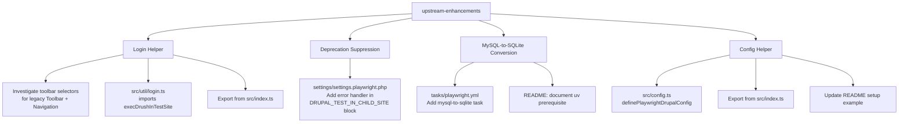
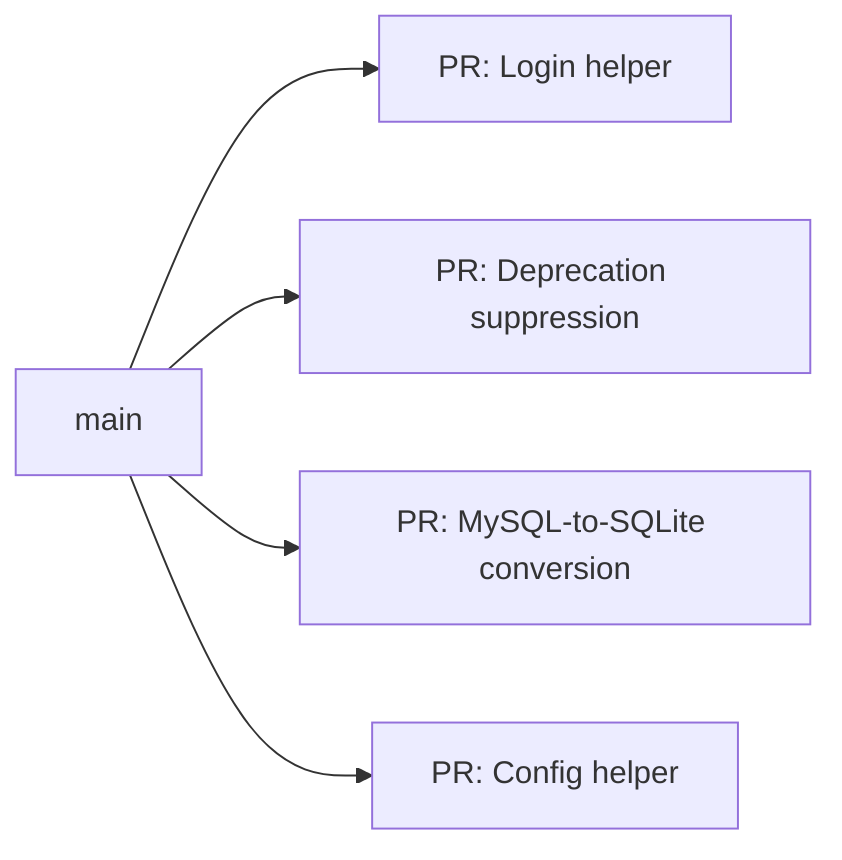
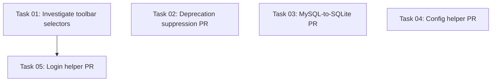

# Plan: Upstream Enhancements for @lullabot/playwright-drupal

## Original Work Order

> Read @upstream-playwright-drupal.md and create a plan from it.

## Plan Clarifications

| Question | Answer |
|----------|--------|
| Which items to include? | All 4 items from the upstream doc |
| Login helper API shape? | Standalone `login(page)` function only (no fixture) |
| MySQL-to-SQLite DB credentials? | DDEV defaults only (db/db/db/3306) |
| mysql2sqlite tooling? | Use `uv` + `mysql-to-sqlite3` (Python, reference implementation) |
| CI reporter delivery? | `definePlaywrightDrupalConfig()` full config wrapper function |
| Login toolbar selector? | Needs investigation — must support both legacy Admin Toolbar and new Navigation module |
| Config helper `baseURL`? | Default to `process.env.DDEV_PRIMARY_URL` |
| Config helper merge strategy? | Shallow merge — user overrides fully replace defaults (e.g., providing `reporter` replaces the entire array) |
| Config helper `globalSetup` path? | Auto-resolve internally — users should never need to specify the path manually |
| Automated testing scope? | Unit tests (Vitest) for config helper + integration tests (Bats) for login, DB conversion, and config helper end-to-end |
| PR strategy? | Separate PRs for each independent component (all 4 are independent). Watch each PR's CI status checks and fix failures before completing. |
| Are components dependent on each other? | No — all 4 are fully independent. Login helper uses existing `execDrushInTestSite`, not the other new components. The only shared file (`src/index.ts`) receives additive one-line export changes that won't conflict. |
| Include truncation step in mysql-to-sqlite task? | No — truncation is project-specific and belongs in the project's `playwright:install:hook`, not in the generic conversion task. |

## Executive Summary

This plan adds four enhancements to `@lullabot/playwright-drupal` based on real-world usage patterns discovered on the `feature/parallel-tests` branch of lullabot.com-d8. Every project adopting this package will need these capabilities, so shipping them upstream eliminates repeated reimplementation.

The four components are: (1) a `login()` helper that handles Drupal authentication with per-test password resets, (2) a deprecation header suppression fix in `settings.playwright.php` that prevents nginx 502 errors on Drupal 11 sites with many contrib modules, (3) a Taskfile task to convert a MySQL/MariaDB database to SQLite for testing against real production content, and (4) a `definePlaywrightDrupalConfig()` helper that provides sensible Playwright configuration defaults for both CI and local development.

The components are independent and can be implemented in any order, though the deprecation suppression fix is the simplest change with the highest impact.

## Context

### Current State vs Target State

| Current State | Target State | Why? |
|---|---|---|
| No login utility — every project reimplements auth | Exported `login(page)` function with env var support | Eliminates boilerplate; works with per-test SQLite isolation |
| Drupal 11 sites with many contrib modules get 502 on first request after rebuild.php | Deprecation headers suppressed in test child sites | `_drupal_error_header()` produces >64KB of headers, exceeding nginx's `fastcgi_buffer_size` |
| `playwright:install` defaults to `drush site:install demo_umami` | New `playwright:mysql-to-sqlite` task converts real DB to SQLite | Projects need to test against their actual database, not a demo install |
| No config helper — projects manually configure reporter, workers, globalSetup, baseURL | `definePlaywrightDrupalConfig()` provides sensible defaults including baseURL from DDEV | Dot reporter is broken in CI; worker count needs tuning; globalSetup path is hard to discover |

### Background

The package currently provides excellent test isolation via SQLite but lacks several utilities that every adopting project needs. The reference implementations exist in lullabot.com-d8's `feature/parallel-tests` branch and have been validated in production use. The deprecation header issue is particularly critical — without the fix, every Drupal 11 site with significant contrib usage will see 100% test failure due to 502 errors on the first page load after `rebuild.php`.

The login helper must account for both Drupal's legacy Admin Toolbar module (`toolbar`) and the newer core Navigation module, which use different DOM structures. Investigation is required to determine the correct selectors for detecting a logged-in state with each.

Key existing code context:
- `execDrushInTestSite()` is exported from `src/testcase/test.ts` and uses a module-level `drupal_test_id` variable set by the test fixture. The login helper will import this function directly.
- `globalSetup` is exported as a default export from `src/setup/global-setup.ts`, compiled to `lib/setup/global-setup.js`. The config helper must resolve this path using `require.resolve()` or `path.resolve(__dirname, ...)`.
- The existing `defineVisualDiffConfig()` in `src/testcase/visualdiff.ts` provides a precedent for the config helper pattern.

## Architectural Approach

### Login Helper

**Objective**: Provide a reusable `login(page)` function that authenticates a Drupal user in any test, working correctly with per-test SQLite database isolation.

The function will:
- Accept a Playwright `Page` object
- Read credentials from `DRUPAL_USER` / `DRUPAL_PASS` environment variables (defaulting to `admin` / `admin`)
- Call `execDrushInTestSite()` to set the user's password — necessary because each test gets a fresh SQLite copy and the password may not match
- Navigate to `/user/login`
- Use `Promise.race()` to detect whether the toolbar or login form appears first, handling already-logged-in state without timeout delays
- Fill and submit the login form if needed, then wait for the toolbar

**File placement**: `src/util/login.ts`, importing `execDrushInTestSite` from `../testcase/test`. This creates a one-way dependency (util -> testcase) with no circular import risk, since testcase imports from util only for `docroot`.

**Investigation needed**: The correct CSS selectors for detecting a logged-in admin must work with both:
1. The legacy **Admin Toolbar** module (Drupal's `toolbar` module)
2. The new **Navigation** module (core experimental, replacing toolbar)

This investigation should happen first, as it determines the selectors used in the `Promise.race()` detection. The approach should favor stable selectors — ARIA roles, `data-` attributes, or `body` classes that Drupal adds for authenticated users — over fragile element IDs that may differ between the two modules.

### Deprecation Header Suppression

**Objective**: Prevent nginx 502 errors caused by oversized HTTP response headers in Drupal 11 test child sites.

Inside the existing `DRUPAL_TEST_IN_CHILD_SITE` block in `settings/settings.playwright.php`, a custom error handler will be registered that intercepts `E_USER_DEPRECATED` and `E_DEPRECATED` errors, returning `TRUE` to suppress them. This prevents `_drupal_error_header()` in `errors.inc` from adding `X-Drupal-Assertion-N` headers for each deprecation notice.

Two code paths in `_drupal_error_handler_real()` add assertion headers:
1. `_drupal_log_error()` — controlled by `SIMPLETEST_COLLECT_ERRORS`
2. Direct `E_USER_DEPRECATED` handler — ignores `SIMPLETEST_COLLECT_ERRORS` and fires when deprecation is triggered inside `@`-suppressed code

The custom error handler wraps Drupal's existing handler using `set_error_handler()` with a closure that captures `&$previousHandler`, forwarding all non-deprecation errors to the previous handler.

### MySQL-to-SQLite Conversion Task

**Objective**: Enable projects to test against their real production database by converting MySQL/MariaDB to SQLite.

A new `playwright:mysql-to-sqlite` task will be added to `tasks/playwright.yml` that:
1. Creates `/tmp/sqlite/` directory
2. Runs `mysql-to-sqlite3` via `uv tool run` with DDEV's default database credentials (`db`/`db`/`db`/`3306`)

This task is intended to be called from a project's `playwright:install:hook`, following the pattern: populate MySQL first (e.g., via site install or DB import), then convert to SQLite.

The `uv` Python tool runner must be available in the DDEV container. It is provided by the ddev-playwright addon.

### Config Helper — `definePlaywrightDrupalConfig()`

**Objective**: Provide a single function that returns a complete `PlaywrightTestConfig` with sensible defaults, reducing boilerplate in each project's `playwright.config.ts`.

The function will:
- Accept an optional `Partial<PlaywrightTestConfig>` overrides object
- Use Playwright's `defineConfig()` internally for type safety and forward compatibility
- Auto-resolve the `globalSetup` path to the compiled `lib/setup/global-setup.js` using `path.resolve(__dirname, ...)` — users never need to specify this
- Apply the following defaults:

| Property | CI (`process.env.CI`) | Local |
|---|---|---|
| `baseURL` | `process.env.DDEV_PRIMARY_URL` | `process.env.DDEV_PRIMARY_URL` |
| `reporter` | `[['line'], ['html']]` | `[['html', { host: '0.0.0.0', port: 9323 }], ['list']]` |
| `workers` | `Math.max(2, os.cpus().length - 2)` | `Math.max(2, os.cpus().length - 2)` |
| `fullyParallel` | `true` | `true` |
| `globalSetup` | Auto-resolved package path | Auto-resolved package path |

**Merge strategy**: Shallow merge — user overrides fully replace defaults at the top level. If a user provides `reporter`, it replaces the entire default reporter array. This is predictable and matches Playwright's own `defineConfig()` behavior.

The function will be placed in `src/config.ts` and re-exported through `src/index.ts`.

## Testing Strategy

### Unit Tests (Vitest)

**Config helper** (`src/config.test.ts`): The `definePlaywrightDrupalConfig()` function is pure logic and the best candidate for unit testing. Tests should cover:
- Default values are applied when no overrides are provided
- CI vs local branching (mock `process.env.CI`) produces correct reporter defaults
- `baseURL` defaults to `process.env.DDEV_PRIMARY_URL`
- User overrides fully replace defaults at the top level (shallow merge)
- `globalSetup` path resolves to a valid file path
- Unknown Playwright config properties pass through untouched

### Integration Tests (Bats)

The existing Bats integration suite (`test/integration.bats` + `test/test_helper.bash`) sets up a full DDEV Drupal project and runs Playwright tests. The new components should be validated by extending this infrastructure:

**Login helper**: Add a test in the example Playwright test file (`write_example_test()` in `test_helper.bash`) that imports `login` from the package and verifies it successfully authenticates. This proves the login helper works end-to-end against a real Drupal site.

**Deprecation header suppression**: The existing integration test already exercises `rebuild.php` (via `playwright:prepare`). If the test site has deprecation-producing modules, the fix prevents 502 errors. Since the demo_umami install may not trigger enough deprecations to exceed the buffer, an explicit test may not be feasible without adding contrib modules. At minimum, verify the error handler is registered by checking that `settings.playwright.php` is syntactically valid and loadable.

**MySQL-to-SQLite conversion**: This requires MySQL to be running, which the DDEV integration test already provides. A new Bats test file (`test/integration-mysql-to-sqlite.bats`) should: (1) install Drupal to MySQL normally, (2) run `task playwright:mysql-to-sqlite`, (3) verify `/tmp/sqlite/.ht.sqlite` exists and is a valid SQLite database, (4) run a Playwright test against the converted database. This requires `uv` to be available in the DDEV container — the test should install it or skip if unavailable.

**Config helper (integration)**: Update `configure_playwright()` in `test_helper.bash` to use `definePlaywrightDrupalConfig()` instead of the current manual `defineConfig()` call. This validates that the helper produces a working config in a real DDEV environment.

## Risk Considerations and Mitigation Strategies

Technical Risks

- **Navigation module selector instability**: The Navigation module is experimental in core and its DOM structure may change between Drupal minor versions.
    - **Mitigation**: Investigate current stable selectors and prefer selectors tied to ARIA roles or data attributes over fragile CSS class names. Document supported Drupal versions.

- **mysql-to-sqlite3 conversion fidelity**: Some MySQL-specific column types or constraints may not convert cleanly.
    - **Mitigation**: This is a known limitation of the tool. The reference implementation has been validated on a real production database. Document known edge cases.

Implementation Risks

- **uv availability in DDEV containers**: The `uv` tool is not installed by default in DDEV web containers.
    - **Mitigation**: The ddev-playwright add-on provides `uv`. Document this prerequisite clearly in the README.

- **Config helper version coupling**: The helper returns a full `PlaywrightTestConfig`, which may need updates as Playwright's config API evolves.
    - **Mitigation**: Use `@playwright/test`'s `defineConfig()` internally and pass through unknown properties, so new Playwright options work without package updates.

- **globalSetup path resolution at compile time**: The `__dirname` in `src/config.ts` resolves to `lib/` after compilation, which must correctly reach `lib/setup/global-setup.js`.
    - **Mitigation**: Use a relative path from `__dirname` (e.g., `path.resolve(__dirname, 'setup', 'global-setup.js')`) and verify in the build output.

## Success Criteria

### Primary Success Criteria
1. All tests pass locally (`npm run test:unit` and `npm run test:bats`) for each component
2. Each component's GitHub PR passes all CI status checks (`unit-test` and `test` jobs in the Test workflow, plus `conventional-commits` and `codeql`)
3. Any CI failures are diagnosed and fixed before the task is marked complete — the PR must have green checks

### Per-Component Success Criteria
4. **Login helper PR**: `login(page)` authenticates against both legacy Admin Toolbar and Navigation module admin UIs; Bats integration test exercises it end-to-end
5. **Deprecation suppression PR**: `settings.playwright.php` loads without errors; error handler is registered in test child sites
6. **MySQL-to-SQLite PR**: `task playwright:mysql-to-sqlite` produces a valid SQLite database; Bats integration test validates the full workflow
7. **Config helper PR**: Vitest unit tests cover defaults, CI branching, merge behavior, and path resolution; Bats integration test uses `definePlaywrightDrupalConfig()` for a working end-to-end run

## Documentation

Each PR ships its own README updates so documentation lands alongside the code:

- **Login helper PR**: Add a README section documenting `login(page)`, env var configuration (`DRUPAL_USER`/`DRUPAL_PASS`), and usage example within a test
- **Deprecation suppression PR**: Inline comments in `settings.playwright.php` only (no README change needed — the fix is transparent to users)
- **MySQL-to-SQLite PR**: Add a README section on testing with an existing database, covering `playwright:mysql-to-sqlite` usage, the `uv` prerequisite, and recommended `playwright:install:hook` pattern
- **Config helper PR**: Add a README section documenting `definePlaywrightDrupalConfig()` with usage example, and update the existing `playwright.config.ts` setup example to use it instead of manual `defineConfig()`

## Resource Requirements

### Development Skills
- TypeScript / Playwright API for the login helper and config helper
- PHP error handling for the deprecation suppression fix
- Drupal DOM structure knowledge for toolbar selector investigation
- Taskfile.dev YAML syntax for the conversion task

### Technical Infrastructure
- DDEV with Drupal 10/11 for testing both toolbar variants
- `uv` Python tool runner for MySQL-to-SQLite conversion testing
- Access to a Drupal site with significant contrib modules to validate the deprecation fix

## Integration Strategy

### Pull Request Structure

All four components are independent — they touch different files, have no runtime dependencies on each other, and can be merged in any order. Each component gets its own PR branched from `main`:

| PR | Branch name | Key files | CI jobs exercised |
|---|---|---|---|
| Login helper | `feat/login-helper` | `src/util/login.ts`, `src/index.ts`, `test/test_helper.bash` | unit-test, test |
| Deprecation suppression | `fix/deprecation-headers` | `settings/settings.playwright.php` | unit-test, test |
| MySQL-to-SQLite | `feat/mysql-to-sqlite` | `tasks/playwright.yml`, `test/integration-mysql-to-sqlite.bats`, README | unit-test, test |
| Config helper | `feat/config-helper` | `src/config.ts`, `src/config.test.ts`, `src/index.ts`, `test/test_helper.bash`, README | unit-test, test |

### CI Verification Workflow

For each PR, after pushing:
1. Monitor the GitHub Actions Test workflow (`unit-test` and `test` jobs)
2. Monitor the `conventional-commits` check (commit message format)
3. Monitor the `codeql` security analysis
4. If any check fails: diagnose the failure from the workflow logs, fix locally, push, and re-verify
5. Only mark the task complete when all status checks are green

Use `gh pr checks <PR-URL> --watch` to monitor status checks from the CLI.

### Merge Order

No ordering constraints — merge as each PR's checks go green. The only minor consideration is that both the login helper and config helper add exports to `src/index.ts`, so whichever merges second will need a trivial rebase to add its export line. This is a one-line additive change and will not conflict meaningfully.

## Notes

- The `playwright:mysql-to-sqlite` task uses hardcoded DDEV database defaults. Projects using non-standard DDEV database configuration will need to create their own conversion task using the hook system.
- The login helper uses `execDrushInTestSite()` to reset the password on each call. This is intentional — each test gets a fresh SQLite copy, and the password state may differ from what's expected.
- The `definePlaywrightDrupalConfig()` helper should use Playwright's `defineConfig()` internally to benefit from type checking and future compatibility.

## Execution Blueprint

**Validation Gates:**
- Reference: `/config/hooks/POST_PHASE.md`

### Dependency Diagram

### ✅ Phase 1: Independent Components + Research
**Parallel Tasks:**
- ✔️ Task 01: Investigate toolbar selectors (research for login helper)
- ✔️ Task 02: Deprecation header suppression PR (#76 — all checks passed)
- ✔️ Task 03: MySQL-to-SQLite conversion PR (#75 — all checks passed)
- ✔️ Task 04: Config helper PR (#77 — all checks passed)

### ✅ Phase 2: Login Helper
**Parallel Tasks:**
- ✔️ Task 05: Login helper PR (#78 — all checks passed)

### Execution Summary
- Total Phases: 2
- Total Tasks: 5
- Maximum Parallelism: 4 tasks (in Phase 1)
- Critical Path Length: 2 phases

## Execution Summary

**Status**: Completed Successfully
**Completed Date**: 2026-03-16

### Results
All 4 upstream enhancements implemented as separate PRs with passing CI:

| PR | Title | Branch | Status |
|---|---|---|---|
| [#76](https://github.com/Lullabot/playwright-drupal/pull/76) | fix: suppress deprecation headers in test child sites | `fix/deprecation-headers` | All 6 checks passing |
| [#75](https://github.com/Lullabot/playwright-drupal/pull/75) | feat: add mysql-to-sqlite conversion task | `feat/mysql-to-sqlite` | All 6 checks passing |
| [#77](https://github.com/Lullabot/playwright-drupal/pull/77) | feat: add definePlaywrightDrupalConfig() config helper | `feat/config-helper` | All 6 checks passing |
| [#78](https://github.com/Lullabot/playwright-drupal/pull/78) | feat: add login helper utility | `feat/login-helper` | All 6 checks passing |

### Noteworthy Events
- **Parallel agent worktree conflicts**: Running 4 agents in the same worktree caused branch-switching interference. Resolved by using isolated git worktrees for Phase 2 (login helper).
- **mysql-to-sqlite3 sqlglot incompatibility**: The latest `mysql-to-sqlite3` had an `ImportError: cannot import name 'Expression' from 'sqlglot'`. Fixed by pinning `mysql-to-sqlite3>=2,<3`.
- **Config helper dual-module afterEach conflict**: Importing `definePlaywrightDrupalConfig` from the main package entry point loaded the test fixture module, causing duplicate `test.afterEach()` registration. Fixed by adding a `./config` subpath export in `package.json` that loads only the config module.
- **Toolbar selector research**: Found `#toolbar-administration` (legacy) and `#admin-toolbar` (Navigation). Both are stable element IDs. Also updated `src/util/images.ts` which had a hardcoded `#toolbar-administration` reference.

### Recommendations
- Merge PRs in any order — they are independent. The config-helper and login-helper PRs both add exports to `src/index.ts`, so whichever merges second needs a trivial rebase.
- Consider adding the `./config` subpath export pattern to the README for users who need to import in `playwright.config.ts` without triggering test fixture side effects.

### Change Log
- 2026-03-16: Initial plan created
- 2026-03-16: Refinement — added config helper clarifications (baseURL defaults to DDEV_PRIMARY_URL, shallow merge strategy, auto-resolved globalSetup path), specified login helper file placement rationale and import direction, added globalSetup path resolution risk, expanded config helper defaults table, added existing code context to Background section
- 2026-03-16: Refinement — added comprehensive Testing Strategy section covering Vitest unit tests for config helper and Bats integration tests for login helper, deprecation suppression, MySQL-to-SQLite conversion, and config helper end-to-end validation. Added 3 test-related success criteria.
- 2026-03-16: Refinement — confirmed all 4 components are fully independent (no cross-dependencies). Restructured success criteria around local tests passing + GitHub CI status checks passing. Added Integration Strategy section with separate PR structure, branch names, CI verification workflow using `gh pr checks --watch`, and merge order guidance.
- 2026-03-16: Refinement — fixed 4 inconsistencies: removed stale "table truncation" reference from docs section (truncation is project-specific, belongs in install hook), updated uv risk mitigation to reference ddev-playwright, corrected unit test description to reflect workers are no longer CI-dependent.
