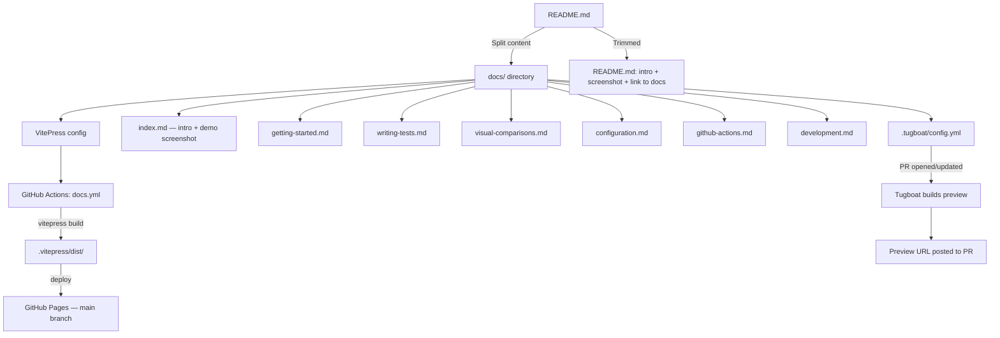
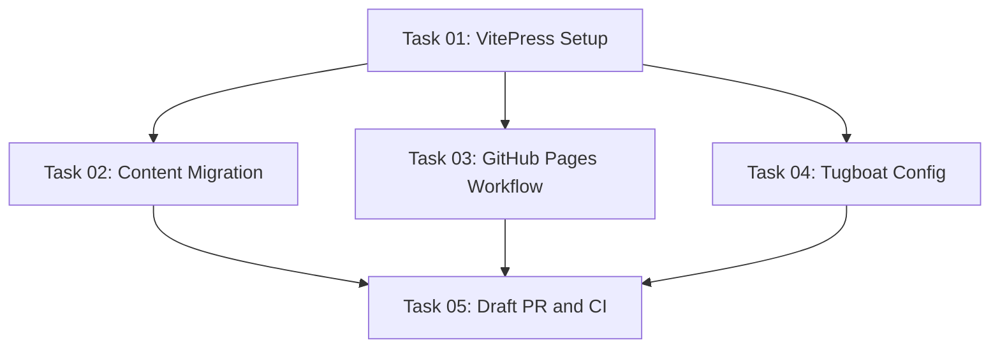

# Plan: Static Documentation Site on GitHub Pages

## Original Work Order

> Convert the README to be a static site hosted on GitHub pages. It should use a documentation focused tool that generates a static site that is well supported, easy to use, easy to theme later if needed, and in order of preference TypeScript, JavaScript, PHP, or Python. The README should still have an introduction and the demo screenshot.

## Plan Clarifications

| Question | Answer |
|---|---|
| GitHub Pages URL / custom domain? | Deploy at `https://lullabot.github.io/playwright-drupal/` — no custom domain; VitePress `base` set to `'/playwright-drupal/'` |
| Tugboat service image? | `tugboatqa/node:24` with `serve` npm package — simpler config preferred over Apache/nginx |
| Add VitePress scripts to `package.json`? | Yes — add `docs:dev`, `docs:build`, and `docs:preview` to root `package.json` |

## Executive Summary

This plan converts the project's comprehensive `README.md` into a multi-page VitePress static documentation site deployed to GitHub Pages at `https://lullabot.github.io/playwright-drupal/`. VitePress is chosen because it is TypeScript-native, purpose-built for documentation, has first-class theming support, and is backed by the Vite ecosystem — the most aligned choice given the project already uses TypeScript and npm.

The existing `README.md` is long (~850 lines) and covers several distinct topics. By splitting its content into focused pages, readers can navigate directly to what they need. The `README.md` itself is preserved but trimmed to an introductory section with the demo screenshot and a link to the full documentation site. A new GitHub Actions workflow deploys the generated site to GitHub Pages on every push to `main`. Tugboat PR previews are enabled via a `.tugboat/config.yml` that builds the site using `tugboatqa/node:24` and serves the output with `serve`. Convenience scripts (`docs:dev`, `docs:build`, `docs:preview`) are added to the root `package.json`.

## Context

### Current State vs Target State

| Current State | Target State | Why? |
|---|---|---|
| All documentation is a single `README.md` (~850 lines) | Multi-page VitePress site with sidebar navigation | Easier to navigate; readers can jump to specific topics |
| README is the only entry point for docs | README retains intro + screenshot + link to docs site | GitHub README remains useful while docs site provides depth |
| No static site tooling in the repo | VitePress added as a `devDependency` under `docs/` | TypeScript-native, zero-config to start, easy to extend |
| No GitHub Pages deployment | New `docs.yml` workflow builds and deploys on push to `main` | Automated, always up-to-date documentation |
| Images live in `images/` at project root | Images referenced from docs with correct relative paths | VitePress serves from `docs/public/` for static assets |
| No PR preview environments | `.tugboat/config.yml` added; Tugboat posts a preview URL on each PR | Reviewers can see docs changes live before merging |

### Background

The project is a TypeScript npm package (`@lullabot/playwright-drupal`) with a thorough README that covers installation, configuration, writing tests, visual comparisons, accessibility annotations, and development. The README has grown large enough that a static site with sidebar navigation will meaningfully improve the developer experience.

The project already uses TypeScript, Vite (via Vitest), and GitHub Actions — VitePress is a natural fit with no technology paradigm shift. It does not need to be added to the published npm package (it's a dev-only concern).

GitHub Pages deployment from the `gh-pages` branch (or `docs/` folder) via a dedicated Actions workflow is the standard approach and requires no third-party hosting.

## Architectural Approach

### VitePress Setup

**Objective**: Add VitePress as a dev dependency, keeping it separate from the published npm package, and configure it for the GitHub Pages deployment path.

VitePress will be installed in the project root `devDependencies` (it is already excluded from the `files` array in `package.json` which only publishes `lib/`, `src/`, `bin/`, `settings/`, `tasks/`, and `README.md`). The configuration lives at `docs/.vitepress/config.ts`. The `docs/public/` directory holds static assets such as images.

*Per clarification: no custom domain is used.* The `base` option in `docs/.vitepress/config.ts` must be set to `'/playwright-drupal/'` so that VitePress generates correct asset URLs for the GitHub Pages project-page path. Without this, all CSS, JS, and image references will 404 on the deployed site.

Three scripts are added to the root `package.json` (*per clarification*):
- `docs:dev` — `vitepress dev docs`
- `docs:build` — `vitepress build docs`
- `docs:preview` — `vitepress preview docs`

The sidebar will mirror the logical sections of the current README:
- Getting Started
- Writing Tests
- Visual Comparisons (Diffs)
- Configuration Reference
- GitHub Actions & Accessibility
- Development

### Content Migration

**Objective**: Split the monolithic README into per-topic Markdown files that map to sidebar pages, preserving all content.

Each top-level README section becomes its own page. Image references (`images/demo.webp`, `images/github-a11y-summary.webp`, `images/a11y-violation-screenshot.webp`) are copied into `docs/public/images/` and reference paths are updated accordingly.

The `README.md` is trimmed to contain:
- The badge row
- The `demo.webp` screenshot
- A short introductory paragraph (the four bullet points describing what this library does)
- A link to the full documentation site

### GitHub Pages Deployment

**Objective**: Automatically build and publish the VitePress site to GitHub Pages on every push to `main`.

A new workflow file `.github/workflows/docs.yml` will use the official GitHub Pages Actions (`actions/configure-pages`, `actions/upload-pages-artifact`, `actions/deploy-pages`). The `pages` and `id-token: write` permissions are required. The build step runs `npm run docs:build`. The workflow is independent of the existing `test.yml`.

### Draft Pull Request and CI

**Objective**: Open a draft PR for review with all existing CI checks passing before the work is considered complete.

All implementation work is done on a feature branch (e.g. `feat/docs-site`). Once all files are committed, a draft pull request is opened against `main` using `gh pr create --draft`. The PR description should summarise what was added. All existing CI jobs must pass on the PR:

- **Conventional Commits** — the branch commits must follow conventional commit format
- **CodeQL** — no new security findings introduced by the docs tooling
- **Tests** — existing unit and bats tests must continue to pass unchanged

The `docs.yml` GitHub Pages deployment workflow does **not** need to succeed on the PR (it only deploys on merge to `main` and requires GitHub Pages to be manually enabled). CI passage for the three existing workflows is the bar.

### Tugboat PR Previews

**Objective**: Provide a live preview URL on every pull request so reviewers can see docs changes before merging, without any developer effort per-PR.

Tugboat is a preview environment service that integrates with GitHub PRs. When a PR is opened or updated, Tugboat builds a fresh preview environment and posts the URL as a status check. The repository owner handles connecting the repo to Tugboat (account setup, GitHub app installation) — this plan only produces the `.tugboat/config.yml` file that drives the build.

*Per clarification: `tugboatqa/node:24` with `serve` is used for a simpler config.* The `.tugboat/config.yml` defines a single default service using `tugboatqa/node:24`. In the `build` phase it runs `npm ci` and `npm run docs:build`. The `online` phase starts `serve` pointing at `docs/.vitepress/dist`, exposing the site on the port Tugboat proxies for the preview URL. Because `serve` is a foreground process, it is run in the Tugboat `online` lifecycle phase (which keeps the process alive for the duration of the preview), not the `build` phase (which expects commands to complete). The VitePress `base` option is not set in the Tugboat build — `serve` serves from root, so no path prefix is needed for previews.

The integration between Tugboat and the GitHub repository (connecting the account, installing the GitHub App, granting repo access) is a **manual prerequisite** performed by the repository owner outside this plan.

## Risk Considerations and Mitigation Strategies

Technical Risks

- **VitePress version compatibility with existing TypeScript config**: VitePress uses Vite internally; the project's `vitest.config.ts` and `tsconfig.json` should not conflict since VitePress config lives inside `docs/.vitepress/` and is not included in the main `tsconfig.json`.
    - **Mitigation**: Scope the VitePress `tsconfig.json` to only include `docs/.vitepress/`, keeping it isolated from the main TypeScript compilation.

- **Image paths**: VitePress serves static assets from `docs/public/`. Images referenced in Markdown must use root-relative paths (`/images/demo.webp`), not relative paths to `images/` in the project root.
    - **Mitigation**: Copy images to `docs/public/images/` and update all references during content migration.

- **`base` path breaks local dev**: Setting `base: '/playwright-drupal/'` for GitHub Pages means `npm run docs:dev` serves at `http://localhost:5173/playwright-drupal/`, which can trip up developers expecting the root.
    - **Mitigation**: Document this in the `docs:dev` script or a comment in `config.ts`. The VitePress dev server handles the base path correctly; developers just need to know to navigate to the prefixed URL.

Implementation Risks

- **GitHub Pages not enabled on the repository**: The deployment will fail if GitHub Pages is not configured to use GitHub Actions as the source.
    - **Mitigation**: Document in the plan that the repository's GitHub Pages settings must be set to "GitHub Actions" source. This is a one-time manual step.

- **Workflow permissions**: Deploying to GitHub Pages requires `pages: write` and `id-token: write` at the workflow level.
    - **Mitigation**: Include the correct `permissions` block in the workflow file.

- **Tugboat integration not set up**: The `.tugboat/config.yml` file will be committed but previews will not work until the repository owner connects the repo to a Tugboat account and installs the GitHub App.
    - **Mitigation**: This is explicitly a manual prerequisite outside the scope of this plan. The config file will be correct and ready; the integration steps are on the repository owner.

## Success Criteria

### Primary Success Criteria
1. The VitePress site builds without errors (`npm run docs:build`) and all content from the original README is present across the pages.
2. The GitHub Pages deployment workflow triggers on push to `main` and publishes the site successfully.
3. The `README.md` retains the introductory content and `demo.webp` screenshot, with a link to the hosted docs site.
4. All images render correctly on the deployed site.
5. `.tugboat/config.yml` is committed and correctly builds the VitePress site; once the Tugboat integration is connected by the repository owner, PR previews are served at the Tugboat-provided URL.
6. A draft pull request is opened on GitHub and all existing CI jobs pass (Conventional Commits, CodeQL, tests).

## Documentation

- `README.md` is updated to be an introduction with a link to the full docs site.
- No assistant-focused documentation changes are needed.

## Resource Requirements

### Development Skills
- VitePress configuration (TypeScript)
- GitHub Actions for Pages deployment
- Markdown authoring

### Technical Infrastructure
- VitePress (`vitepress` npm package) as a dev dependency
- GitHub Actions: `actions/configure-pages`, `actions/upload-pages-artifact`, `actions/deploy-pages`
- GitHub Pages enabled on the repository (manual one-time setup in repository settings)
- Tugboat account with GitHub App installed and repo connected (manual prerequisite by repository owner)

## Notes

- VitePress does not need to be in the published package's `files` array — it's already excluded.
- The `docs/` directory should be added to `.gitignore` entries for the VitePress cache (`docs/.vitepress/cache/`) and build output (`docs/.vitepress/dist/`).
- GitHub Pages must be configured to use "GitHub Actions" as the deployment source in the repository settings before the workflow can succeed.
- Tugboat's `.tugboat/config.yml` is inert until the repository owner sets up the Tugboat account and GitHub integration at tugboatqa.com. The config can be committed safely ahead of that.
- The `base: '/playwright-drupal/'` VitePress config is only needed for GitHub Pages deployment. Tugboat previews serve from root so they are unaffected by this setting — `serve` doesn't use the VitePress base path.

### Change Log
- 2026-04-12: Added Plan Clarifications section. Specified `base: '/playwright-drupal/'` requirement for GitHub Pages. Switched Tugboat image from `node:20` to `node:24` and clarified `serve` runs in `online` phase (not `build`). Added `docs:dev`, `docs:build`, `docs:preview` scripts to scope. Added `base` path / local dev risk.
- 2026-04-12: Added Draft PR and CI section. All implementation work must be on a feature branch with a draft PR opened via `gh pr create --draft`. Conventional Commits, CodeQL, and test CI jobs must pass. The `docs.yml` deployment workflow is excluded from the PR CI bar (requires manual GitHub Pages setup).
- 2026-04-12: Generated 5 tasks and execution blueprint.

---

## Dependency Diagram

## Execution Blueprint

**Validation Gates:**
- Reference: `/config/hooks/POST_PHASE.md`

### ✅ Phase 1: Foundation
**Parallel Tasks:**
- ✔️ Task 01: VitePress installation, config.ts, npm scripts, .gitignore

### ✅ Phase 2: Implementation
**Parallel Tasks:**
- ✔️ Task 02: Content migration — README → docs pages + trim README (depends on: 01)
- ✔️ Task 03: GitHub Pages deployment workflow (depends on: 01)
- ✔️ Task 04: Tugboat PR preview config (depends on: 01)

### ✅ Phase 3: PR and CI
**Parallel Tasks:**
- ✔️ Task 05: Open draft PR and verify CI passes (depends on: 02, 03, 04)

### Execution Summary
- Total Phases: 3
- Total Tasks: 5
- Maximum Parallelism: 3 tasks (Phase 2)
- Critical Path Length: 3 phases

---

## Execution Summary

**Status**: ✅ Completed Successfully
**Completed Date**: 2026-04-12

### Results
VitePress documentation site scaffolded and all README content migrated to 6 focused pages. GitHub Pages deployment workflow and Tugboat PR preview config committed. Draft PR #113 opened at https://github.com/Lullabot/playwright-drupal/pull/113. All 12 CI checks passed (Conventional Commits, CodeQL, unit tests, and integration tests across 3 bats test files).

### Noteworthy Events
- VitePress config required `.mts` extension (not `.ts`) because the project uses CJS by default and VitePress is ESM-only — `.mts` forces ESM treatment without changing the root `package.json`.
- The pre-commit bats integration tests ran for ~30 minutes total for the Task 01 commit (3 bats files × full DDEV + Playwright stack). The Task 02 commit was fast (~10s) because none of the staged files matched `TESTABLE_PATHS`.
- The npm pack output confirmed the trimmed README is 1.2kB (down from 35.1kB) and no `docs/` files appear in the published package tarball.
- All 12 CI checks passed on the first push with no fixes required.

### Recommendations
- Enable GitHub Pages in repository settings (Settings → Pages → Source: GitHub Actions) to activate the `docs.yml` deployment workflow on merge to `main`.
- Connect the repository to a Tugboat account at tugboatqa.com to activate PR preview environments.
