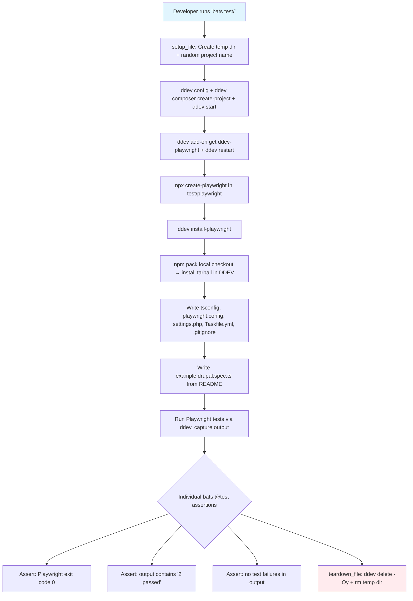
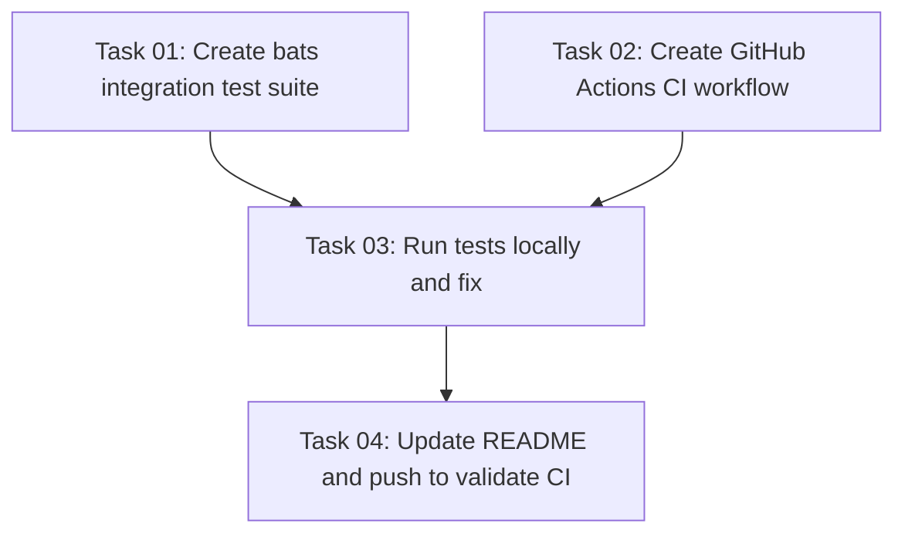

# Plan: Automated Integration Tests for playwright-drupal

## Original Work Order

> I need to create automated tests that prove that the example Drupal tests work. They should be able to be run locally and in GitHub CI. I suspect bats is the right framework to use, but I'm open to suggestions. When executing this plan, all tests must pass locally before considering it complete. The tests will need to set up everything using the documentation in the README as a guide.

## Plan Clarifications

| Question | Answer |
|----------|--------|
| Test approach? | Full end-to-end integration: spin up a real DDEV Drupal project, install playwright-drupal, run the README example tests |
| Framework? | bats-core (Bash Automated Testing System) |
| Fresh or reusable projects? | Fresh DDEV project in temp directory each run |
| Browser scope? | Chromium only (proving integration, not cross-browser) |
| DDEV project naming? | Randomized suffix (e.g. `pwtest-a3f2`) to avoid conflicts |
| Prior work? | Copilot branch `copilot/add-github-workflow-for-testing` has a GitHub Actions workflow attempt to use as reference, but we build independently |
| `ddev composer create` vs `create-project`? | `ddev composer create` is **deprecated** in DDEV v1.25+. Use `ddev composer create-project` as the README documents. |
| Build before `npm pack`? | Not needed — `lib/` directory (compiled JS) is committed to the repo and stays in sync with `src/`. |

## Executive Summary

This plan creates an automated integration test suite using bats-core that proves the playwright-drupal library works by following the README's getting-started guide programmatically. The tests will create a fresh DDEV-based Drupal project, install playwright-drupal from the local checkout via `npm pack`, configure everything per the README, and run the example Playwright tests — verifying that both the "has title" and "proves parallel tests work" tests pass.

The same test logic will run both locally (via `bats test/`) and in GitHub Actions CI. bats-core is the right tool because the entire setup flow is shell commands (ddev, npm, drush, task), and bats provides structured test output with TAP format, setup/teardown hooks, and assertion helpers — all while keeping the tests readable and debuggable.

The key architectural insight is structuring the bats tests so that the expensive DDEV project setup happens once (in `setup_file`), then individual bats test cases assert on the outcomes. This avoids re-creating the Drupal project for each assertion while keeping failures granular. After local tests pass, the branch is pushed and CI runs are monitored until green.

## Context

### Current State vs Target State

| Current State | Target State | Why? |
|---|---|---|
| No automated tests exist (`"test": "echo \"Error: no test specified\" && exit 1"` in package.json) | bats-core integration tests that verify the README workflow | Prove the library works and catch regressions |
| No CI pipeline (no `.github/workflows/`) | GitHub Actions workflow running tests on push/PR | Automated quality gate for contributions |
| Manual verification only — developers must follow README by hand | Single `bats test/` command reproduces the full README flow | Faster feedback loop, reproducible results |
| Prior copilot attempt exists but was abandoned | Complete, working test infrastructure | Resolve the outstanding need for CI |

### Background

The playwright-drupal library provides Playwright/Drupal integration for isolated parallel testing using SQLite databases. It's an npm package (`@lullabot/playwright-drupal` v1.0.7) that users install into their Drupal project's test directory.

The library's correctness depends on a complex integration between DDEV, Drupal, Playwright, SQLite, Task (taskfile.dev), and PHP — making it impossible to unit test in isolation. The only meaningful test is an end-to-end integration test that exercises the full stack.

A previous attempt on the `copilot/add-github-workflow-for-testing` branch created a GitHub Actions workflow with the right general approach (create Drupal project → install library → run tests) but was not completed. We use it as a reference while building a more robust solution that also runs locally via bats.

Key technical facts discovered during planning:
- `ddev composer create` is deprecated in DDEV v1.25+ — use `ddev composer create-project` as the README documents.
- The compiled `lib/` directory is committed to git; no `npm run build` step is needed before `npm pack`.
- `.npmignore` only excludes `.idea` and `.ddev`, so `npm pack` produces a complete, installable package from a fresh checkout.

## Architectural Approach

### bats-core Test Structure

**Objective**: Provide a structured, readable test suite that exercises the README workflow and produces clear pass/fail output.

The test suite will live at `test/integration.bats` with a helper file at `test/test_helper.bash`. The helper contains shared functions for DDEV project setup, configuration, and teardown. The main test file uses bats' `setup_file`/`teardown_file` hooks to manage the DDEV project lifecycle, and individual `@test` blocks to assert specific outcomes.

Key design decisions:
- **`setup_file` runs the full setup AND executes Playwright** — creating the DDEV project, installing dependencies, configuring Playwright, writing the example test, and running `npx playwright test`. The Playwright stdout/stderr is captured to a file. Individual `@test` cases then assert on the captured output and exit code. This avoids repeating the expensive setup for each assertion while keeping failures granular and debuggable.
- **No bats-assert/bats-support libraries needed** — basic bats assertions (`[ "$status" -eq 0 ]`, `[[ "$output" =~ pattern ]]`, `grep`) are sufficient for checking Playwright output. This avoids adding git submodule dependencies.
- **Randomized DDEV project names** (e.g. `pwtest-a3f2`) prevent conflicts with developer's existing projects.
- **`teardown_file` always cleans up** — runs `ddev delete -Oy` and removes the temp directory, even on failure.
- **`npm pack` installs the local checkout** — `npm pack` is run on the host, producing a `.tgz` tarball. The tarball is copied into the Drupal project directory and installed inside DDEV via `ddev exec npm install /var/www/html/<tarball>`. This tests the actual package as it would be published, not a symlink.
- **Chromium only, single worker in CI** — the Playwright config uses `workers: process.env.CI ? 1 : undefined` for CI stability. The goal is proving integration works, not cross-browser or parallel performance testing.
- **Prerequisites check** — the first bats test verifies `ddev` and `docker` are available, failing early with a clear message if not.

### GitHub Actions CI Workflow

**Objective**: Run the same integration tests automatically on push to main and on pull requests.

The workflow (`.github/workflows/test.yml`) will:
1. Check out the repository.
2. Install bats-core via `apt-get install bats`.
3. Install DDEV using the official `ddev/github-action-setup-ddev@v1` action with `autostart: false` (bats manages DDEV lifecycle).
4. Run `bats test/` — the exact same command developers run locally.
5. Upload Playwright HTML report as an artifact (always, for debugging).

This ensures CI and local testing use identical logic — there's no divergence between what runs in CI vs. what developers run. The job has a 30-minute timeout to accommodate the slow `ddev install-playwright` step (which rebuilds the Docker image to include browsers).

### Package Configuration Updates

**Objective**: Wire up the test command in package.json so `npm test` works.

The `package.json` test script will be updated from the current error stub to run `bats test/`. This is a minimal change — one line in `package.json`.

## Risk Considerations and Mitigation Strategies

Technical Risks

- **DDEV startup failures in CI**: Docker-in-Docker or networking issues can cause DDEV to fail in GitHub Actions.
    - **Mitigation**: Use the official `ddev/github-action-setup-ddev` action which handles these edge cases. The copilot branch already proved this action works.
- **`ddev install-playwright` builds a custom Docker image**: This is slow (~5-10 min) and could fail if upstream browser packages change.
    - **Mitigation**: The CI workflow will have a 30-minute timeout. This step is inherently slow and cannot be cached. If it fails due to upstream changes, that's a real issue that needs attention.
- **Drupal site install timing**: `drush site:install` with the Umami profile takes several minutes.
    - **Mitigation**: The CI job has a generous overall timeout (30 min). The bats test itself has no per-test timeout — the CI job timeout is the control.
- **DDEV project name collisions**: Two concurrent local test runs could collide.
    - **Mitigation**: 4-character random hex suffix (e.g. `pwtest-a3f2`) gives 65,536 possible names. Concurrent local runs are unlikely, and if they occur, DDEV will error clearly.

Implementation Risks

- **Cleanup on test failure**: If bats crashes or is killed (SIGKILL), the DDEV project may be left behind.
    - **Mitigation**: `teardown_file` uses `ddev delete -Oy` which is idempotent. Stale projects can be manually cleaned with `ddev list` + `ddev delete`.
- **Flaky Playwright tests**: The "proves parallel tests work" test creates content and asserts on it, which could be timing-sensitive.
    - **Mitigation**: Use `retries: 2` in the Playwright config for CI. The test itself has been battle-tested in the README for over a year.
- **Host vs. container boundary for npm pack**: `npm pack` runs on the host; the tarball must be accessible inside DDEV.
    - **Mitigation**: Copy the tarball to the Drupal project root (which is bind-mounted into DDEV), then install via `ddev exec npm install /var/www/html/<tarball>`.

## Success Criteria

### Primary Success Criteria
1. `bats test/` passes locally — both the "has title" and "proves parallel tests work" example Playwright tests succeed against a fresh DDEV Drupal project
2. GitHub Actions CI workflow runs the same tests and passes on push/PR
3. Cleanup is complete — no leftover DDEV projects or temp directories after test runs
4. Test output clearly shows what passed/failed with actionable error messages
5. Branch is pushed, CI workflow runs are monitored, and any CI-specific failures are fixed until the workflow is green

## Documentation

- Update `package.json` test script from the error stub to `bats test/`
- Add a "Running Tests" or "Development" section to the README explaining how to run the integration tests locally (prerequisites: DDEV, Docker, bats-core)

## Resource Requirements

### Development Skills
- Bash scripting and bats-core test authoring
- DDEV configuration and Drupal site installation
- GitHub Actions workflow authoring
- Understanding of the playwright-drupal setup flow (documented in README)

### Technical Infrastructure
- **bats-core**: Test framework (installed via `apt install bats` on Ubuntu, `brew install bats-core` on macOS)
- **DDEV v1.25+**: Local development environment manager (already available)
- **Docker**: Container runtime (already available)
- **GitHub Actions**: CI runner with Docker support (via `ubuntu-latest`)
- **`ddev/github-action-setup-ddev@v1`**: Official DDEV GitHub Action

## Integration Strategy

The test infrastructure integrates with the existing project by:
- Living in a `test/` directory (standard convention)
- Using `npm pack` to test the package as published (not via symlinks)
- Following the README step-by-step — if the README is wrong, the tests fail
- CI workflow triggers on push to main and PRs, becoming a required check

## Validation Strategy

After all tests pass locally, push the `add-tests` branch and monitor the GitHub Actions workflow runs. Since this is a public repository, the CI results will be visible. If CI fails, investigate the logs, fix the issues, and push again — iterating until CI is green. The plan is not complete until both local and CI tests pass.

## Notes

- The copilot branch (`copilot/add-github-workflow-for-testing`) provides useful reference for the GitHub Actions workflow structure, particularly the `ddev/github-action-setup-ddev` usage and the `npm pack` approach for installing the local checkout. Note: that branch incorrectly uses deprecated `ddev composer create` — use `ddev composer create-project` instead.
- The bats test should capture Playwright's stdout/stderr to a temp file so that individual assertions can check for specific output patterns (e.g., "2 passed" for 2 chromium tests).
- The `ddev install-playwright` step rebuilds the web Docker image to include browsers — this is the slowest step and cannot be easily cached in CI.

### Change Log
- 2026-02-27: Initial plan creation
- 2026-02-27: Refinement — clarified `ddev composer create` deprecation; confirmed no build step needed (lib/ committed); detailed host-vs-container npm pack flow; specified no bats-assert library needed (YAGNI); added CI worker count detail; updated mermaid diagram with accurate assertion details; expanded risk mitigations
- 2026-02-27: Task generation — created 4 tasks, appended execution blueprint

## Dependency Diagram

## Execution Blueprint

**Validation Gates:**
- Reference: `/config/hooks/POST_PHASE.md`

### Phase 1: Create Test Infrastructure
**Parallel Tasks:**
- Task 01: Create bats integration test suite
- Task 02: Create GitHub Actions CI workflow

### ✅ Phase 2: Local Validation
**Parallel Tasks:**
- ✔️ Task 03: Run tests locally and fix until passing (depends on: 01, 02)

### Phase 3: Documentation and CI Validation
**Parallel Tasks:**
- Task 04: Update README and push to validate CI (depends on: 03)

### Execution Summary
- Total Phases: 3
- Total Tasks: 4
- Maximum Parallelism: 2 tasks (in Phase 1)
- Critical Path Length: 3 phases
