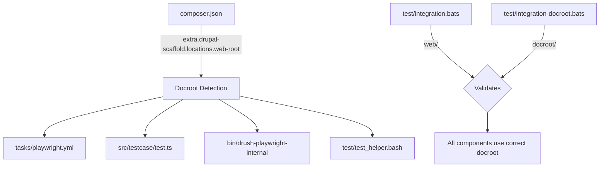
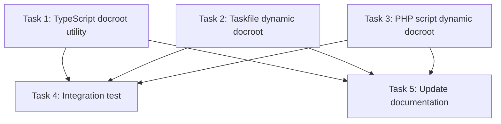

# Plan: Detect Drupal Docroot from composer.json

## Original Work Order

> I would like to fix https://github.com/Lullabot/playwright-drupal/issues/9 so it can work with any docroot. https://github.com/Lullabot/playwright-drupal/pull/10 implements this but I would like to try something different. Instead, can we determine what the docroot is from the `composer.json` file of a typical Drupal project? I suspect we can from the drupal scaffold configuration.

## Plan Clarifications

| Question | Answer |
|---|---|
| Should we support `./` (legacy project) docroot where Drupal lives at the project root? | No. Only support named docroots like `web/`, `docroot/`, etc. Legacy project support is out of scope. |
| Should the new `docroot` integration test run in a separate CI job or sequentially? | Sequentially in the same job. The second test benefits from Playwright browsers already being installed by the first test. |

## Executive Summary

This plan replaces all hardcoded `web/` references in playwright-drupal with a dynamically detected docroot, read from the Drupal project's `composer.json` file. The Drupal scaffold plugin stores the web root location in `extra.drupal-scaffold.locations.web-root` — this is the canonical source of truth for where Drupal's public files live. By reading this value at runtime, playwright-drupal will work with any named docroot configuration (`web/`, `docroot/`, etc.) without requiring users to set environment variables.

PR #10 takes a different approach (a `DOCROOT` environment variable with a default). The composer.json approach is superior because it is zero-config — the docroot is already declared in every Drupal Composer project and doesn't require users to set anything.

A new integration test validates the full round-trip with `docroot/` as the web root, proving auto-detection works end-to-end.

## Context

### Current State vs Target State

| Current State | Target State | Why? |
|---|---|---|
| `web/` is hardcoded in `tasks/playwright.yml` (lines 57-58, 65-66, 123-124) | Read docroot from `composer.json` | Support projects using `docroot/` or other named web roots |
| `web/` hardcoded in `src/testcase/test.ts` (line 74) | Use detected docroot for error log path | Error log attachment fails for non-`web/` projects |
| `/var/www/html/web/core/...` hardcoded in `bin/drush-playwright-internal` (line 42) | Derive path from `composer.json` | `drush-playwright` breaks for non-`web/` projects |
| `web/sites/default/settings.php` hardcoded in `test/test_helper.bash` (line 173) | Use detected docroot in test helper | Integration tests assume `web/` |
| Only one integration test with `web/` docroot | Two tests: `web/` and `docroot/` | Prove docroot detection works for non-default configurations |

### Background

Every Drupal project created with Composer declares its web root in `composer.json`:

```json
"extra": {
  "drupal-scaffold": {
    "locations": {
      "web-root": "web/"
    }
  }
}
```

- **`drupal/recommended-project`**: uses `"web-root": "web/"`
- **Custom projects**: may use `"web-root": "docroot/"` or other named directories

This value is the canonical, authoritative source for the docroot across the Drupal ecosystem. The `drupal/core-composer-scaffold` plugin and other tools already rely on it.

**Out of scope**: `drupal/legacy-project` uses `"web-root": "./"` (docroot at project root). This is a deprecated template with significantly different path semantics and is not supported by this plan. *(See Plan Clarifications.)*

## Architectural Approach

The strategy is to read the docroot from `composer.json` in each context where it's needed (TypeScript, Taskfile, PHP), then use that value in place of hardcoded `web/`.



### Docroot Detection — TypeScript Utility

**Objective**: Provide a function that reads `composer.json` and returns the docroot path, usable from the TypeScript source files.

Playwright tests run from `test/playwright/` as their working directory (the Taskfile does `cd test/playwright` before `npx playwright test`). This means `composer.json` is always at `../../composer.json` relative to cwd.

The function will:
1. Read `../../composer.json` (relative to cwd, i.e. two levels up from `test/playwright/`)
2. Parse `extra.drupal-scaffold.locations.web-root`
3. Normalize the value (strip trailing slashes)
4. Fall back to `web` if the key is missing (matching the Drupal ecosystem default)

This utility will be used by `src/testcase/test.ts` for the error log path. The current hardcoded path `../../web/sites/simpletest/{id}/error.log` becomes `../../{docroot}/sites/simpletest/{id}/error.log`.

### Docroot Detection — Taskfile Variable

**Objective**: Make `tasks/playwright.yml` use the docroot from `composer.json` instead of hardcoding `web/`.

The Taskfile will define a dynamic variable that shells out to read the value from `composer.json`. The task runner executes from the Drupal project root, so `composer.json` is in the current directory. A `node -e` one-liner can extract the value since Node is always available in the DDEV container. The variable defaults to `web` if the key is absent.

All references to `web/sites/simpletest/...` and `web/sites/default/...` in the taskfile will use this variable.

### Docroot Detection — PHP Script

**Objective**: Update `bin/drush-playwright-internal` to find the docroot dynamically.

Since this PHP script already includes `/var/www/html/vendor/autoload.php`, it can read and parse `/var/www/html/composer.json` with `json_decode(file_get_contents(...))` to extract the web-root value. This avoids requiring an environment variable (as PR #10 does). Falls back to `web` if the key is absent.

The hardcoded path `/var/www/html/web/core/includes/bootstrap.inc` becomes `/var/www/html/{docroot}/core/includes/bootstrap.inc`.

### Test Helper Update

**Objective**: Parameterize `test/test_helper.bash` to accept a docroot argument so both integration test files can reuse the same setup logic.

The helper functions (`setup_drupal_project`, `configure_playwright`, etc.) currently hardcode `web` in paths like `web/sites/default/settings.php` and pass `--docroot=web` to `ddev config`. These will accept the docroot as a parameter, defaulting to `web`.

### Integration Test for `docroot` Projects

**Objective**: Add a second BATS integration test file (`test/integration-docroot.bats`) that proves playwright-drupal works end-to-end with a Drupal project whose docroot is `docroot` instead of `web`.

The test will:

1. Call `setup_drupal_project` with `docroot` as the docroot parameter
2. `setup_drupal_project` passes `--docroot=docroot` to `ddev config`
3. After `ddev composer create-project drupal/recommended-project`, modify `composer.json`:
   - Change `extra.drupal-scaffold.locations.web-root` from `web/` to `docroot/`
   - Change all `installer-paths` keys from `web/...` to `docroot/...`
4. Rename the `web/` directory to `docroot/`
5. Run `ddev restart` (required for DDEV to recognize the new docroot)
6. Run `ddev composer install` to re-scaffold files into the new docroot
7. Configure Playwright and run the same example tests

Both test files run sequentially in the same CI job via `bats test/`. The `docroot` test benefits from Playwright browsers already being installed by the first test. *(See Plan Clarifications.)* The CI workflow timeout may need increasing from 30 to 45 minutes.

## Risk Considerations and Mitigation Strategies

<details>
<summary>Technical Risks</summary>

- **Missing or malformed `composer.json`**: The project root might not have a `composer.json`, or it might lack the `drupal-scaffold` key.
    - **Mitigation**: Fall back to `web` as the default, matching the most common Drupal project structure. This preserves existing behavior for projects that don't customize their docroot.
- **`jq` availability**: The Taskfile could use `jq` or `node` for JSON parsing. `jq` may not be installed in all DDEV containers.
    - **Mitigation**: Use `node -e` for the Taskfile variable extraction since Node is always available in DDEV containers.
</details>

<details>
<summary>Implementation Risks</summary>

- **Performance of reading `composer.json` in hot paths**: The taskfile `prepare` and `cleanup` tasks run per-test. Reading `composer.json` on every invocation adds minimal overhead (it's a small file read + JSON parse).
    - **Mitigation**: Taskfile variables are evaluated once per task invocation, not per shell line — this is inherently cached within a single task run.
- **CI time increase**: Adding a second integration test roughly doubles CI time.
    - **Mitigation**: Run sequentially in the same job so the second test reuses installed Playwright browsers. Increase CI timeout from 30 to 45 minutes if needed.
</details>

## Success Criteria

### Primary Success Criteria
1. All hardcoded `web/` references are replaced with dynamically detected docroot values
2. Projects using `drupal/recommended-project` (web root `web/`) continue to work with zero configuration changes
3. Projects using `docroot/` as the web root work without any manual overrides
4. Existing integration tests (`test/integration.bats`) pass, confirming no regressions for `web/` projects
5. New integration test (`test/integration-docroot.bats`) passes, proving end-to-end functionality with `docroot/` as the web root

## Documentation

- Update `README.md` to note that the docroot is auto-detected from `composer.json`
- Remove any instructions that assume `web/` as the docroot

## Resource Requirements

### Development Skills
- TypeScript for the utility function and test.ts changes
- Taskfile/YAML for the variable extraction
- PHP for the drush-playwright-internal script
- Bash for test helper updates

### Technical Infrastructure
- `node` available in the DDEV container (already present)
- Access to `composer.json` at the Drupal project root

## Notes

- The `settings/settings.playwright.php` file does not reference the docroot directly — it uses relative paths like `sites/simpletest/...` which are relative to the Drupal root, so no changes are needed there.
- The `/var/www/html` base path in container contexts remains correct — it's the DDEV mount point, not the docroot. Only the subdirectory within it (e.g., `web/`) changes.
- `drupal/legacy-project` (`"web-root": "./"`) is explicitly out of scope.

### Change Log
- 2026-03-10: Initial plan created
- 2026-03-10: Added integration test for `docroot` projects
- 2026-03-10: Refined plan — scoped out `./` legacy project support, specified sequential CI, clarified TypeScript path resolution (cwd is `test/playwright/`), added `ddev restart` step to test, specified `node -e` over `jq` for Taskfile, added CI timeout note
- 2026-03-10: Generated 5 tasks with execution blueprint

## Execution Blueprint

### Dependency Diagram



### Phase 1: Core Implementation
**Parallel Tasks:**
- Task 1: Create TypeScript docroot utility and update hardcoded references
- Task 2: Replace hardcoded web/ in Taskfile with dynamic docroot variable
- Task 3: Update drush-playwright-internal to detect docroot from composer.json

### Phase 2: Validation & Documentation
**Parallel Tasks:**
- Task 4: Parameterize test helper and add docroot integration test (depends on: 1, 2, 3)
- Task 5: Update README to document auto-detected docroot (depends on: 1, 2, 3)

### Execution Summary
- Total Phases: 2
- Total Tasks: 5
- Maximum Parallelism: 3 tasks (in Phase 1)
- Critical Path Length: 2 phases
