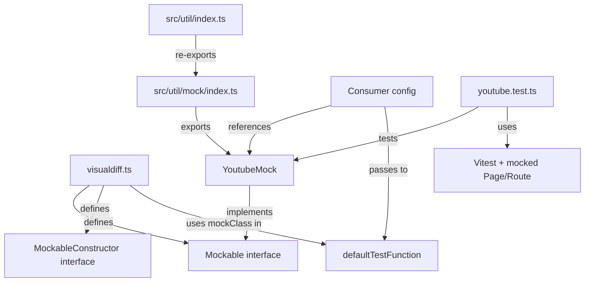
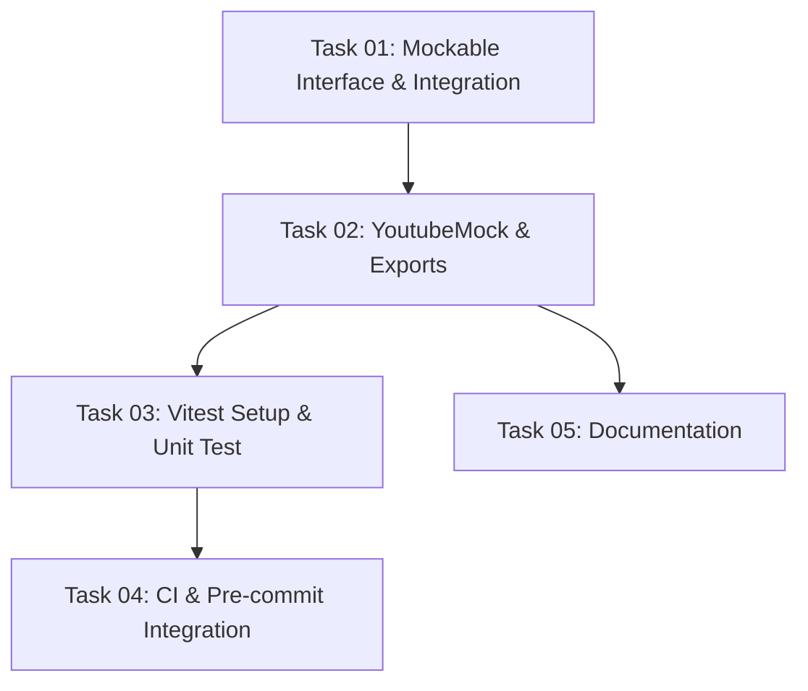

# Plan: Finish Iframe Mock Support (PR #17)

## Original Work Order

> I would like to finish the iframe mock support issue at https://github.com/Lullabot/playwright-drupal/pull/17. Read the code and comments, and create a plan that addresses remaining todos, fixes, and improvements.

## Plan Clarifications

| Question | Answer |
|----------|--------|
| `tsconfig.json` has no `exclude`. Adding `*.test.ts` under `src/` means `tsc` will compile them into `lib/`. Should we add `"exclude"` or place tests outside `src/`? | Add `"exclude": ["**/*.test.ts"]` to `tsconfig.json`. Keep tests co-located with source files. |
| `lib/` is currently tracked in git (22 files). Should we keep it tracked or gitignore it? | `lib/` will be gitignored on `main` before this plan executes. Assume `lib/` is not tracked. Do not commit `lib/` files. |
| `npm test` running `test:unit && test:bats` will fail on machines without bats. Should we add a fallback? | No fallback needed. Assume dev machines have bats and ddev available. |

## Executive Summary

PR #17 introduces iframe mock support for visual diff tests, allowing external iframe content (e.g., YouTube embeds) to be replaced with deterministic HTML during screenshot tests. The PR has review feedback from @deviantintegral and security warnings from GitHub Advanced Security that need to be addressed before merging.

The core approach is sound: a `Mockable` interface with per-service mock implementations that intercept network requests via Playwright's `page.route()`. The work remaining is primarily: addressing reviewer feedback (naming, unnecessary files), fixing a regex security issue, integrating the mock classes into the package exports, and adding documentation.

## Context

### Current State vs Target State

| Current State | Target State | Why? |
|---|---|---|
| No iframe mocking in visual diff tests | `Mockable` interface + YouTube mock shipped with the package | External iframes (YouTube, etc.) cause flaky/non-deterministic screenshots |
| PR has a generic `Mock` class that wraps `Youtube` | Each mock class stands on its own (e.g., `YoutubeMock`) | Reviewer feedback: the `Mock` wrapper is confusing and unnecessary |
| `packageManager` field added to `package.json` | `packageManager` field removed | Reviewer feedback: project doesn't use yarn lockfile, this is unneeded |
| Regex `'www\.youtube\.com'` in `new RegExp()` has unescaped dots | Properly escaped regex `'www\\.youtube\\.com'` or use regex literal | GitHub Advanced Security flagged: dots match any character, not literal dots |
| Mock classes exist in `src/util/mock/` but aren't exported | Mock classes exported from the package | Consumers need to import `YoutubeMock` and `Mockable` from `@lullabot/playwright-drupal` |
| `mockClass` typed as `MockableConstructor \| void` | `mockClass` typed as `MockableConstructor` (optional field) | `void` in union type is unusual; the field is already optional via `?` |
| No `exclude` in `tsconfig.json` | `tsconfig.json` excludes `**/*.test.ts` | Prevents test files from being compiled into `lib/` build output |
| `defaultTestFunction` doesn't apply mocks | `defaultTestFunction` applies mocks when `mockClass` is configured | Core integration point for the feature |
| No documentation for mock usage | README or docs section explaining mock usage | PR TODO checklist item: "Add docs and examples" |
| No unit tests exist in the project | Vitest configured with a unit test for `YoutubeMock` | Validates mock behavior without requiring full DDEV integration stack |
| `npm test` only runs `bats test/` | `npm test` runs all tests; `test:unit` for Vitest, `test:bats` for bats | Clear separation of fast unit tests vs slow integration tests |
| CI only runs bats integration tests | CI also runs `npm run test:unit` (Vitest) as a separate parallel job | Fast feedback on unit test failures without waiting for DDEV |
| Pre-commit hook runs bats only under AI agents | Pre-commit hook always runs `npm run test:unit` unconditionally | Vitest is fast (sub-second), so it should gate every commit |

### Background

The PR was opened by @penyaskito on 2025-02-27. @deviantintegral reviewed it the same day with three main pieces of feedback:

1. **Remove `packageManager` field** from `package.json` - the project doesn't use a yarn lockfile.
2. **Rename/remove the generic `Mock` class** - it's unclear that loading `Mock` actually does something with YouTube. The suggestion is to either have each mock class standalone (like `YoutubeMock implements Mockable`) or rename to something descriptive like `EveryIframeServiceMock`.
3. **YouTube mock visual fidelity** - a suggestion to use a screenshot of a YouTube player in the mock HTML was discussed but both reviewers agreed that a simple placeholder is fine since sites can always override it.

Additionally, GitHub Advanced Security flagged the regex `new RegExp('www\.youtube\.com', 'i')` because `\.` inside a string literal is just `.` (the backslash is consumed by the string, not the regex engine). The regex needs double-escaping: `'www\\.youtube\\.com'`.

The current `src/testcase/visualdiff.ts` on `main` does **not** include the `Page` import, `Mockable`/`MockableConstructor` interfaces, or `mockClass` property - these all need to be added as part of this work.

## Architectural Approach

### Mockable Interface and Integration in `visualdiff.ts`

**Objective**: Define the `Mockable` contract and wire it into the default test function so mocks are applied before page navigation.

The `Mockable` interface and `MockableConstructor` type will be added to `src/testcase/visualdiff.ts`. The `BaseVisualDiff` type gets an optional `mockClass?: MockableConstructor` property. In `defaultTestFunction`, if `testCase.mockClass` is defined, a new instance is created and `mock(page)` is called before `page.goto()`.

The `Page` type import from `@playwright/test` is needed for the `Mockable` interface.

### YouTube Mock Implementation

**Objective**: Provide a built-in YouTube iframe mock that replaces YouTube embed requests with a deterministic placeholder.

A `YoutubeMock` class (renamed from `Youtube` for clarity) in `src/util/mock/youtube.ts` implements `Mockable`. It uses `page.route()` with a properly escaped regex (`/www\.youtube\.com/i` as a regex literal) to intercept YouTube requests and return a simple HTML placeholder.

The current `src/util/mock/mock.ts` (the generic `Mock` wrapper) will be removed per reviewer feedback. Each mock is standalone and users configure the specific mock class they need via `mockClass`.

### Package Exports

**Objective**: Make mock classes importable from the package.

A new `src/util/mock/index.ts` barrel file will export `YoutubeMock`. The existing `src/util/index.ts` will re-export from `./mock`. This ensures consumers can import via `@lullabot/playwright-drupal`.

### Cleanup

**Objective**: Remove unnecessary changes flagged in review.

- Remove the `packageManager` field from `package.json` (revert that change).
- Add `"exclude": ["**/*.test.ts"]` to `tsconfig.json` so test files are not compiled into `lib/`. *Per clarification: tests stay co-located with source.*
- Do not commit `lib/` files. *Per clarification: `lib/` will be gitignored on `main` before this plan executes.*

### Unit Testing with Vitest

**Objective**: Add a unit test for `YoutubeMock` using Vitest, establishing the project's unit testing infrastructure, and integrate it into CI and pre-commit hooks.

Vitest will be added as a dev dependency along with a `vitest.config.ts` at the project root. The npm test scripts will be reorganized:

- `test` — runs all tests (`npm run test:unit && npm run test:bats`)
- `test:unit` — runs `vitest run`
- `test:bats` — runs `bats test/`

This replaces the current single `"test": "bats test/"` script. References to `npm test` in CI and hooks that intend to run bats specifically should be updated to `npm run test:bats`.

The test file `src/util/mock/youtube.test.ts` will mock the Playwright `Page` and `Route` objects using `vi.fn()` and verify that:

1. `YoutubeMock.mock(page)` calls `page.route()` with a regex matching `www.youtube.com`
2. The route handler calls `route.fulfill()` with `contentType: 'text/html'` and body containing the mock placeholder text
3. The regex correctly matches YouTube embed URLs (e.g., `https://www.youtube.com/embed/abc123`) and does not match unrelated URLs

This scope is intentionally limited to `YoutubeMock` only. Unit tests for other files (`frames.ts`, `images.ts`, `accessible-screenshot.ts`, `visualdiff.ts`) are deferred to a future plan.

#### CI Integration

The existing `.github/workflows/test.yml` workflow runs `bats test/` for integration tests (this will be updated to `npm run test:bats`). A new job will run `npm run test:unit`. Since Vitest needs no Docker, DDEV, or browsers, it can run with just a Node.js setup — making it significantly faster than the integration test job. Adding it as a separate job allows it to run in parallel with the bats integration tests.

#### Pre-commit Hook Integration

The current `.husky/pre-commit` hook only runs `npm test` (bats) under AI agents when testable paths are staged — because bats tests are slow (they spin up DDEV). Vitest unit tests are fast (sub-second), so they should run unconditionally on every commit. The hook will be updated to always run `npm run test:unit` before the existing conditional bats block. The conditional bats invocation will be updated from `npm test` to `npm run test:bats`.

### Documentation

**Objective**: Add usage docs as noted in the PR TODO checklist.

Update the project README with a section on iframe mocking, showing how to use `YoutubeMock` and how to create custom mocks implementing the `Mockable` interface.

## Risk Considerations and Mitigation Strategies

Technical Risks

- **Regex matching too broadly or too narrowly**: The YouTube regex could miss some embed URL patterns or match unintended URLs.
    - **Mitigation**: Use a regex literal `/www\.youtube\.com/i` which correctly escapes dots. This matches the standard YouTube embed domain.

Implementation Risks

- **Breaking the existing `defaultTestFunction` behavior**: Adding mock logic before navigation could affect existing tests that don't use mocks.
    - **Mitigation**: The mock logic is gated behind `if (testCase.mockClass != undefined)`, so it only runs when explicitly configured.

## Success Criteria

### Primary Success Criteria
1. All PR review comments from @deviantintegral are addressed (packageManager removed, Mock class removed, naming clarified)
2. GitHub Advanced Security regex warning is resolved with properly escaped regex
3. `YoutubeMock` and `Mockable` interface are properly exported from the package
4. The project compiles successfully with `tsc`
5. README includes iframe mock documentation with usage examples
6. Vitest unit test for `YoutubeMock` passes, verifying route interception and HTML placeholder fulfillment
7. `npm run test:unit` runs in `.github/workflows/test.yml` as a separate job
8. `.husky/pre-commit` runs `npm run test:unit` unconditionally on every commit

## Documentation

- Update `README.md` with an iframe mocking section covering:
  - How to use `YoutubeMock` in visual diff config
  - How to create a custom mock implementing `Mockable`

## Resource Requirements

### Development Skills
- TypeScript, Playwright route interception APIs

### Technical Infrastructure
- Existing project build toolchain (`tsc`)
- Vitest (new dev dependency) for unit tests

## Notes

- 2026-03-10: Initial plan created from PR #17 review feedback analysis
- 2026-03-10: Added Vitest unit testing strategy (scoped to YoutubeMock only)
- 2026-03-10: Added CI and pre-commit hook integration for Vitest
- 2026-03-10: Renamed test scripts (`test`, `test:unit`, `test:bats`)
- 2026-03-10: Refinement — added `tsconfig.json` exclude for test files, clarified `lib/` will be gitignored on main before execution, confirmed dev machines have bats/ddev

## Dependency Diagram

## Execution Blueprint

**Validation Gates:**
- Reference: `/config/hooks/POST_PHASE.md`

### ✅ Phase 1: Core Interfaces
**Parallel Tasks:**
- ✔️ Task 01: Add Mockable interface and mock integration to visualdiff.ts

### ✅ Phase 2: Mock Implementation
**Parallel Tasks:**
- ✔️ Task 02: Create YoutubeMock class and package exports (depends on: 01)

### Phase 3: Testing & Documentation
**Parallel Tasks:**
- Task 03: Set up Vitest and write YoutubeMock unit test (depends on: 02)
- Task 05: Add iframe mock documentation to README (depends on: 02)

### Phase 4: CI Integration
**Parallel Tasks:**
- Task 04: Add unit tests to CI and pre-commit hook (depends on: 03)

### Post-phase Actions

### Execution Summary
- Total Phases: 4
- Total Tasks: 5
- Maximum Parallelism: 2 tasks (in Phase 3)
- Critical Path Length: 4 phases
