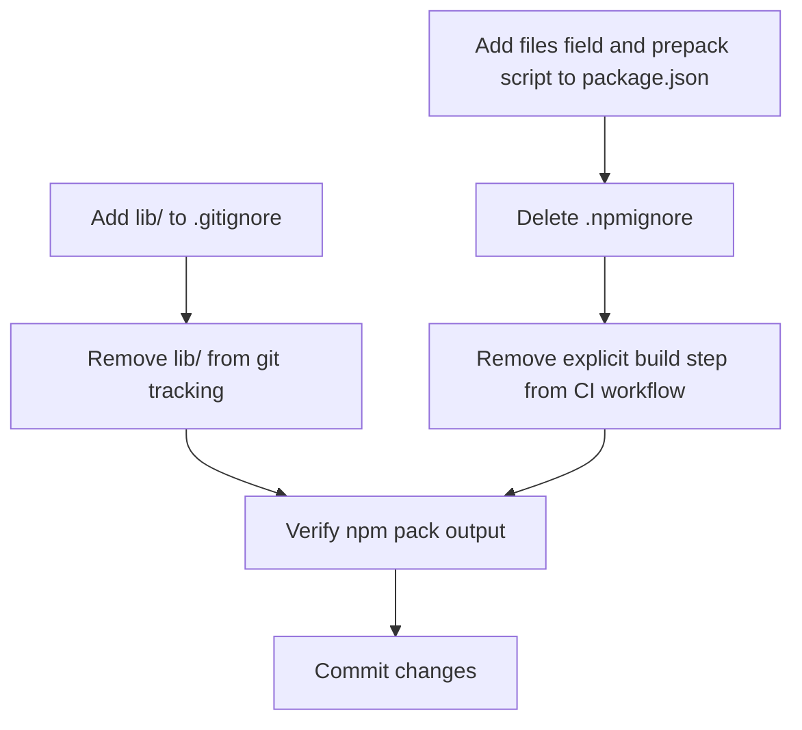

# Plan: Remove Committed Build Output and Fix npm Package Contents

## Original Work Order
> Remove the committed lib/ directory and add it to .gitignore. Add a files field to package.json with the appropriate files so npm packages are correct.

## Plan Clarifications

| Question | Answer |
|---|---|
| `.npmignore` exists and becomes inert once `files` is added — delete it or keep it? | Delete it. Dead config is confusing. |
| CI workflow has an explicit `npm run build` step that `prepack` makes redundant — remove or keep? | Remove the explicit build step from the CI workflow. |
| Add `prepack` script for git-based install support? | Yes (agreed during planning). |

## Executive Summary

The `lib/` directory (TypeScript build output) is currently committed to the repository, even though the CI release workflow already rebuilds it from source before every `npm publish`. This causes noisy diffs on PRs, potential merge conflicts, and staleness risk.

The package currently lacks a `files` field in `package.json` and relies on an `.npmignore` for exclusion control. This approach is incomplete — `npm pack --dry-run` shows that `.claude/` agent configs, `images/demo.webp` (510 kB), `.release-please-manifest.json`, and `renovate.json` still leak into the published package, inflating it to ~550 kB with 62 files.

This plan removes `lib/` from git tracking, gitignores it, replaces the `.npmignore` with a precise `files` allowlist in `package.json`, adds a `prepack` script to guarantee builds before packaging, and removes the now-redundant explicit build step from the CI release workflow.

## Context

### Current State vs Target State

| Current State | Target State | Why? |
|---|---|---|
| `lib/` is committed to the repo | `lib/` is gitignored and not tracked | Eliminates noisy diffs, merge conflicts, and staleness risk |
| No `files` field in `package.json` | Explicit `files` field listing `lib/`, `bin/`, and `README.md` | Prevents unintended files from being published to npm |
| `.npmignore` used for exclusion control | `.npmignore` deleted | The `files` field supersedes `.npmignore` — keeping both is confusing dead config |
| npm package is ~550 kB with 62 files | npm package contains only essential files | Reduces package size and avoids leaking internal tooling config |
| No `prepack` script | `prepack` script runs `npm run build` | Ensures `lib/` is built automatically for git-based installs, `npm pack`, and `npm publish` |
| CI workflow has explicit `npm run build` step before `npm publish` | Explicit build step removed | `prepack` handles this automatically; removing it avoids redundant work |

### Background

The release workflow (`.github/workflows/release-please.yml`) runs `npm ci`, `npm run build`, then `npm publish`. With a `prepack` script, `npm publish` will trigger the build automatically, making the explicit step redundant.

The `tsconfig.json` compiles `src/` to `lib/` with `"outDir": "lib/"`.

An `.npmignore` file currently excludes `.idea`, `.ddev`, `tmp`, `.husky`, `.ai`, `.github`, `commitlint.config.js`, and `release-please-config.json`. However, it misses `.claude/`, `images/`, `.release-please-manifest.json`, and `renovate.json` — all of which leak into the published package. The `files` field approach is strictly superior: it's an allowlist rather than a denylist, so new files added to the repo are excluded by default.

The `bin/` directory contains shell scripts (`drush-playwright`, `drush-playwright-internal`) that are used by consumers and referenced in the README. These are not declared in a `bin` field in `package.json` but should be included in the `files` field so they ship with the package.

## Architectural Approach

### Gitignore and Untrack `lib/`

**Objective**: Stop tracking build output in git while keeping the build workflow intact.

Add `lib/` to `.gitignore`. Then remove `lib/` from git's index using `git rm -r --cached lib/`. This untracks the files without deleting them from disk, so local development continues to work.

### Add `files` Field to `package.json`

**Objective**: Explicitly declare which files belong in the published npm package, replacing the `.npmignore` approach.

Add a `files` field to `package.json` with exactly:
- `lib/` — the compiled JavaScript and type declarations (built before publish via `prepack`)
- `bin/` — the `drush-playwright` and `drush-playwright-internal` shell scripts
- `README.md` — the project readme

npm always includes `package.json` automatically, so it does not need to be listed. The `files` field acts as an allowlist and takes precedence over both `.gitignore` and `.npmignore`, so `lib/` will be included in the package even though it's gitignored.

### Delete `.npmignore`

**Objective**: Remove dead configuration that would be superseded by the `files` field.

When `package.json` has a `files` field, npm ignores `.npmignore` entirely. Keeping it would be misleading — future contributors might edit it thinking it has an effect. Delete the file.

### Add `prepack` Script

**Objective**: Ensure `lib/` is always built before packaging, regardless of install method.

Add a `prepack` script to `package.json` that runs `npm run build`. This script fires automatically before `npm publish`, `npm pack`, and when installing from git. This guarantees that `lib/` is freshly compiled in all distribution scenarios:

- **`npm publish`** — build happens automatically, no explicit step needed in CI
- **`npm pack`** — local tarball creation auto-builds
- **`npm install github:lullabot/playwright-drupal`** — git-based installs get a working package

### Remove Explicit Build Step from CI Workflow

**Objective**: Eliminate redundancy in the release workflow now that `prepack` handles building.

Remove the `npm run build` step from `.github/workflows/release-please.yml`. The `npm publish` command will trigger `prepack` automatically, which runs `npm run build`. The `npm ci` step must remain so that `devDependencies` (including `typescript`) are installed before `prepack` fires.

### Verification

**Objective**: Confirm the npm package contents are correct after changes.

Run `npm pack --dry-run` to verify the package contains only the intended files and the package size is significantly reduced compared to the current ~550 kB / 62 files.

## Risk Considerations and Mitigation Strategies

Technical Risks

- **`prepack` running in unexpected contexts**: The `prepack` script runs before any tarball creation, including during `npm pack` in local development. This requires `devDependencies` (specifically `typescript`) to be installed.
    - **Mitigation**: This is standard behavior for TypeScript packages and `typescript` is already a `devDependency`.

Implementation Risks

- **Missing files in npm package**: If the `files` field is too restrictive, consumers could be missing required files.
    - **Mitigation**: Run `npm pack --dry-run` to verify the package contents before committing. Compare with the current file list to ensure nothing essential is dropped.

## Success Criteria

### Primary Success Criteria
1. `lib/` is listed in `.gitignore` and no longer tracked by git
2. `package.json` has a `files` field that includes `lib/`, `bin/`, and `README.md`
3. `package.json` has a `prepack` script that runs `npm run build`
4. `.npmignore` is deleted
5. The explicit `npm run build` step is removed from `.github/workflows/release-please.yml`
6. `npm pack --dry-run` shows only the intended files (no `.claude/`, `images/`, `renovate.json`, etc.)

## Documentation

No documentation updates are required. The `README.md` does not reference the `lib/` directory or the build output being committed.

## Resource Requirements

### Development Skills
Basic familiarity with git, npm packaging, and TypeScript project structure.

### Technical Infrastructure
No additional tools or infrastructure needed. Standard git and npm CLI.

## Notes

- 2026-03-10: Initial plan created.
- 2026-03-10: Refinement — added `.npmignore` deletion (was missed in initial plan), CI workflow build step removal, corrected `npm pack` analysis to account for existing `.npmignore`, added clarifications table, updated mermaid diagram.
