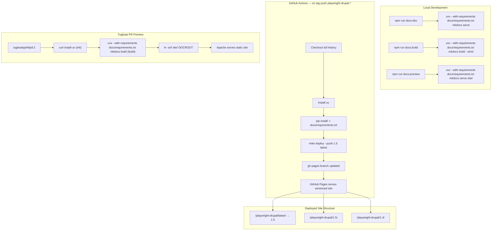
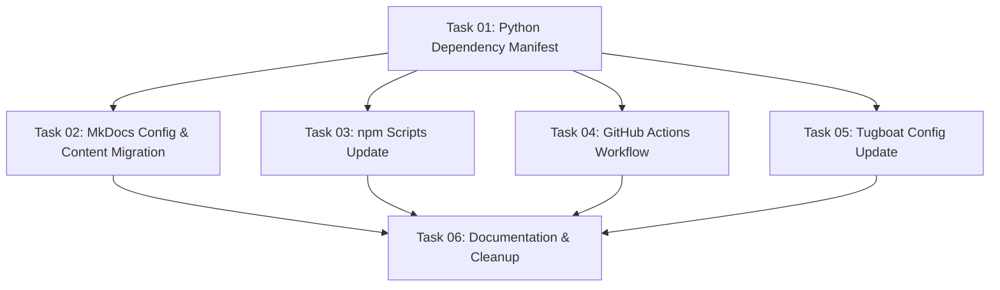

# Plan: VitePress to MkDocs + Material + mike Migration

## Original Work Order

> Create a plan for refactoring the documentation from VitePress to MkDocs + Material theme + mike for versioning.
>
> This is the `lullabot/playwright-drupal` npm package repo at `/home/claude/github.com/lullabot/playwright-drupal`. It's a Node.js/TypeScript project — a Playwright helper library for Drupal testing.
>
> ### Current docs state (VitePress, on feature branch `feature/6--static-docs-site`):
> - `docs/.vitepress/config.mts` — VitePress config with `base: '/playwright-drupal/'`, sidebar for 6 pages
> - `docs/index.md` — home page with VitePress `layout: home` frontmatter
> - `docs/getting-started.md`, `docs/writing-tests.md`, `docs/visual-comparisons.md`, `docs/configuration.md`, `docs/github-actions.md`, `docs/development.md` — six content pages migrated from README
> - `docs/public/images/` — demo.webp, github-a11y-summary.webp, a11y-violation-screenshot.webp
> - `.github/workflows/docs.yml` — GitHub Pages deployment via Actions
> - `.tugboat/config.yml` — PR preview via Tugboat (builds docs, serves with runit + vitepress preview)
> - `package.json` — has `docs:dev`, `docs:build`, `docs:preview` scripts using vitepress
> - `vitepress` in devDependencies
>
> ### Target state:
> - MkDocs + Material theme for the static site
> - `mike` for versioned docs deployment to GitHub Pages
> - The deployed site should be on the latest tag; previous tags' docs accessible at versioned URLs
> - All URLs should have a version number
> - Tugboat PR preview should still work (Python environment needed in the Node image, or a different approach)
> - The README should still link to the docs site
> - The existing six content pages should be preserved (content migration, not rewrite)
> - `docs:dev`, `docs:build`, `docs:preview` equivalent scripts should exist in `package.json` (using npm scripts that shell out to Python/mkdocs commands)
>
> ### Key constraints:
> - This is a Node.js package — Python tooling will be added but should not require contributors to manage a Python virtualenv manually; consider using `uvx` or a simple `pip install -r docs/requirements.txt` pattern
> - GitHub Pages is already configured for the repo (using GitHub Actions source)
> - The Tugboat image is `tugboatqa/node:24` — Python must be installed or a different approach used for the preview
> - mike deploys to `gh-pages` branch; the current docs.yml workflow deploys the VitePress dist directly — this needs to change
> - The feature branch `feature/6--static-docs-site` is the working branch (open draft PR); all work should happen there
> - Conventional commits required

## Plan Clarifications

| Question | Answer |
|----------|--------|
| Does `writing-tests.md` exist on the feature branch? | Yes — confirmed present at `docs/writing-tests.md`. The plan covers 7 content pages: `index.md`, `getting-started.md`, `writing-tests.md`, `visual-comparisons.md`, `configuration.md`, `github-actions.md`, `development.md`. |
| Which files contain image references that need updating? | Two files: `docs/index.md` references `/images/demo.webp` (hero image in VitePress frontmatter); `docs/github-actions.md` references `/images/github-a11y-summary.webp`. |
| Does a `gh-pages` branch already exist? | No — confirmed absent. `mike` will create it on first deployment. |
| What is the version numbering scheme? | SemVer with a `playwright-drupal-` prefix (e.g. `playwright-drupal-1.5.1`). The `mike deploy` command should strip the prefix to produce clean version directories (e.g. `1.5`). |
| What is the correct `uvx` invocation for npm scripts? | `uvx --with-requirements docs/requirements.txt mkdocs <command>` — `uvx` reads the pinned versions from `docs/requirements.txt` and creates a transient environment. |
| What Tugboat image is used? | `tugboatqa/httpd:2` — Apache-based image. Python 3 is available; `uv` is installed via its shell installer in the Tugboat `init` phase. |

## Executive Summary

This plan migrates the docs site for `@lullabot/playwright-drupal` from VitePress to MkDocs with the Material theme and `mike` for versioned deployments. The migration preserves all seven content pages while replacing the toolchain with a Python-based stack that provides first-class versioning support. The existing deployment infrastructure (GitHub Pages via Actions, Tugboat PR previews) is updated rather than replaced.

The versioning model is the primary motivation for this change: MkDocs + mike allows each npm release tag to have its own documentation URL (e.g. `/playwright-drupal/1.5/`), with the latest stable version set as the default. VitePress offers no equivalent versioning capability without significant custom tooling. The Material theme also provides a version selector widget in the site header natively via its `mike` integration.

Python tooling is integrated via `uvx` so contributors interact only through familiar `npm run docs:*` scripts. Each script invokes `uvx --with-requirements docs/requirements.txt` to run the appropriate MkDocs command, with `uv` handling environment creation transparently on first run — no manual virtualenv setup required. The Tugboat preview environment is updated to install `uv` via its shell installer and build with `uvx`, then serve the static output via Apache. VitePress and its Node.js dependencies are removed from `package.json` once the migration is complete.

## Context

### Current State vs Target State

| Aspect | Current State | Target State | Why |
|--------|--------------|--------------|-----|
| Static site generator | VitePress (Node.js) | MkDocs + Material theme (Python) | MkDocs has first-class `mike` versioning support |
| Versioning | None — single unversioned deployment | `mike` manages versioned subdirectories on `gh-pages` branch | Package has multiple released versions; users need docs pinned to their installed version |
| URL structure | `/playwright-drupal/` (no version) | `/playwright-drupal/1.5/` with `latest` alias | All URLs include a version; `latest` alias redirects to current stable |
| Home page | VitePress `layout: home` with hero image + 4 feature cards in frontmatter | MkDocs Material `home.html` override with equivalent hero + 4 feature grid | Content identical; template mechanism differs |
| Content pages | 7 pages: index, getting-started, writing-tests, visual-comparisons, configuration, github-actions, development | Same 7 pages; VitePress-specific frontmatter removed | Content preserved; tooling-specific markup replaced |
| Image paths | `docs/public/images/`; referenced as `/images/foo.webp` (site-root absolute) | `docs/images/`; referenced as `images/foo.webp` (relative) | MkDocs resolves paths relative to `docs_dir`, not site root |
| Deployment trigger | `push` to `main` branch | `push` matching `playwright-drupal-*` tag pattern | Versioned deployment must be tied to releases, not branch pushes |
| Deployment mechanism | `actions/upload-pages-artifact` + `actions/deploy-pages` (Pages artifact model) | `mike deploy --push` committing to `gh-pages` branch | `mike` requires branch-based Pages source |
| GitHub Pages source | "GitHub Actions" | "Deploy from a branch (`gh-pages`, root)" | Branch-based source required for `mike`; one-time manual repository settings change |
| Tugboat image | `tugboatqa/node:24`; runs `vitepress preview` via runit on port 3000 | `tugboatqa/httpd:2`; installs `uv`, builds with `uvx`, symlinks `site/` to `${DOCROOT}` | Apache serves static files natively — no runit or process management needed |
| Developer interface | `npm run docs:dev/build/preview` via VitePress | `npm run docs:dev/build/preview` via `uvx --with-requirements docs/requirements.txt mkdocs` | Interface unchanged; implementation swapped |
| Python dependency management | None | `docs/requirements.txt` with pinned versions of `mkdocs`, `mkdocs-material`, `mike` | Reproducible builds; no manual virtualenv required |

### Background

The feature branch `feature/6--static-docs-site` was created to add a hosted documentation site. The initial implementation used VitePress because it is a natural fit for Node.js projects, but the lack of versioning support became a blocking concern once the team decided that deployed docs should track npm release tags. `mike` solves this problem elegantly by managing a `gh-pages` branch where each version gets its own directory; MkDocs Material has native integration with `mike` via the `version` provider in its theme configuration.

The `uvx` approach (from the `uv` Python package manager) allows running MkDocs tools without creating a persistent virtualenv. Contributors run `npm run docs:dev`, which internally calls `uvx --with-requirements docs/requirements.txt mkdocs serve`, and `uv` handles environment creation transparently on first run. This is consistent with how the project already uses `uv` — `mysql-to-sqlite3` in the existing README references `uv` as pre-installed in DDEV, so `uv` is already a known tool in the project ecosystem.

The current `docs.yml` workflow triggers on `push` to `main` and uses the `actions/upload-pages-artifact` + `actions/deploy-pages` pattern, which requires GitHub Pages to be configured as "GitHub Actions" source. `mike` instead commits versioned directories directly to the `gh-pages` branch, requiring the Pages source to be changed to "Deploy from a branch". These two modes are mutually exclusive in GitHub's Pages settings, so this one-time manual change is a prerequisite before the first versioned deployment succeeds. The `gh-pages` branch does not currently exist; `mike` creates it automatically on first run.

Release tags follow the pattern `playwright-drupal-X.Y.Z` (e.g. `playwright-drupal-1.5.1`). The deployment workflow extracts the version number from the tag (stripping the `playwright-drupal-` prefix) before passing it to `mike deploy`, so deployed directories are clean semver paths like `1.5`.

## Architectural Approach

### Component 1: Python Dependency Manifest

**Objective**: Define the Python toolchain versions in a single reproducible manifest that is used identically by CI, Tugboat, and local development.

A `docs/requirements.txt` file pins explicit versions for `mkdocs`, `mkdocs-material`, and `mike`. This file is the single source of truth for the Python toolchain. CI installs via `pip install -r docs/requirements.txt` within the Actions runner. Tugboat installs via the same pattern after `uv` is available. Locally, `npm run docs:*` scripts pass the file to `uvx` via `--with-requirements docs/requirements.txt`, so no separate install step is required from contributors. Versions are pinned (e.g. `mkdocs==1.6.1`) rather than using ranges, ensuring builds are reproducible across environments.

### Component 2: MkDocs Configuration and Content Migration

**Objective**: Replace the VitePress configuration and frontmatter with an equivalent MkDocs + Material setup that preserves all seven content pages and reproduces the home page layout.

The `docs/.vitepress/` directory is removed. A `mkdocs.yml` is placed at the repository root with `docs_dir: docs` (the MkDocs default), `site_dir: site`, and `site_url` pointing to the versioned GitHub Pages base. The Material theme is configured with the `mike` version provider so the version selector widget appears in the header automatically. The nav mirrors the VitePress sidebar: Getting Started, Writing Tests, Visual Comparisons, Configuration, GitHub Actions & Accessibility, Development.

The home page (`docs/index.md`) is rewritten to use MkDocs Material's `overrides/home.html` template, which reproduces the hero image and four feature cards from the VitePress `layout: home` frontmatter. The four features (Fast Parallel Tests, Drush in Tests, Browser Console Errors, PHP Error Log) are preserved verbatim. The remaining six content pages require only mechanical changes: removal of any VitePress-specific frontmatter and updating of image paths (see below).

All three images (`demo.webp`, `github-a11y-summary.webp`, `a11y-violation-screenshot.webp`) move from `docs/public/images/` to `docs/images/`. Two image references require path updates: `docs/index.md` (hero image, handled via the home template) and `docs/github-actions.md` (inline image, updated from `/images/github-a11y-summary.webp` to `images/github-a11y-summary.webp`).

### Component 3: npm Script Interface

**Objective**: Preserve the `docs:dev`, `docs:build`, and `docs:preview` script names in `package.json` while switching their implementations from VitePress to MkDocs via `uvx`.

The three scripts are rewritten to use `uvx --with-requirements docs/requirements.txt` as the invocation prefix:

- `docs:dev` — invokes `mkdocs serve` for live-reload local development (default port 8000)
- `docs:build` — invokes `mkdocs build --strict` to emit the static site to `site/`
- `docs:preview` — invokes `mkdocs serve` against the already-built `site/` directory for reviewing the production build

`vitepress` is removed from `devDependencies`. No other scripts are added or changed. The `uvx` binary must be available in the local environment; the prerequisite is a single `uv` installation, which is documented in `docs/development.md`.

### Component 4: GitHub Actions Workflow Replacement

**Objective**: Replace the single-artifact deployment workflow with a `mike`-based versioned deployment triggered on release tag pushes.

The existing `docs.yml` workflow is replaced entirely. The new workflow triggers on `push` matching the tag pattern `playwright-drupal-*` and on `workflow_dispatch` for manual re-deployments. The workflow:

1. Checks out the full repository history (`fetch-depth: 0`) so `mike` can read and update the `gh-pages` branch
2. Installs `uv` via its official installer action
3. Installs the pinned Python dependencies from `docs/requirements.txt`
4. Extracts the version number by stripping the `playwright-drupal-` prefix from the tag (e.g. `playwright-drupal-1.5.1` → `1.5.1`)
5. Configures git identity (required for `mike` to commit to `gh-pages`)
6. Runs `mike deploy --push --update-aliases <version> latest`
7. Runs `mike set-default --push latest` to ensure the root URL redirects to the current stable version

The `permissions` block uses `contents: write` (needed for `mike` to push to `gh-pages`) and removes the `pages: write` / `id-token: write` permissions that were only needed for the Actions Pages artifact model. GitHub Pages source must be changed from "GitHub Actions" to "Deploy from a branch (`gh-pages`, root)" — this is a one-time manual repository settings change documented in `docs/development.md`.

### Component 5: Tugboat Preview Environment Update

**Objective**: Replace the Node.js Tugboat service configuration with an Apache-based service that builds the MkDocs static site and serves it with no process management overhead.

The service image changes from `tugboatqa/node:24` to `tugboatqa/httpd:2`. The `expose: 3000` directive is removed — Apache on `tugboatqa/httpd:2` serves on port 80, which Tugboat maps automatically via `${DOCROOT}`. The runit service script and the `echo` / `chmod` commands building it are removed entirely.

In the `init` phase, `uv` is installed via `curl -LsSf https://astral.sh/uv/install.sh | sh`. In the `build` phase, `uvx --with-requirements docs/requirements.txt mkdocs build --strict` produces `site/`, and `ln -snf ${TUGBOAT_ROOT}/site ${DOCROOT}` makes Apache serve it. The `npm ci` and `npm run docs:build` steps are removed since the MkDocs build does not require Node.js.

## Risk Considerations and Mitigation Strategies

Technical Risks

- **`uv` not available in Tugboat image**: `tugboatqa/httpd:2` ships without `uv`, and it is not available via `apt`.
    - **Mitigation**: Install `uv` via its official shell installer (`curl -LsSf https://astral.sh/uv/install.sh | sh`) in the Tugboat `init` phase. The fallback if the installer is unavailable is `pip3 install -r docs/requirements.txt` using the system Python that ships with the Debian-based Apache image.

- **`mike` requires full git history**: `mike deploy` reads and commits to the `gh-pages` branch; a shallow clone will fail when `mike` tries to fetch the branch.
    - **Mitigation**: Set `fetch-depth: 0` in the `actions/checkout` step of the deployment workflow.

- **GitHub Pages source must change from "Actions" to "Branch"**: The current workflow uses the Actions deployment model; `mike` uses the branch model. These are mutually exclusive in GitHub Pages settings.
    - **Mitigation**: The one-time manual repository settings change (Settings → Pages → Source → "Deploy from a branch", branch: `gh-pages`, folder: `/root`) is documented in `docs/development.md` and must be completed before the first tag-triggered deployment. The change is reversible.

Implementation Risks

- **VitePress home page layout has no direct MkDocs equivalent**: The current `docs/index.md` uses VitePress-specific `layout: home` frontmatter with a hero image and four feature cards. MkDocs Material does not process this frontmatter natively.
    - **Mitigation**: Use MkDocs Material's `overrides/home.html` template approach, which supports a hero section and feature grid via Jinja2 template variables. This is a documented and supported pattern in the Material theme requiring only a small `overrides/` directory — no custom CSS or JavaScript.

- **Absolute image paths break under MkDocs**: VitePress resolved `/images/foo.webp` from the `public/` directory as a site-root path. MkDocs resolves image paths relative to the Markdown file's location within `docs_dir`.
    - **Mitigation**: Move all three images from `docs/public/images/` to `docs/images/` and update the two affected files (`index.md` hero reference via the home template, `github-actions.md` inline reference) to use relative paths.

Integration Risks

- **Tag naming scheme requires version extraction**: Release tags use the `playwright-drupal-X.Y.Z` prefix rather than a bare `vX.Y.Z`, so the workflow cannot pass the tag name directly to `mike deploy`.
    - **Mitigation**: The workflow extracts the version by stripping the `playwright-drupal-` prefix using a shell parameter expansion step, producing a clean semver string (e.g. `1.5.1`) before invoking `mike deploy`.

- **`gh-pages` branch state is empty**: The `gh-pages` branch does not exist yet, which is the expected state for a first `mike` deployment. However, if GitHub Pages is still configured as "GitHub Actions" source when the first deployment runs, the branch push will succeed but Pages will not serve it.
    - **Mitigation**: The repository settings change (Pages source to "Deploy from a branch") must be completed before merging the feature branch. This dependency is documented in `docs/development.md`.

## Success Criteria

### Primary Success Criteria

1. `npm run docs:dev` starts a live-reload MkDocs server accessible at `localhost:8000` without any manual Python environment setup beyond having `uv` installed globally.
2. `npm run docs:build` produces a complete static site in `site/` with no errors under `--strict` mode; all seven pages render with working internal links and images.
3. Pushing a release tag matching `playwright-drupal-*` triggers the GitHub Actions workflow and deploys versioned docs such that both `/playwright-drupal/1.5.1/` and `/playwright-drupal/latest/` return the correct content from GitHub Pages.
4. A Tugboat PR preview successfully builds the MkDocs site and serves it via Apache with no runit or Node.js involvement.
5. `vitepress` is no longer listed in `package.json` `devDependencies`.
6. The version selector widget in the MkDocs Material header displays available versions and links to their versioned URLs.

## Documentation

- `README.md` links to the docs site are updated from `/playwright-drupal/` to `/playwright-drupal/latest/` to reflect the new versioned URL structure.
- `docs/development.md` gains a section describing: (a) how to install `uv` to run docs locally; (b) the one-time GitHub Pages source setting change required before deploying; (c) how the tag-triggered deployment workflow works.

## Resource Requirements

### Development Skills

- MkDocs and MkDocs Material theme configuration (nav, theme options, `mike` version provider, `overrides/` templates)
- `mike` versioning workflow and `gh-pages` branch management
- GitHub Actions workflow authoring (triggering on tag patterns, configuring git credentials for branch pushes, extracting version from tag name)
- Python dependency management via `uv` / `uvx`
- Tugboat build configuration

### Technical Infrastructure

- `uv` installed in the local development environment (single-command install; no system Python management required)
- `tugboatqa/httpd:2` image for Tugboat (ships with Python 3 and Apache; `uv` installed via curl in `init` phase)
- GitHub repository `gh-pages` branch (created automatically by `mike` on first deployment)
- GitHub Pages source setting changed from "GitHub Actions" to "Deploy from a branch (`gh-pages`, root)" — one-time manual repository settings change

## Notes

The plan was originally written with the assumption that `writing-tests.md` might be absent; codebase inspection confirmed it exists at `docs/writing-tests.md` on the feature branch. The migration covers all seven files present: `index.md`, `getting-started.md`, `writing-tests.md`, `visual-comparisons.md`, `configuration.md`, `github-actions.md`, and `development.md`.

The `a11y-violation-screenshot.webp` image in `docs/public/images/` has no references in any Markdown file — it is moved to `docs/images/` as part of the directory migration but requires no path updates in content files.

## Execution Blueprint

**Validation Gates:**
- Reference: `/config/hooks/POST_PHASE.md`

### Dependency Diagram

### Phase 1: Foundation
**Parallel Tasks:**
- Task 01: Create Python dependency manifest (`docs/requirements.txt`)

### Phase 2: Core Migration
**Parallel Tasks:**
- Task 02: MkDocs configuration and content migration (depends on: 01)
- Task 03: Update npm scripts and remove VitePress dependency (depends on: 01)
- Task 04: Replace GitHub Actions docs deployment workflow (depends on: 01)
- Task 05: Update Tugboat PR preview configuration (depends on: 01)

### Phase 3: Finalization
**Parallel Tasks:**
- Task 06: Documentation updates and repository cleanup (depends on: 02, 03, 04, 05)

### Execution Summary
- Total Phases: 3
- Total Tasks: 6
- Maximum Parallelism: 4 tasks (in Phase 2)
- Critical Path Length: 3 phases
