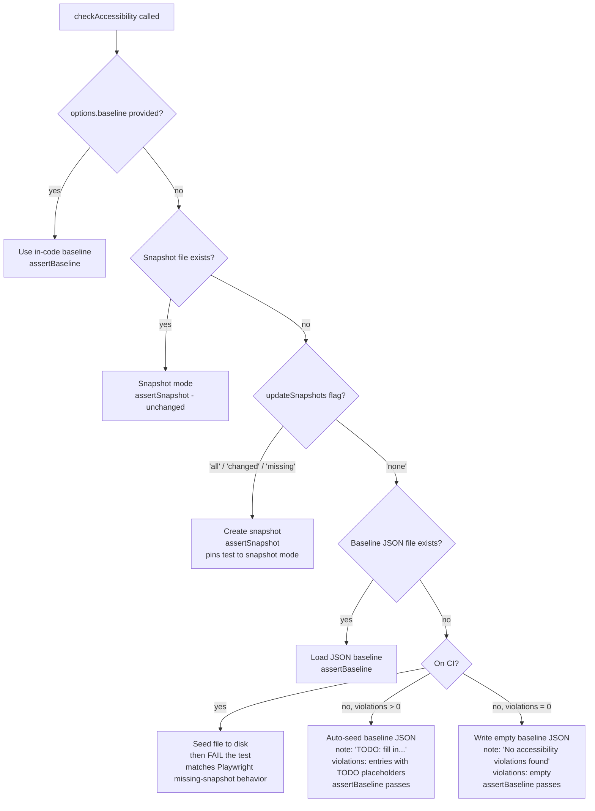
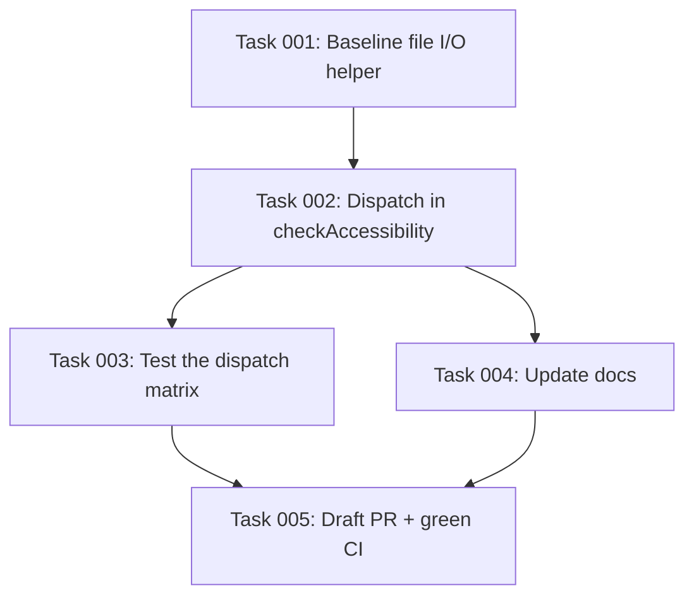

# Plan: Default New A11y Tests to Baseline Mode, Preserve Snapshot Mode for Existing Tests

## Original Work Order
> Implement this: The new baseline allowlist is strictly opt-in — passing a baseline option to checkAccessibility() (or a11y.check()) switches to the new mode, otherwise toMatchSnapshot() runs as before (src/util/accessible-screenshot.ts:164-169).
>
> This means your stated ideal is not the current behaviour. Today:
> - Existing tests: unchanged (good).
> - New tests with a11y errors: also default to snapshot mode, not the new baseline flow.
>
> To get your desired behaviour (new tests → baseline, existing tests → snapshot), the default would need to flip to baseline mode when no snapshot file exists yet, while continuing to honor existing snapshots.

## Plan Clarifications

| Question | Answer |
|---|---|
| How to decide between snapshot and baseline when no `baseline` option is passed? | By snapshot-file existence on disk. |
| What happens on a brand-new test in the new default with violations present? | Auto-seed a baseline file on first run. |
| How does `--update-snapshots` behave when no snapshot exists? | It still creates a snapshot (preserves Playwright behavior, giving users an explicit opt-in to snapshot mode for new tests). |
| Where do auto-seeded baseline files live? | Alongside snapshots, using Playwright's `testInfo.snapshotPath()` convention. |
| How are `reason` and `willBeFixedIn` populated when auto-seeding? | Placeholder values (e.g. `TODO`) — first run passes, authors fill in later. |
| Should the baseline JSON file be per-browser/platform (like snapshots)? | **No — one shared file per test.** Axe results are deterministic across browsers, so a single file simplifies review and avoids near-duplicate files. |
| Which `testInfo.config.updateSnapshots` values route a snapshotless test into snapshot-mode creation? | **`all`, `changed`, and `missing`.** Only `none` leaves the test in baseline mode. This matches Playwright's default when `--update-snapshots` is passed without a value. |
| Does the new default apply to the best-practice scan as well, or WCAG only? | **Both scans.** Best-practice scan also gets the baseline-or-snapshot dispatch so behavior is consistent. |
| What gets written when a snapshotless test runs and has zero violations? | An empty baseline file in the new object schema: `{ "note": "No accessibility violations found", "violations": [] }`. This gives reviewers an explicit "clean" artifact and makes later-introduced violations fail loudly as unmatched. |
| What schema should the on-disk baseline file use? | An **object** wrapper: `{ "note": string, "violations": AccessibilityBaselineEntry[] }`. Clean runs get a human-readable "No accessibility violations found" note; seeded runs get a note pointing authors at the `TODO` placeholders. |
| What should happen on CI when a test would auto-seed? | **Seed and fail**, matching Playwright's own default behavior for a missing visual snapshot: write the file so it's downloadable from the CI artifacts, and fail the test with a clear message telling the author to commit it. Applies whether the seed is clean (zero violations) or contains TODO entries. |
| How are multiple `checkAccessibility()` calls within a single test named? | **Counter per call**, 1:1 with Playwright's snapshot counter: `test-name-1.a11y-baseline.json`, `test-name-2.a11y-baseline.json`, etc., matching `test-name-1-<browser>-<platform>.txt` / `test-name-2-...`. |

## Executive Summary

Today, `checkAccessibility()` defaults to `toMatchSnapshot()` for WCAG violations and only switches to the new baseline allowlist when a `baseline` option is explicitly passed. As a result, brand-new tests that happen to have accessibility violations silently land in the older snapshot flow rather than the richer baseline flow (which tracks per-violation `reason` / `willBeFixedIn` metadata and reports stale or unmatched entries clearly).

This plan changes the default selection so that the choice between snapshot mode and baseline mode is driven by whether a snapshot file already exists on disk for the test. Existing tests, which by definition have a committed snapshot, keep using snapshot mode with no behavior change. Tests that have no snapshot (new tests, or existing tests where the snapshot was deleted) default to baseline mode, auto-seeding a baseline JSON file alongside the snapshot on first run with placeholder `reason` / `willBeFixedIn` values. Developers still opt into snapshot mode for a new test the normal Playwright way — by running once with `--update-snapshots`, which will continue to generate a snapshot file and from then on pin the test to snapshot mode.

The approach is backwards compatible for all tests currently committed and their snapshots, preserves the explicit `baseline` option as the highest-priority signal, and steers new accessibility work toward the baseline flow without requiring any per-test opt-in.

## Context

### Current State vs Target State

| Current State | Target State | Why? |
|---|---|---|
| `checkAccessibility()` defaults to `assertSnapshot()` whenever `baseline` option is absent (`src/util/accessible-screenshot.ts:163-169`). | `checkAccessibility()` defaults to `assertSnapshot()` only when a snapshot file already exists (or `--update-snapshots` is in effect); otherwise it runs `assertBaseline()`. | We want new tests to adopt the richer baseline workflow without breaking existing tests. |
| Brand-new tests with violations go through snapshot comparison and attach `a11y-baseline-suggestions` but still pass via `toMatchSnapshot()`. | Brand-new tests with violations write an auto-seeded baseline JSON file on first run (analogous to how Playwright writes a new snapshot), producing a structured, committable baseline. | Baseline mode yields better signal (stale-entry reporting, per-entry metadata, unmatched-only failures). |
| Only source of baseline data is the in-code `defineAccessibilityBaseline()` array passed via `options.baseline`. | An additional source: a JSON baseline file on disk, colocated with the snapshot, loaded automatically when no explicit `baseline` option is passed. | Enables auto-seeding and keeps baselines versioned next to the tests that use them. |
| `reason` and `willBeFixedIn` are required fields enforced for in-code baselines. | Auto-seeded JSON entries contain placeholder `TODO` values and are accepted by the matcher; surfaced to the developer via an annotation so the fields get filled in. | Allows a green first run while preserving accountability. |
| Explicit `options.baseline` fully controls mode selection. | Explicit `options.baseline` still wins — if provided, it's used and the on-disk JSON is ignored. | Preserves the current API contract for consumers who pass baselines in code. |
| Only the WCAG scan is affected by the new dispatch; best-practice scan keeps `toMatchSnapshot()` unconditionally. | Best-practice scan uses the same dispatch (with its own baseline file), so both scans behave consistently. | Avoids confusing mixed behavior where one scan auto-seeds and the other demands `--update-snapshots`. |
| Snapshots are always per-browser/platform; nothing else is colocated. | A single shared `*.a11y-baseline.json` (and `*.a11y-baseline-best-practice.json`) per test, stored in the `-snapshots/` directory without a browser/platform suffix. | Axe results are deterministic across browsers; one file per test minimizes review churn. |
| Baseline file on disk = plain array, matching in-code `AccessibilityBaseline` exactly. | Baseline file on disk = `{ note: string, violations: AccessibilityBaselineEntry[] }`. In-code API is unchanged. | The `note` makes clean-state files self-documenting and gives authors a built-in nudge to replace `TODO` placeholders. |

### Background

The baseline allowlist was introduced in commit `37cd52e` (`feat: add baseline allowlist and a11y fixture helper`). Its design anticipated per-test, in-code baselines via `defineAccessibilityBaseline()`. In practice, the snapshot-mode default is noisier for new tests and doesn't capture the "why we're accepting this violation" metadata that the baseline flow was built to collect.

The change is intentionally scoped: we are not deprecating snapshot mode, not changing any existing snapshot, and not modifying the in-code `baseline` API. The behavioural change is a single decision point inside `checkAccessibility()` plus a small amount of I/O (reading/writing a sibling baseline JSON). Playwright already exposes `testInfo.snapshotPath()` and a way to detect `--update-snapshots` (`testInfo.config.updateSnapshots`), so both "does a snapshot exist?" and "should we write one?" can be answered without reaching outside the test runner.

## Architectural Approach

The change centers on a single dispatch in `checkAccessibility()`. Instead of `if (baseline) baseline-mode else snapshot-mode`, we introduce a three-way decision based on explicit option, on-disk snapshot presence, and Playwright's update-snapshots flag. A small on-disk baseline file, colocated with snapshots, gives baseline mode a persistent home when no in-code baseline is supplied.

### Mode Dispatch in `checkAccessibility`
**Objective**: Replace the current binary `baseline ? baseline-mode : snapshot-mode` branch with the three-way decision above while keeping each branch's downstream behavior stable.

The dispatch lives in `src/util/accessible-screenshot.ts` at the current `if (baseline) ... return assertSnapshot(...)` block. The new logic computes:

1. Whether an explicit `options.baseline` was provided — highest priority, preserves today's API.
2. Whether the WCAG snapshot file for this test exists on disk — resolved via `testInfo.snapshotPath()` and a filesystem existence check.
3. Whether Playwright is in snapshot-update mode — read from `testInfo.config.updateSnapshots` (the value Playwright uses when `--update-snapshots` is set).
4. Whether an on-disk baseline JSON file exists for this test.

The branch chosen governs which assertion helper runs (`assertSnapshot` vs `assertBaseline`) and, in the auto-seed case, whether a baseline JSON is written before the assertion.

### On-Disk Baseline File Format and Location
**Objective**: Define a minimal, human-readable, committable JSON format for baselines that mirrors the in-code `AccessibilityBaseline` shape.

- **Location**: Colocated with the WCAG snapshot but **not** dimensioned by browser/platform. Playwright stores snapshots like `foo.spec.ts-snapshots/test-name-1-chromium-linux.txt`; the baseline file lives in the same `-snapshots/` directory with a projectless name `test-name-1.a11y-baseline.json`. The `1` is Playwright's auto-incrementing per-test snapshot counter; a test that calls `checkAccessibility()` twice produces `test-name-1.a11y-baseline.json` and `test-name-2.a11y-baseline.json`, pairing 1:1 with the corresponding `test-name-N-<browser>-<platform>.txt` snapshot files. Best-practice files follow the same pattern with a `-best-practice` suffix. The filename is derived deterministically from the same snapshot identifier `assertSnapshot` already uses, with the `-<browser>-<platform>` suffix stripped and the extension swapped. Because axe results are deterministic across Chromium/Firefox/WebKit, this produces one file per call per test across all browser projects rather than N copies.
- **Schema**: A JSON **object** with two fields:
  - `note` (string): a human-readable summary. Set to `"No accessibility violations found"` on a clean seed and to something like `"TODO: fill in reason and willBeFixedIn for each entry"` on a seed with violations.
  - `violations` (array): zero or more `AccessibilityBaselineEntry` objects (`rule`, `targets`, `reason`, `willBeFixedIn`). This mirrors what `defineAccessibilityBaseline()` accepts in-code.
- **Loading**: When `options.baseline` is absent and we enter baseline mode, the helper reads the file (if present), parses its `violations` array, and passes those entries to `assertBaseline()` exactly as the in-code path does. The `note` field is informational only and is ignored by the matcher.
- **In-code baseline API**: `defineAccessibilityBaseline()` continues to accept and return an array (unchanged) — the object wrapper is an on-disk concern only. This keeps the TS API stable.

### Auto-Seeding on First Run
**Objective**: Make a brand-new test pass on first execution while still producing a committable artifact that captures its current state — whether clean or with violations.

When the decision tree reaches the "no snapshot, no JSON baseline, `updateSnapshots === 'none'`" leaf:

1. Extract normalized violations from the WCAG scan (the helper `extractNormalizedViolations` already exists).
2. If **zero violations**, prepare a clean-state payload: `{ "note": "No accessibility violations found", "violations": [] }`.
3. If **one or more violations**, build entries with placeholder `reason: 'TODO'` and `willBeFixedIn: 'TODO'`, wrap them as `{ "note": "TODO: fill in reason and willBeFixedIn for each entry before committing.", "violations": [...] }`.
4. Write the file to the computed path, creating any missing parent directory. Use `fs.writeFile` with `flag: 'wx'` so concurrent workers seeding the same path can't clobber each other.
5. **Decide pass vs. fail based on environment** — see "CI vs. Local Behavior" below.
6. Push a `testInfo.annotations` entry ("Auto-seeded a11y baseline — review the file and fill in reason / willBeFixedIn before committing") whenever the file contains at least one placeholder value.

The seeding path is gated so it only runs when the file doesn't already exist, avoiding any risk of overwriting a hand-curated baseline. On subsequent runs the file is loaded normally: a newly introduced violation is unmatched against either an empty or a partially populated `violations` array and fails the test — giving correct regression signal in both clean-seed and violation-seed cases.

### CI vs. Local Behavior
**Objective**: Match Playwright's own default for missing visual snapshots — write the artifact and fail the test — so that a11y regressions cannot slip through CI by way of silent re-seeding on every ephemeral checkout.

- **Local (`!process.env.CI`)**: seed the file as described above and let `assertBaseline()` run. The first run writes the file and passes; subsequent runs load the file and enforce it. Matches Playwright's local ergonomics for a missing snapshot.
- **CI (`process.env.CI` set)**: seed the file (so it's downloadable from CI artifacts/the test output directory) *and* fail the test with a message such as `A11y baseline file was missing. Seeded to <path> — download from CI artifacts or run locally and commit the file.` This mirrors the user-visible behavior Playwright gives for a missing visual snapshot on CI: the artifact is produced for convenience, but the test fails so the missing baseline cannot go unnoticed.
- Attach the seeded file to `testInfo` via `testInfo.attach()` on CI so it's always reachable from the HTML/trace report, even if the workspace is torn down immediately.
- This behavior is symmetric for the WCAG and best-practice scans.

### Interaction with `--update-snapshots`
**Objective**: Preserve Playwright's standard update-snapshots ergonomics so teams have a well-known way to put a new test into snapshot mode instead of baseline mode.

Playwright's `testInfo.config.updateSnapshots` takes one of four values: `'all'`, `'changed'`, `'missing'`, `'none'`. The dispatch treats **`all`, `changed`, and `missing`** as "snapshot-creating" modes — any of them, combined with a missing snapshot file, routes the test to `assertSnapshot()` and lets Playwright write the snapshot. Only `'none'` (the default when no update-snapshots flag is passed) routes to baseline mode. `'missing'` is included because it's Playwright's default value when `--update-snapshots` is passed bare, and users running that flag almost certainly intend to seed missing snapshots.

For tests already in snapshot mode, `--update-snapshots` continues to work exactly as today. If no snapshot exists but a JSON baseline already exists and `updateSnapshots !== 'none'`, snapshot generation still wins; this "I want to migrate from baseline to snapshot" edge case is acceptable and documented.

### Attachments and Annotations
**Objective**: Keep existing telemetry sensible across the two modes.

- `a11y-baseline-suggestions` attachment: still produced by snapshot mode as today (unchanged).
- Baseline mode stale/unmatched annotations: unchanged.
- New annotation on auto-seed: a single human-readable entry pointing at the placeholder `TODO` fields in the newly written file.
- Existing `@a11y` annotation and WCAG summary annotations remain untouched.

### Best-Practice Scan Parity
**Objective**: Apply the same dispatch to the best-practice scan so both scans behave consistently.

Today the best-practice scan calls `expect.soft(violationFingerprints(results)).toMatchSnapshot()` directly inside `runBestPracticeScan`. As part of this change, extract the assertion into its own helper and apply the same three-way dispatch (explicit `baseline` > snapshot-exists > `updateSnapshots !== 'none'` > baseline with auto-seed). Two details specific to the best-practice scan:

- **Soft-vs-hard semantics are preserved.** Best-practice scan uses `expect.soft()` by default (when `bestPracticeMode === 'soft'`) so the WCAG scan still runs. The baseline-mode assertion for the best-practice scan uses the same soft-vs-hard behavior as today, driven by `bestPracticeMode`.
- **Separate on-disk baseline file.** The best-practice baseline is stored next to the WCAG baseline but with a distinct suffix (e.g. `test-name-1.a11y-baseline-best-practice.json`) so the two scans don't collide.

This keeps the two scans coherent: a test with no snapshots at all gets one WCAG baseline and one best-practice baseline seeded on first run; a test already using snapshots for one or both scans keeps those snapshots untouched.

### Fixture Helper (`a11y.check`)
**Objective**: Ensure the fixture helper inherits the new default transparently.

The `a11y.check(options?)` fixture currently forwards to `checkAccessibility()` with the provided options. Because the new dispatch lives inside `checkAccessibility()`, the fixture surface does not change — users of `a11y.check()` receive the new default automatically, and explicit `baseline` passed through the fixture continues to win.

### Tests
**Objective**: Cover the new dispatch exhaustively.

Unit / integration tests will cover:

- Existing tests with a snapshot file present → snapshot mode used, JSON baseline ignored.
- New tests with no snapshot and no JSON, violations present, **local** run → JSON auto-seeded as `{ note: "TODO: ...", violations: [...] }`, test passes, annotation emitted.
- New tests with no snapshot and no JSON, **zero violations**, **local** run → JSON auto-seeded as `{ note: "No accessibility violations found", violations: [] }`, test passes.
- New tests with no snapshot and no JSON, **on CI** (`process.env.CI`) → file is seeded, `testInfo.attach()` captures it, test FAILS with a directive to commit the seeded file.
- A subsequent run of a clean-seeded test that now has violations → unmatched against empty `violations`, test fails. (Regression-signal guarantee.)
- New tests with no snapshot but an existing JSON → JSON loaded and matched; unmatched violations fail; stale entries reported.
- New tests run with `updateSnapshots` = `all` / `changed` / `missing` → snapshot created, no JSON written.
- New tests with `updateSnapshots = 'none'` → baseline mode, no snapshot written.
- Explicit `options.baseline` provided → takes precedence regardless of on-disk state.
- **Multi-call tests**: a single test that calls `checkAccessibility()` twice produces two distinct baseline files (`…-1.a11y-baseline.json`, `…-2.a11y-baseline.json`), matched 1:1 with the snapshot counter.
- Best-practice scan parity: all of the above also apply to the best-practice scan, using its own baseline file.
- Single-file-per-test assertion: running the same test across chromium + firefox projects produces exactly one `.a11y-baseline.json` per call (plus one best-practice file), not one per project.
- Regression coverage: existing snapshot-mode tests and existing in-code-baseline tests behave identically to before.

## Risk Considerations and Mitigation Strategies

Technical Risks

- **Snapshot-path resolution differs across Playwright versions**: `testInfo.snapshotPath()` API shape has evolved; we need a stable way to compute the expected WCAG-snapshot path.
    - **Mitigation**: Reuse the same arguments/snapshot name that `expect(...).toMatchSnapshot()` already uses in `assertSnapshot`; derive the baseline file path from that single source of truth so they can't drift.
- **False "snapshot missing" on CI due to working-dir or sharding quirks**: If the existence check runs before snapshots are fetched or with a wrong cwd, we may accidentally auto-seed.
    - **Mitigation**: Use the absolute path returned by Playwright's snapshot APIs rather than a relative path; add a test that simulates a non-default `testDir`.
- **Race conditions writing the JSON under parallel workers**: Two workers could both attempt to seed the same file.
    - **Mitigation**: Playwright's per-test snapshot path is unique per test, so concurrent writes to the same path would only occur if the same test runs twice in parallel (not the default). Write using `fs.writeFile` with `flag: 'wx'` so a second writer no-ops gracefully.

Implementation Risks

- **Hidden regressions in mode-detection logic**: A wrong-branch decision silently changes a test's assertion behavior.
    - **Mitigation**: Cover all four dispatch branches with explicit integration tests before landing; add a debug annotation (gated behind an env var) that prints which branch was taken.
- **Developers commit the auto-seeded JSON with placeholder `TODO` values and never revisit**: accountability erodes.
    - **Mitigation**: Emit a clear annotation on every run where placeholders are still present, and document the convention in the README/AGENTS docs. (No hard block — that would defeat the point of the placeholder.)

Operational Risks

- **CI auto-seed silently passing**: Without the CI fail-on-seed behavior, every CI run of a new test would re-seed an ephemeral baseline and pass, hiding regressions.
    - **Mitigation**: Implemented as part of the dispatch — on CI, seed-and-fail with a clear message, matching Playwright's missing-snapshot behavior. Covered by a dedicated integration test that sets `CI=1` and asserts the test fails while the file is written and attached.
- **Multiple `checkAccessibility()` calls in a single test create orphan baseline files when tests are renamed or re-ordered**: The per-call counter is positional, so reordering calls produces mismatched files.
    - **Mitigation**: This is the same failure mode Playwright's positional snapshot counter has; documented in the README so authors know to re-seed when they re-order. Stale-entry annotations from `assertBaseline()` also surface orphans at runtime.

Integration Risks

- **In-repo consumers relying on snapshot-mode suggestions attachment for new tests**: Teams that expected snapshot mode on a test without a committed snapshot will now get baseline mode.
    - **Mitigation**: Document the change prominently in release notes; the opt-out is simply running once with `--update-snapshots`.
- **Explicit `baseline` users expect baseline file on disk to be irrelevant**: Make sure the on-disk JSON is only considered when `options.baseline` is absent.
    - **Mitigation**: Dispatch order explicitly gives the in-code `baseline` option priority, and this is covered by a dedicated test.

## Success Criteria

### Primary Success Criteria
1. With no changes to a test that already has a committed WCAG snapshot, `checkAccessibility()` continues to run `toMatchSnapshot()` and produces byte-identical snapshot assertions as before.
2. A brand-new test calling `checkAccessibility()` with violations and no snapshot, run **locally**, passes on first run, and a committable JSON baseline file appears alongside where its snapshot would have been, containing one entry per detected violation with `reason` and `willBeFixedIn` set to placeholder values. When the same run happens on **CI**, the file is still written (and attached to the test report), but the test fails with a message directing the author to commit it — mirroring Playwright's default behavior for a missing visual snapshot.
3. A second run of that same new test (without re-seeding) loads the JSON baseline, matches all pre-existing violations, and fails only if a new, unbaselined violation appears.
4. Running a new test once with `--update-snapshots` creates a WCAG snapshot as today, no JSON baseline is written, and subsequent runs use snapshot mode.
5. Supplying an explicit `baseline` option to `checkAccessibility()` or `a11y.check()` behaves exactly as it does today, regardless of any on-disk JSON baseline.
6. The work is pushed on a feature branch and a **draft pull request** is opened against `main` describing the behavioral change.
7. All CI jobs on the draft PR pass (lint, type-check, unit tests, integration/a11y tests, docs build, and any other required checks).

## Documentation

- Update the project README/docs section on accessibility testing to describe the new default, the JSON baseline file convention, and the `--update-snapshots` opt-out for snapshot mode.
- Update `AGENTS.md` (and any `.claude/skills/*` entries covering a11y testing) so assistants know that running `a11y.check()` on a new test produces a JSON baseline that must be reviewed and have its `TODO` placeholders filled in before commit.
- Add a short changelog entry describing the behavioral change and its backwards compatibility story.

## Resource Requirements

### Development Skills
- TypeScript, Playwright test APIs (`testInfo.snapshotPath`, `testInfo.config.updateSnapshots`, `testInfo.annotations`, `testInfo.attach`), and familiarity with axe-core result shapes.
- Node filesystem APIs for the read/write of the baseline JSON.

### Technical Infrastructure
- Existing repo tooling is sufficient: `ddev exec` for Playwright runs, the existing unit-test setup for the `src/util/` helpers, and the existing integration-test harness that already exercises `checkAccessibility` in both modes.

## Delivery

The work ships via a feature branch and a **draft pull request** against `main`. Before marking the plan complete:

- Push the branch and open a draft PR with a summary of the behavioral change, the migration story (existing snapshots unchanged, new tests auto-seed JSON baselines, `--update-snapshots` opts into snapshot mode), and a short test plan.
- Ensure all required CI checks on the PR are green (lint, type-check, unit tests, integration/a11y tests, docs build, and any other required status checks). Do not mark the PR ready-for-review as part of this plan — leaving it as draft is the terminal state.

## Integration Strategy

The change is additive: it introduces a new dispatch branch and a new optional on-disk file but leaves every existing code path reachable. Consumers need no migration; existing tests keep their snapshots and existing `defineAccessibilityBaseline()` usage continues to win over on-disk state. Opt-out to snapshot mode on a new test is the already-known Playwright gesture (`--update-snapshots`).

## Notes

### Decision Log

- **Baseline file is per-test, not per-browser/project.** Axe-core results are deterministic across browsers, so dimensioning the file the way Playwright dimensions snapshots would create near-duplicate artifacts and review churn for no benefit.
- **On-disk schema is an object, not a bare array.** The `note` field gives clean-state files a self-documenting marker and gives seeded-with-TODOs files a visible prompt for authors. The in-code `defineAccessibilityBaseline()` API is left as an array to avoid a breaking change; the wrapper is an on-disk concern only.
- **`updateSnapshots === 'none'` is the only baseline-routing value.** `'all'`, `'changed'`, and `'missing'` all mean "create snapshots as Playwright normally would"; only the explicit no-update mode lets baseline dispatch run.
- **Best-practice scan participates.** Applying the new default to only the WCAG scan would leave an inconsistent seam where one scan auto-seeds and the other requires `--update-snapshots`. Both scans now share the dispatch, each with its own baseline file.
- **Clean-state artifact is written.** Writing nothing would mean a later-introduced violation gets silently auto-baselined with `TODO` placeholders. Writing an empty `violations: []` makes the second-run regression fail correctly.
- **CI seeds but fails.** If CI auto-seeded and passed (the naive behavior), every CI run of a new test would silently re-seed against a fresh checkout and never surface the violations. Seeding-and-failing on CI mirrors Playwright's own default for missing visual snapshots and keeps regression signal intact.
- **Multi-call baseline files use the snapshot counter.** Requiring an explicit per-call name would push boilerplate onto every test; reusing Playwright's existing counter keeps 1:1 parity with snapshot files and the existing mental model.

### Change Log

- 2026-04-14: Plan created.
- 2026-04-14: Added delivery requirement (draft PR + green CI).
- 2026-04-14: Refinement round — clarified baseline-file dimensionality (one shared file per test), `updateSnapshots` dispatch values (`all`/`changed`/`missing` → snapshot), scope (best-practice scan now included), zero-violation seed behavior (empty file written), and on-disk schema (object wrapper with `note` field). Updated the dispatch flowchart and assertion helpers to match; added a dedicated "Best-Practice Scan Parity" section.
- 2026-04-14: Second refinement round — added explicit **CI vs. local** behavior (CI seeds the file, attaches it, and fails the test to match Playwright's default for missing visual snapshots); clarified **multi-call** baseline naming (per-call counter, 1:1 with Playwright's snapshot counter, e.g. `test-name-1.a11y-baseline.json`, `test-name-2…`). Updated flowchart, test matrix, success criteria, and added an "Operational Risks" section.
- 2026-04-14: Tasks generated and execution blueprint appended.

## Execution Blueprint

**Validation Gates:**
- Reference: `.ai/task-manager/config/hooks/POST_PHASE.md`

### Dependency Diagram

### Phase 1: Foundations
**Parallel Tasks:**
- Task 001: Create on-disk baseline file I/O helper

### Phase 2: Core Dispatch
**Parallel Tasks:**
- Task 002: Implement three-way dispatch in `checkAccessibility` (WCAG + best-practice) with CI vs local behaviour (depends on: 001)

### Phase 3: Verify & Document
**Parallel Tasks:**
- Task 003: Cover the new dispatch matrix with meaningful tests (depends on: 002)
- Task 004: Update README, AGENTS, and Claude skill docs (depends on: 002)

### Phase 4: Delivery
**Parallel Tasks:**
- Task 005: Push branch, open draft PR, confirm CI passes (depends on: 003, 004)

### Execution Summary
- Total Phases: 4
- Total Tasks: 5
- Maximum Parallelism: 2 tasks (in Phase 3)
- Critical Path Length: 4 phases
