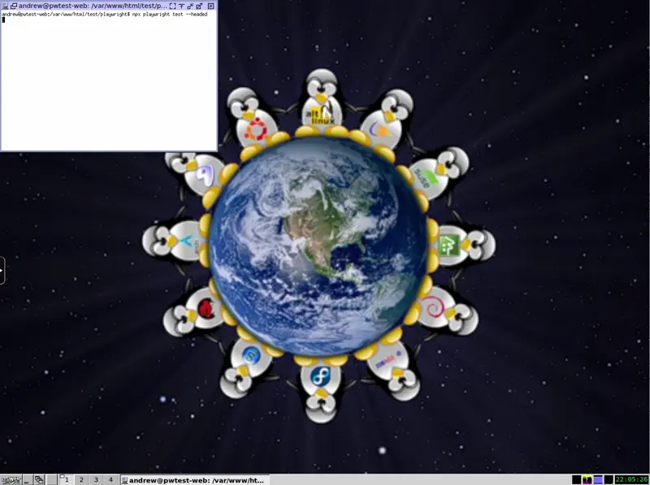

# Playwright in Drupal (in DDEV)



This project, building on [deviantintegral/ddev-playwright](https://github.com/deviantintegral/ddev-playwright), enables full support for Playwright testing of Drupal websites.

1. Supports fast parallel tests by installing sites into sqlite databases.
2. Enables Playwright tests to run Drush commands against a test site.
3. Shows browser console errors during the test.
4. Attaches PHP's error log to the Playwright test results.

<!-- START doctoc generated TOC please keep comment here to allow auto update -->
<!-- DON'T EDIT THIS SECTION, INSTEAD RE-RUN doctoc TO UPDATE -->
**Table of Contents**  *generated with [DocToc](https://github.com/thlorenz/doctoc)*

- [Requirements](#requirements)
- [How This Works](#how-this-works)
- [Getting Started](#getting-started)
  - [Create the Drupal Site and Initialize DDEV](#create-the-drupal-site-and-initialize-ddev)
  - [Initialize Playwright Tests](#initialize-playwright-tests)
  - [Install Playwright Dependencies](#install-playwright-dependencies)
  - [Check Playwright Works](#check-playwright-works)
  - [Add the playwright-drupal Integration](#add-the-playwright-drupal-integration)
  - [Configure Playwright](#configure-playwright)
  - [Ignore playwright-drupal from Git](#ignore-playwright-drupal-from-git)
  - [Create Taskfile.yml](#create-taskfileyml)
  - [Add Playwright to Drupal's Settings](#add-playwright-to-drupals-settings)
  - [Create and Run an Example Drupal Test](#create-and-run-an-example-drupal-test)
- [Writing Tests](#writing-tests)
- [Visual Comparisons (Diffs)](#visual-comparisons-diffs)
  - [Visual Comparisons for Static Content](#visual-comparisons-for-static-content)
  - [Including the Visual Comparison Drupal database as a fixture](#including-the-visual-comparison-drupal-database-as-a-fixture)
  - [Replacing the test case with your own](#replacing-the-test-case-with-your-own)
- [Replacing the Standard Profile With Your Own](#replacing-the-standard-profile-with-your-own)
- [Running Drush in Tests](#running-drush-in-tests)
- [Running Tests Without Isolation](#running-tests-without-isolation)

<!-- END doctoc generated TOC please keep comment here to allow auto update -->

## Requirements

- The Drupal site must be using DDEV for development environments.
- The Drupal site is meant to be tested after a site install, like how Drupal core tests work.
- The Playwright tests must be using `npm` as their package manager.
  - PRs supporting yarn are welcome! It's unclear at this moment how we could integrate yarn packages into the separate directory Playwright requires for test libraries.
- Playwright tests will be written in TypeScript.

## How This Works

- This library includes an extended version of Playwright's `test` function that sets up and tears down isolated Drupal sites.
- We use Playwright's concept of "packages" to allow for a npm dependency to export a test function.
- Test requests from the web browser are directed to the right database though `settings.php` additions.
- `drush-playwright` does its own bootstrap to route drush commands to the right site.
- We use [Task](https://taskfile.dev) as a task runner to install Drupal and set up the tests. This allows developers to easily run individual components of the test setup and teardown without having to step through JavaScript, or reuse them in other non-testing scenarios.
- While as of this writing (March 2024) this is new code, a nearly identical version of this has been running on a real-world project for over a year.

## Getting Started

Integrating this library into a site takes several steps. For the sake of completeness, these steps start as if you are starting a brand-new Drupal site.

### Create the Drupal Site and Initialize DDEV

```console
composer create-project drupal/recommended-project pwtest
composer require drush/drush
cd pwtest
ddev config --project-type drupal10
ddev get deviantintegral/ddev-playwright
ddev start
```

### Initialize Playwright Tests

```console
mkdir -p test/playwright
ddev exec -- npx create-playwright@latest --lang=TypeScript --quiet test/playwright --no-browsers
```

### Install Playwright Dependencies

This command will build a web image that contains the browsers we omitted above. Building this way allows for much faster startup times for environments that don't need Playwright, and also allows for caching of large downloads.

```console
ddev install-playwright
```

### Check Playwright Works

Before going further, make sure Playwright can run a sample test against https://playwright.dev.

```console
ddev exec -d /var/www/html/test/playwright npx playwright test
```

### Add the playwright-drupal Integration

```console
ddev exec -d /var/www/html/test/playwright npm i playwright-drupal
```

```console
# Or, to pull from GitHub's main branch:
ddev exec -d /var/www/html/test/playwright npm i playwright-drupal@github:deviantintegral/playwright-drupal
```

### Configure Playwright

Set the following in `test/playwright/tsconfig.json`, merging with any existing configuration:

```json
{
  "compilerOptions": {
    "noEmit": true,
    "baseUrl": ".",
    "paths": {
      "@packages/playwright-drupal": ["./packages/playwright-drupal"]
    }
  },
  "include": [
    "tests/**/*.ts"
  ]
}
```

Add the following `globalSetup` and `use` line to the `defineConfig` section in `test/playwright/playwright.config.ts`:
```typescript
export default defineConfig({
  globalSetup: require.resolve('./node_modules/playwright-drupal/lib/setup/global-setup'),
  baseURL: process.env.DDEV_PRIMARY_URL,
  use: {
    ignoreHTTPSErrors: true,
  }
})
```

### Ignore playwright-drupal from Git

We have to copy the library outside the `node_modules` directory for Playwright to work correctly. Ignore this directory from git, since it's effectively a npm package:

```console
echo './packages/playwright-drupal' >> test/playwright/.gitignore
```

### Create Taskfile.yml

In the root of your project, create `Taskfile.yml`:

```yaml
version: '3'
silent: true
includes:
  playwright:
    taskfile: test/playwright/node_modules/playwright-drupal/tasks/playwright.yml
    optional: true
```

### Add Playwright to Drupal's Settings

Add the following line to `web/sites/default/settings.php`:

```php
include '../test/playwright/node_modules/playwright-drupal/settings/settings.playwright.php';
```

### Create and Run an Example Drupal Test

Copy the following to `test/playwright/tests/example.drupal.spec.ts`.

```typescript
import { test, expect, execDrushInTestSite } from '@packages/playwright-drupal';

test('has title', async ({ page }) => {
  await page.goto('/');

  // Expect a title "to contain" a substring.
  await expect(page).toHaveTitle(/Playwright/);
});

// This tests proves parallel databases work by setting a random title for the
// first node created in the site.
test('proves parallel tests work', async ({ page }) => {
  await execDrushInTestSite('user:password admin "correct horse battery staple"');
  await page.goto('/user/login');
  const username = page.getByLabel('Username');
  const password = page.getByLabel('Password');
  const loginButton = page.getByRole('button', { name: 'Log in' });
  await username.fill('admin');
  await password.fill('correct horse battery staple');
  await loginButton.click();

  await page.goto('/node/add/article');

  let randomTitle = (Math.random() + 1).toString(36).substring(2);
  await page.getByLabel('Title', { exact: true }).fill(randomTitle);
  await page.getByRole('button', { name: 'Save' }).click();

  await expect(page.url()).toMatch('node/1')

  await expect(page).toHaveTitle(`${randomTitle} | Playwright`);
  await expect(page.locator('h1')).toHaveText(randomTitle);
});
```

Run the test with:

```console
ddev playwright test
```

```console
# Or you can run inside the container with:
ddev ssh
cd test/playwright
npx playwright test
```

You should see output similar to this. If you see JavaScript browser console errors, those are likely Drupal core bugs to investigate and report.

```console
$ ddev playwright test
Task playwright:install:hook does not exist. Running drush site:install --yes...
 You are about to:
 * CREATE the '/tmp/sqlite/.ht.sqlite' database.

 // Do you want to continue?: yes.

 [notice] Starting Drupal installation. This takes a while.
 [notice] Performed install task: install_select_language
 [notice] Performed install task: install_select_profile
 [notice] Performed install task: install_load_profile
 [notice] Performed install task: install_verify_requirements
 [notice] Performed install task: install_verify_database_ready
 [notice] Performed install task: install_base_system
 [notice] Performed install task: install_bootstrap_full
 [notice] Performed install task: install_profile_modules
 [notice] Performed install task: install_profile_themes
 [notice] Performed install task: install_install_profile
 [notice] Performed install task: install_configure_form
 [notice] Performed install task: install_finished
 [success] Installation complete.  User name: admin  User password: ifVQZgGpRK

Running 6 tests using 4 workers

  ✓  1 [chromium] › example.spec.ts:3:5 › has title (1.9s)
     2 [firefox] › example.spec.ts:3:5 › has title
  ✓  2 [firefox] › example.spec.ts:3:5 › has title (2.4s)
  ✓  3 [chromium] › example.spec.ts:12:5 › proves parallel tests work (4.2s)
  ✓  4 [firefox] › example.spec.ts:12:5 › proves parallel tests work (4.5s)
  ✓  5 [webkit] › example.spec.ts:3:5 › has title (1.6s)

 [success] Changed password for admin.


 [success] Changed password for admin.

  ✓  6 [webkit] › example.spec.ts:12:5 › proves parallel tests work (2.8s)

 [success] Changed password for admin.


  6 passed (9.9s)

To open last HTML report run:

  npx playwright show-report
```

You're now ready for the hard part - writing tests for your own application! 🙌

## Writing Tests

The important part of writing a test is to use the Test class shipped with this library (that extends Playwright's normal Test class):

```typescript
import { test, expect } from '@packages/playwright-drupal';
```

This will trigger the setup and teardown of the separate Drupal site.

If you have a test that you don't want to run this way, import test and expect from `@playwright/test` as normal.

## Visual Comparisons (Diffs)

Playwright Visual Comparisons are a great way to add additional assertions to your tests. Since visual comparisons are integrated into the testing system, developers can compare all aspects of a site - including content forms or other authenticated content.

We've found that taking a screenshot for a visual comparison is a great point to check for accessibility issues. Unlike other steps in a test, a visual comparison is specifically declaring that the page is ready for human consumption.

The `takeAccessibleScreenshot()` method will:

1. Ensure that complex pages like node forms have time to stabilize before taking screenshots.
2. Handle browsers that have non-deterministic rendering of images (in particular, WebP) and allow for minute pixel differences in images that are not observable by a human.
3. Automatically trigger loading of all lazy-loaded images.
4. Automatically trigger loading of all lazy-loaded iframes.
5. Generate an accessibility report of the element being tested.

The accessibility reports save a JSON object with all accessibility failures. Commit these to your repository to mark those failures as ignored. Pages with no failures will generate a report with an empty array (`[]`).

### Visual Comparisons for Static Content

The above workflow is great for testing after creating or editing content. However, teams may also want visual comparisons purely of the front-end. In that case, there's no concurrency issues (every request can use the same Drupal database), and often the content itself comes from a test website whose database has been copied down.

The `VisualDiffTestCases` class scaffolds out support for this use case, including:

- The ability to define a configuration file of URLs to test.
- Grouping of related tests for better reporting.
- The ability to skip specific tests. This is useful when a test is added and later determined to be flaky.
- Links to related content, such as a link to a production URL similar to the tested content, or a ticket for fixing the underlying reason behind a skipped test.

To set up visual comparisons this way:

1. Create a file at `test/playwright/tests/visualdiff/urls.ts` to hold pages to compare. Here is an example using the Drupal Umami install profile.

```typescript
import { defineVisualDiffConfig } from '@packages/playwright-drupal';

export const config = defineVisualDiffConfig({
  name: "Umami Visual Diffs",
  description: "Execute a series of visual diffs against the Umami site.",
  groups: [
    {
      name: "Recipes",
      description: "Pages built using the Recipe content type.",
      // There isn't a stable link to a running copy of the Umami profile, but
      // imagine this goes to a production website.
      representativeUrl: "https://drupal.org/...",
      testCases: [
        {
          name: "TBD",
          path: "/asdf",
        },
        {
          name: "Alternate Recipe View",
          path: "/zzzz",
          skip: {
            reason: "The recipies are listed in random order",
            willBeFixedIn: "https://drupal.org/node/12345",
          }
        }
      ]
    }
  ],
});
```

2. Create a test file at `test/playwright/tests/visualdiff/visualdiffs.spec.ts`:

```typescript
import {config} from './urls';

config.describe();
```

3. Update the Playwright configuration to skip these tests in normal functional tests, and skip normal functional tests when running these tests.

For all existing tests, add `testIgnore` like so:

```typescript
{
  name: 'desktop chrome',
  testIgnore: '/visualdiffs/*',
  use: { ...devices['Desktop Chrome'] },
},
```

Then, add the following as projects to run the new visual diffs, editing as needed.

```typescript
{
  name: 'visualdiff-desktop',
  testMatch: '/visualdiff/*',
  use: { baseURL: "https://<MYPROJECT>.ddev.site/", ...devices['Desktop Chrome'] },
},
{
  name: 'visualdiff-tablet',
  testMatch: '/visualdiff/*',
  use: { baseURL: "https://<MYPROJECT>.ddev.site/", ...devices['Galaxy Tab S4'] },
},
{
  name: 'visualdiff-phone',
  testMatch: '/visualdiff/*',
  use: { baseURL: "https://<MYPROJECT>.ddev.site/", ...devices['Pixel 5'] },
},
```
Now, you can run just these tests with a command like:

```console
# Run all visual diff tests, using path matching.
ddev playwright test -- tests/visualdiff
```

```console
# Run all tests, but only at desktop.
ddev playwright --project 'visualdiff-desktop'
```

### Including the Visual Comparison Drupal database as a fixture

It's important that the database with the content is tied to version control somehow. Otherwise, changes to content will yield false failures and developer tears. Since every site is different, we don't automatically set this up in this project. However, if you are using [lullabot/drainpipe](https://github.com/lullabot/drainpipe), you likely already have much of this wired up. Otherwise, consider adding something like the following to the end of your `playwright:install:hook` task:

```yaml
# Now set up the Visual Comparison database.
unset PLAYWRIGHT_SETUP

# Remove any old databases from prior checkouts.
rm -f .private/databases/MYSITE-live_*_database.sql.gz

# Create the directory for first-runs.
mkdir -p ./private/databases

# Copy the database to the expected location before refreshing the site.
cp ./test/playwright/tests/visualdiff/fixtures/MYSITE-live_*_database.sql.gz ./private/databases/

# Restore the database, but don't download a new one, and don't enable
# development dependencies.
# "refresh" should be the command that imports the database, runs database
# updates, and so on.
task refresh site=@mysite no_fetch=1 production_mode=1

# Enable Stage File Proxy for images.
./vendor/bin/drush @mysite -y en stage_file_proxy
```

### Replacing the test case with your own

The describe() function can optionally take a replacement test function. This is useful if you need to mock HTTP responses or add other custom logic.

```typescript
visualdiffs.describe(async ({page, browserName}, defaultCallback) => {
  test.skip(browserName == 'firefox', 'Skip Firefox as we are trying to save CI budget.');
  defaultCallback(testCase, group)();
})
```
## Replacing the Standard Profile With Your Own

Out of the box, we can't know what setup steps your site needs to work correctly. To use your own steps, add a `playwright:install:hook` task to your Taskfile. This will be called with the right environment set so that the site is installed into sqlite (and not your normal ddev database). From here, run Drush commands or call other tasks as needed to install your site. To test this when developing, feel free to call `task playwright:install` without actually running tests.

## Running Drush in Tests

There's many good reasons to want to run Drush in a test. The above example sets a known password for an account so the test can log in. Other good reasons are to scaffold out test data, or turn on testing-related modules.

To run Drush during a test, use `execDrushInTestSite` as shown in the example test. This ensures that Drush bootstraps against the test site, and not the default site.

There may be times you want to run Drush once, globally before all tests. In that case, add a `playwright:install:hook` task to your Taskfile, and from there you can call Drush or anything else you may need to do during setup.

## Running Tests Without Isolation

There are times you may want to run Playwright without isolating test runs. Perhaps you're manually scaffolding test content by hand, before writing code to create it. Or perhaps you would like to be absolutely sure that a test passes or fails when running against mariadb.

To do this, run `export PLAYWRIGHT_NO_TEST_ISOLATION=1`. This **must** be done inside a ddev shell (via ddev ssh) and not `ddev playwright` or `ddev exec`. Consider running Playwright with `--workers=1` and with a single browser, since any changes to the database will persist.
