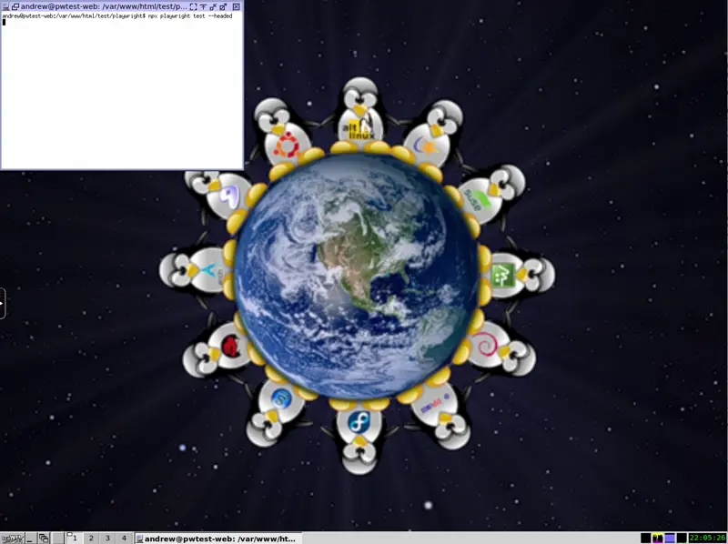

# Playwright in Drupal (in DDEV)

[](https://www.npmjs.com/package/@lullabot/playwright-drupal)
[](https://www.npmjs.com/package/@lullabot/playwright-drupal)
[](https://github.com/Lullabot/playwright-drupal/actions/workflows/test.yml)
[](https://github.com/Lullabot/playwright-drupal/blob/main/LICENSE)



This project, building on [lullabot/ddev-playwright](https://github.com/lullabot/ddev-playwright), enables full support for Playwright testing of Drupal websites.

1. Supports fast parallel tests by installing or importing sites into sqlite databases.
2. Enables Playwright tests to run Drush commands against a test site.
3. Shows browser console errors during the test.
4. Attaches PHP's error log to the Playwright test results.

## Requirements

- The Drupal site must be using DDEV for development environments.
- The Drupal site is meant to be tested after a site install or database import, like how Drupal core tests work.
- The Playwright tests must be using `npm` as their package manager, or creating an npm-like node_modules directory. It's unclear at this moment how we could integrate yarn packages into the separate directory Playwright requires for test libraries. PRs welcome!
- Playwright tests will be written in TypeScript.

## How This Works

- This library includes an extended version of Playwright's `test` function that sets up and tears down isolated Drupal sites. Each test gets its own copy of a base SQLite database, whether that database was created by a fresh site install or converted from an existing MySQL/MariaDB database.
- We use Playwright's concept of "packages" to allow for a npm dependency to export a test function.
- Test requests from the web browser are directed to the right database though `settings.php` additions.
- `drush-playwright` does its own bootstrap to route drush commands to the right site.
- We use [Task](https://taskfile.dev) as a task runner to install Drupal and set up the tests. This allows developers to easily run individual components of the test setup and teardown without having to step through JavaScript, or reuse them in other non-testing scenarios.
- While as of this writing (March 2024) this is new code, a nearly identical version of this has been running on a real-world project for over a year.

## Docroot Auto-Detection

This library automatically detects your Drupal docroot by reading the `extra.drupal-scaffold.locations.web-root` key from your project's `composer.json`. This means it works out of the box with `web/`, `docroot/`, or any custom directory name — no manual configuration is needed. If the key is not present in `composer.json`, it defaults to `web`.

## Getting Started

Integrating this library into a site takes several steps. For the sake of completeness, these steps start as if you are starting a brand-new Drupal site.

### Create the Drupal Site and Initialize DDEV

```console
mkdir pwtest && cd pwtest
ddev config --project-type=drupal11 --docroot=web
ddev composer create-project drupal/recommended-project
ddev composer require drush/drush
ddev add-on get Lullabot/ddev-playwright
ddev start
```

### Initialize Playwright Tests

```console
mkdir -p test/playwright
ddev exec -- npx create-playwright@latest --lang=TypeScript --quiet test/playwright --no-browsers
```

### Install Playwright Dependencies

This command will build a web image that contains the browsers we omitted above. Building this way allows for much faster startup times for environments that don't need Playwright, and also allows for caching of large downloads.

```console
ddev install-playwright
```

### Check Playwright Works

Before going further, make sure Playwright can run a sample test against https://playwright.dev.

```console
ddev exec -d /var/www/html/test/playwright npx playwright test
```

### Add the playwright-drupal Integration

```console
ddev exec -d /var/www/html/test/playwright npm i lullabot/playwright-drupal
```

```console
# Or, to pull from GitHub's main branch:
ddev exec -d /var/www/html/test/playwright npm i lullabot/playwright-drupal@github:Lullabot/playwright-drupal
```

### Configure Playwright

Set the following in `test/playwright/tsconfig.json`, merging with any existing configuration:

```json
{
  "compilerOptions": {
    "noEmit": true,
    "baseUrl": ".",
    "paths": {
      "~": ["./src"],
      "~*": ["./src/*"],
      "@packages/playwright-drupal": ["./packages/playwright-drupal"]
    }
  },
  "include": [
    "tests/**/*.ts"
  ]
}
```

Replace the contents of `test/playwright/playwright.config.ts` with:
```typescript
import { definePlaywrightDrupalConfig } from '@lullabot/playwright-drupal/config';
import { devices } from '@playwright/test';

export default definePlaywrightDrupalConfig({
  testDir: './tests',
  forbidOnly: !!process.env.CI,
  retries: process.env.CI ? 2 : 0,
  use: {
    ignoreHTTPSErrors: true,
    trace: 'on-first-retry',
  },
  projects: [
    {
      name: 'chromium',
      use: { ...devices['Desktop Chrome'] },
    },
    {
      name: 'firefox',
      use: { ...devices['Desktop Firefox'] },
    }
  ],
});
```

`definePlaywrightDrupalConfig()` automatically provides sensible defaults (see [Configuration Helper](#configuration-helper) below), so you only need to specify project-specific settings. Import from `@lullabot/playwright-drupal/config` (the subpath export) to avoid loading the test fixture module, which would conflict with the source copy used by test files.

### Ignore playwright-drupal from Git

We have to copy the library outside the `node_modules` directory for Playwright to work correctly. Ignore this directory from git, since it's effectively a npm package:

```console
echo '/packages/playwright-drupal' >> test/playwright/.gitignore
```

### Create Taskfile.yml

In the root of your project, create `Taskfile.yml`:

```yaml
version: '3'
silent: true
includes:
  playwright:
    taskfile: test/playwright/node_modules/@lullabot/playwright-drupal/tasks/playwright.yml
    optional: true
```

### Add Playwright to Drupal's Settings

Add the following to your Drupal `sites/default/settings.php` (e.g. `web/sites/default/settings.php` or `docroot/sites/default/settings.php`, depending on your project). A `file_exists()` guard is used so that Drupal can still boot normally when the package is not installed:

```php
if (file_exists('../test/playwright/node_modules/@lullabot/playwright-drupal/settings/settings.playwright.php')) {
  include '../test/playwright/node_modules/@lullabot/playwright-drupal/settings/settings.playwright.php';
}
```

The relative path `../test/playwright/...` resolves from Drupal's docroot directory (where `index.php` lives), since PHP's working directory is set to that location during request handling — not from the directory where `settings.php` itself resides.

### Create and Run an Example Drupal Test

Copy the following to `test/playwright/tests/example.drupal.spec.ts`.

```typescript
import { test, expect, execDrushInTestSite } from '@packages/playwright-drupal';

test('has title', async ({ page }) => {
  await page.goto('/');

  // Expect a title "to contain" a substring.
  await expect(page).toHaveTitle(/Playwright/);
});

// This tests proves parallel databases work by setting a random title for the
// first node created in the site.
test('proves parallel tests work', async ({ page }) => {
  await execDrushInTestSite('user:password admin "correct horse battery staple"');
  await page.goto('/user/login');
  const username = page.getByLabel('Username');
  const password = page.getByLabel('Password');
  const loginButton = page.getByRole('button', { name: 'Log in' });
  await username.fill('admin');
  await password.fill('correct horse battery staple');
  await loginButton.click();
  // A waitForURL or page assertion is needed here; otherwise Playwright's
  // next goto() call won't wait for the form submission to finish before
  // navigating, which can cause the login to be skipped.
  await page.waitForURL(/\/user\//);

  await page.goto('/node/add/article');

  let randomTitle = (Math.random() + 1).toString(36).substring(2);
  await page.getByLabel('Title', { exact: true }).fill(randomTitle);
  await page.getByRole('button', { name: 'Save' }).click();

  // Since we're testing with Umami, upstream changes may change the node ID.
  // If you are creating a test like this on your own site, and the node ID is
  // deterministic, consider hard-coding that node ID instead.
  await expect(page).toHaveURL(/\/node\/\d+(?:\?.*)?$/);

  await expect(page).toHaveTitle(`${randomTitle} | Playwright`);
  await expect(page.locator('h1')).toHaveText(randomTitle);
});
```

Run the test with:

```console
ddev playwright test
```

```console
# Or you can run inside the container with:
ddev ssh
cd test/playwright
npx playwright test
```

You should see output similar to this. If you see JavaScript browser console errors, those are likely Drupal core bugs to investigate and report.

```console
$ ddev playwright test
Task playwright:install:hook does not exist. Running drush site:install --yes...
 You are about to:
 * CREATE the '/tmp/sqlite/.ht.sqlite' database.

 // Do you want to continue?: yes.

 [notice] Starting Drupal installation. This takes a while.
 [notice] Performed install task: install_select_language
 [notice] Performed install task: install_select_profile
 [notice] Performed install task: install_load_profile
 [notice] Performed install task: install_verify_requirements
 [notice] Performed install task: install_verify_database_ready
 [notice] Performed install task: install_base_system
 [notice] Performed install task: install_bootstrap_full
 [notice] Performed install task: install_profile_modules
 [notice] Performed install task: install_profile_themes
 [notice] Performed install task: install_install_profile
 [notice] Performed install task: install_configure_form
 [notice] Performed install task: install_finished
 [success] Installation complete.  User name: admin  User password: ifVQZgGpRK

Running 6 tests using 4 workers

  ✓  1 [chromium] › example.spec.ts:3:5 › has title (1.9s)
     2 [firefox] › example.spec.ts:3:5 › has title
  ✓  2 [firefox] › example.spec.ts:3:5 › has title (2.4s)
  ✓  3 [chromium] › example.spec.ts:12:5 › proves parallel tests work (4.2s)
  ✓  4 [firefox] › example.spec.ts:12:5 › proves parallel tests work (4.5s)
  ✓  5 [webkit] › example.spec.ts:3:5 › has title (1.6s)

 [success] Changed password for admin.


 [success] Changed password for admin.

  ✓  6 [webkit] › example.spec.ts:12:5 › proves parallel tests work (2.8s)

 [success] Changed password for admin.


  6 passed (9.9s)

To open last HTML report run:

  npx playwright show-report
```

You're now ready for the hard part - writing tests for your own application! 🙌

## Writing Tests

The important part of writing a test is to use the Test class shipped with this library (that extends Playwright's normal Test class):

```typescript
import { test, expect } from '@packages/playwright-drupal';
```

This will trigger the setup and teardown of the separate Drupal site.

If you have a test that you don't want to run this way, import test and expect from `@playwright/test` as normal.

### Recording tests in VS Code

The VS Code “Record new” command generates absolute URLs and default imports. To keep URLs relative and use `@lullabot/playwright-drupal` helpers, record **at cursor** into a test file.

1. Create a test from the following template:

   ```ts
   // test/playwright/tests/test1.spec.ts
   import { test, expect, execDrushInTestSite } from '@packages/playwright-drupal';

   // 1. Update the test name.
   test('new test', async ({ page }) => {
     // 2. Keep paths relative; "Record new" would supply the absolute URL.
     await page.goto('/');
     // 3. Place cursor here, then use "Record at cursor"
   });
   ```

2. In the VS Code Testing sidebar, under Playwright:

   * Scroll to and toggle the correct configs (gear icon) pointing to your project's `test/playwright/playwright.config.ts`.
   * Use **Record at cursor** to append steps into the template.
     (If the recorder adds an extra absolute `page.goto('http://…')`, change it to keep them relative `/`.)

This keeps tests portable across DDEV/CI, leverages `use.baseURL`, and ensures Lullabot helpers are available.

## Visual Comparisons (Diffs)

Playwright Visual Comparisons are a great way to add additional assertions to your tests. Since visual comparisons are integrated into the testing system, developers can compare all aspects of a site - including content forms or other authenticated content.

We've found that taking a screenshot for a visual comparison is a great point to check for accessibility issues. Unlike other steps in a test, a visual comparison is specifically declaring that the page is ready for human consumption.

The `takeAccessibleScreenshot()` method will:

1. Ensure that complex pages like node forms have time to stabilize before taking screenshots.
2. Handle browsers that have non-deterministic rendering of images (in particular, WebP) and allow for minute pixel differences in images that are not observable by a human.
3. Automatically trigger loading of all lazy-loaded images.
4. Automatically trigger loading of all lazy-loaded iframes.
5. Generate an accessibility report of the element being tested.

The accessibility reports save a JSON object with all accessibility failures. Commit these to your repository to mark those failures as ignored. Pages with no failures will generate a report with an empty array (`[]`).

### Visual Comparisons for Static Content

The above workflow is great for testing after creating or editing content. However, teams may also want visual comparisons purely of the front-end. In that case, there's no concurrency issues (every request can use the same Drupal database), and often the content itself comes from a test website whose database has been copied down.

The `VisualDiffTestCases` class scaffolds out support for this use case, including:

- The ability to define a configuration file of URLs to test.
- Grouping of related tests for better reporting.
- The ability to skip specific tests. This is useful when a test is added and later determined to be flaky.
- Links to related content, such as a link to a production URL similar to the tested content, or a ticket for fixing the underlying reason behind a skipped test.

To set up visual comparisons this way:

1. Create a file at `test/playwright/src/visualdiff-urls.ts` to hold pages to compare. Here is an example using the Drupal Umami install profile.

```typescript
import { defineVisualDiffConfig } from '@packages/playwright-drupal';

export const config = defineVisualDiffConfig({
  name: "Umami Visual Diffs",
  description: "Execute a series of visual diffs against the Umami site.",
  groups: [
    {
      name: "Landing Pages",
      description: "Pages built with Layout Builder and Views.",
      // There isn't a stable link to a running copy of the Umami profile, but
      // imagine this goes to a production website.
      representativeUrl: "https://drupal.org/...",
      testCases: [
        {
          name: "Home Page",
          path: "/",
        },
        {
          name: "Articles",
          path: "/en/articles",
        },
        {
          name: "Recipes",
          path: "/en/recipes",
        },
        {
          name: "Alternate Recipe View",
          path: "/en/recipes-alt",
          skip: {
            reason: "The recipes are listed in random order",
            willBeFixedIn: "https://drupal.org/node/12345",
          }
        }
      ]
    }
  ],
});
```

2. Create a test file at `test/playwright/tests/visualdiff/visualdiffs.spec.ts`:

```typescript
import {config} from '~/visualdiff-urls';

config.describe();
```

3. Update the Playwright configuration to skip these tests in normal functional tests, and skip normal functional tests when running these tests.

For all existing tests, add `testIgnore` like so:

```typescript
{
  name: 'desktop chrome',
  testIgnore: '/visualdiff/*',
  use: { ...devices['Desktop Chrome'] },
},
```

Then, add the following as projects to run the new visual diffs, editing as needed.

```typescript
{
  name: 'visualdiff-desktop',
  testMatch: '/visualdiff/*',
  use: { baseURL: "https://<MYPROJECT>.ddev.site/", ...devices['Desktop Chrome'] },
},
{
  name: 'visualdiff-tablet',
  testMatch: '/visualdiff/*',
  use: { baseURL: "https://<MYPROJECT>.ddev.site/", ...devices['Galaxy Tab S4'] },
},
{
  name: 'visualdiff-phone',
  testMatch: '/visualdiff/*',
  use: { baseURL: "https://<MYPROJECT>.ddev.site/", ...devices['Pixel 5'] },
},
```
Now, you can run just these tests with a command like:

```console
# Run all visual diff tests, using path matching.
ddev playwright test -- tests/visualdiff
```

```console
# Run all tests, but only at desktop.
ddev playwright --project 'visualdiff-desktop'
```

### Including the Visual Comparison Drupal database as a fixture

It's important that the database with the content is tied to version control somehow. Otherwise, changes to content will yield false failures and developer tears. Since every site is different, we don't automatically set this up in this project. However, if you are using [lullabot/drainpipe](https://github.com/lullabot/drainpipe), you likely already have much of this wired up. Otherwise, consider adding something like the following to the end of your `playwright:install:hook` task:

```yaml
# Now set up the Visual Comparison database.
unset PLAYWRIGHT_SETUP

# Remove any old databases from prior checkouts.
rm -f .private/databases/MYSITE-live_*_database.sql.gz

# Create the directory for first-runs.
mkdir -p ./private/databases

# Copy the database to the expected location before refreshing the site.
cp ./test/playwright/tests/visualdiff/fixtures/MYSITE-live_*_database.sql.gz ./private/databases/

# Restore the database, but don't download a new one, and don't enable
# development dependencies.
# "refresh" should be the command that imports the database, runs database
# updates, and so on.
task refresh site=@mysite no_fetch=1 production_mode=1

# Enable Stage File Proxy for images.
./vendor/bin/drush @mysite -y en stage_file_proxy
```

### Replacing the test case with your own

The describe() function can optionally take a replacement test function. This is useful if you need to mock HTTP responses or add other custom logic.

```typescript
import {config} from '~/visualdiff-urls';
import {defaultTestFunction, VisualDiff, VisualDiffGroup} from "@packages/playwright-drupal";
import {test, TestInfo} from "@playwright/test";

/**
 * Skips Firefox on /en/articles.
 */
const skipFirefox = function (testCase: VisualDiff, group: VisualDiffGroup) {
  const defaultFunction = defaultTestFunction(testCase, group);
  return async ({page, context, browserName}, testInfo: TestInfo) => {
    test.skip(browserName == 'firefox' && testCase.path == '/en/articles', 'Skip Firefox as we are trying to save CI budget.');
    await defaultFunction({page, context}, testInfo);
  };
}

config.describe(skipFirefox);
```

```typescript
import {config} from '~/visualdiff-urls';
import {defaultTestFunction, VisualDiff, VisualDiffGroup} from "@packages/playwright-drupal";
import {TestInfo} from "@playwright/test";

/**
 * Mirror all console messages to the Playwright console, even if they aren't
 * errors.
 */
const consoleLoggingTestFunction = function (testCase: VisualDiff, group: VisualDiffGroup) {
  const defaultFunction = defaultTestFunction(testCase, group);
  return async ({page, context}, testInfo: TestInfo) => {
    context.on('console', (message) => {
      console.log(message.text());
    });

    await defaultFunction({page, context}, testInfo);
  };
}

config.describe(consoleLoggingTestFunction);
```

### Mocking Iframe Content

External iframes (such as YouTube embeds) load third-party content that changes independently of your site, causing non-deterministic screenshots in visual diff tests. The `mockClass` property on test cases allows you to intercept and replace these requests with stable placeholder content.

#### Using the Built-in YouTube Mock

```typescript
import { defineVisualDiffConfig } from '@packages/playwright-drupal';
import { YoutubeMock } from '@packages/playwright-drupal';

export const config = defineVisualDiffConfig({
  name: "MySite Visual Diffs",
  groups: [
    {
      name: "Landing Pages",
      testCases: [
        {
          name: "About Us",
          path: "/about-us",
          mockClass: YoutubeMock,
        }
      ]
    }
  ],
});
```

When `mockClass` is set, the mock's `mock(page)` method is called before the page navigates to the test URL. `YoutubeMock` intercepts all requests to `www.youtube.com` and returns a simple HTML placeholder, ensuring consistent screenshots regardless of YouTube's actual content.

#### Creating a Custom Mock

Any class implementing the `Mockable` interface can be used with `mockClass`. The interface requires a single method:

```typescript
import { Page } from '@playwright/test';
import { Mockable } from '@packages/playwright-drupal';

export class VimeoMock implements Mockable {
  public async mock(page: Page): Promise<void> {
    await page.route(/player\.vimeo\.com/i, async route => {
      await route.fulfill({
        contentType: 'text/html',
        body: '<html><body><div>Vimeo Mock</div></body></html>',
      });
    });
  }
}
```

Use Playwright's [`page.route()`](https://playwright.dev/docs/api/class-page#page-route) to intercept requests matching a URL pattern and return deterministic content via `route.fulfill()`.

### Masking Dynamic Elements

Some elements change over time independently of your code — copyright years, timestamps, or live counters. These cause false snapshot failures. You can mask such elements by providing CSS selectors at any level of the visual diff configuration. Masked elements are covered with an overlay box (pink `#FF00FF` by default) in the screenshot.

Masks defined at multiple levels are merged together, so you can set global masks on the config and add more at the group or test-case level.

```typescript
import { defineVisualDiffConfig } from '@packages/playwright-drupal';

export const config = defineVisualDiffConfig({
  name: "MySite Visual Diffs",
  // Global masks applied to every screenshot.
  mask: ['.footer__copyright-year'],
  groups: [
    {
      name: "Landing Pages",
      // Additional masks for this group, merged with the global masks.
      mask: ['.live-counter'],
      testCases: [
        {
          name: "Home Page",
          path: "/",
        },
        {
          name: "Events",
          path: "/events",
          // Test-case masks are also merged with config and group masks.
          mask: ['.event-countdown'],
        },
      ]
    }
  ],
});
```

In this example, the "Events" screenshot will mask `.footer__copyright-year`, `.live-counter`, and `.event-countdown`. The "Home Page" screenshot will mask `.footer__copyright-year` and `.live-counter`.

You can also override the mask overlay color at any level. The most specific level wins (test case > group > config):

```typescript
{
  name: "MySite Visual Diffs",
  mask: ['.copyright-year'],
  maskColor: '#000000',  // Black overlay globally
  groups: [
    {
      name: "Landing Pages",
      maskColor: '#333333',  // Dark gray for this group
      testCases: [
        {
          name: "Home Page",
          path: "/",
          maskColor: '#666666',  // Lighter gray for this specific test
        },
      ]
    }
  ],
}
```

Selectors that don't match any element on the page are silently ignored — no error is thrown.

**Note:** When using a custom test function via `config.describe(myTestFunction)`, automatic mask merging is bypassed. Your custom function is responsible for applying masks itself.

## Configuration Helper

The `definePlaywrightDrupalConfig()` function returns a complete Playwright configuration with sensible defaults for Drupal testing. It wraps Playwright's `defineConfig()` and applies the following defaults:

| Setting | Default |
|---|---|
| `use.baseURL` | `process.env.DDEV_PRIMARY_URL` |
| `fullyParallel` | `true` |
| `workers` | `Math.max(2, os.cpus().length - 2)` |
| `reporter` | CI: `[['line'], ['html']]`; Local: `[['html', { host: '0.0.0.0', port: 9323 }], ['list']]` |
| `globalSetup` | Auto-resolved path to this package's `global-setup` module |

### Usage

```typescript
import { definePlaywrightDrupalConfig } from '@lullabot/playwright-drupal/config';
import { devices } from '@playwright/test';

export default definePlaywrightDrupalConfig({
  testDir: './tests',
  forbidOnly: !!process.env.CI,
  retries: process.env.CI ? 2 : 0,
  use: {
    ignoreHTTPSErrors: true,
    trace: 'on-first-retry',
  },
  projects: [
    {
      name: 'chromium',
      use: { ...devices['Desktop Chrome'] },
    },
  ],
});
```

### Overriding Defaults

Plain-object properties are deep-merged with their defaults at every nesting level, so providing `use.ignoreHTTPSErrors` keeps the default `use.baseURL` while adding your setting. Non-object properties (including arrays like `reporter`) replace the default entirely.

If you need full control, you can always use Playwright's `defineConfig()` directly with the `globalSetup` path from this package, as described in prior versions of this README.

## Replacing the Standard Profile With Your Own

Out of the box, we can't know what setup steps your site needs to work correctly. To use your own steps, add a `playwright:install:hook` task to your Taskfile. This will be called with the right environment set so that the site is installed into sqlite (and not your normal ddev database). From here, run Drush commands or call other tasks as needed to install your site. To test this when developing, feel free to call `task playwright:install` without actually running tests.

If your site is too complex for a fresh install, consider using `playwright:mysql-to-sqlite` to convert an existing database instead. See [Testing With an Existing Database](#testing-with-an-existing-database) for details.

## Testing With an Existing Database

Instead of installing a fresh site, you can convert your existing MySQL/MariaDB database to SQLite. This is useful when your site has complex configuration, content, or setup that is difficult to reproduce with `drush site:install`.

The `playwright:mysql-to-sqlite` task converts the active DDEV database to SQLite:

```console
ddev exec task playwright:mysql-to-sqlite
```

This creates the base SQLite database at `/tmp/sqlite/.ht.sqlite`, which is the same location used by `playwright:install`. From there, tests run identically — each test gets its own copy of the database.

To integrate this into your workflow, create a `playwright:install:hook` task in your `Taskfile.yml` that calls `mysql-to-sqlite` instead of (or after) a site install:

```yaml
version: '3'
silent: true
includes:
  playwright:
    taskfile: test/playwright/node_modules/@lullabot/playwright-drupal/tasks/playwright.yml
    optional: true

tasks:
  playwright:install:hook:
    cmds:
      # Import your database first (e.g. from a dump file).
      # - drush sql:cli < path/to/dump.sql

      # Then convert it to SQLite for parallel test isolation.
      - task playwright:mysql-to-sqlite
```

The conversion uses [mysql-to-sqlite3](https://github.com/techouse/mysql-to-sqlite3) and requires `uv` (which is pre-installed in DDEV). No additional dependencies need to be installed.

## Running Drush in Tests

There's many good reasons to want to run Drush in a test. The above example sets a known password for an account so the test can log in. Other good reasons are to scaffold out test data, or turn on testing-related modules.

To run Drush during a test, use `execDrushInTestSite` as shown in the example test. This ensures that Drush bootstraps against the test site, and not the default site.

There may be times you want to run Drush once, globally before all tests. In that case, add a `playwright:install:hook` task to your Taskfile, and from there you can call Drush or anything else you may need to do during setup.

## Logging In

The `login()` helper authenticates a Drupal admin user during a test. It resets the password via Drush (so it works with each test's isolated SQLite database), navigates to the login form, and waits for the admin toolbar to appear.

```typescript
import { test, expect, login } from '@packages/playwright-drupal';

test('can access the admin dashboard', async ({ page }) => {
  await login(page);
  await page.goto('/admin');
  await expect(page).toHaveTitle(/Drupal/);
});
```

**API:** `login(page: Page): Promise<void>`

**Environment variables:**

| Variable | Default | Description |
|---|---|---|
| `DRUPAL_USER` | `admin` | The Drupal username to log in as |
| `DRUPAL_PASS` | `admin` | The password to set and use for login |

The helper supports both the legacy Admin Toolbar (`#toolbar-administration`) and the Navigation module (`#admin-toolbar`, available since Drupal 10.3). If the user is already logged in when navigating to `/user/login`, the helper detects the toolbar and returns immediately.

## Running Tests Without Isolation

There are times you may want to run Playwright without isolating test runs. Perhaps you're manually scaffolding test content by hand, before writing code to create it. Or perhaps you would like to be absolutely sure that a test passes or fails when running against mariadb.

To do this, run `export PLAYWRIGHT_NO_TEST_ISOLATION=1`. This **must** be done inside a ddev shell (via ddev ssh) and not `ddev playwright` or `ddev exec`. Consider running Playwright with `--workers=1` and with a single browser, since any changes to the database will persist.

## Pull Request Commands

Maintainers can use the following commands by posting a comment on a pull request:

- **`/fast-forward`** — Performs a true fast-forward merge (`git merge --ff-only`) that preserves the original commit SHAs. This avoids the SHA-rewriting that GitHub's built-in rebase merge does. The PR branch must be up to date with the base branch for this to succeed.
- **`/rebase`** — Rebases the PR branch onto the base branch, stripping any empty commits created during the rebase. Only repository owners, members, and collaborators can trigger this command.

## Development

### Running Tests

This project uses [bats-core](https://github.com/bats-core/bats-core) for integration testing. The tests create a fresh DDEV Drupal project, install this library, and run the example Playwright tests to verify everything works end-to-end.

**Prerequisites:**
- [DDEV](https://ddev.readthedocs.io/en/stable/) (v1.25+)
- [Docker](https://docs.docker.com/get-docker/)
- [bats-core](https://bats-core.readthedocs.io/en/stable/installation.html)

**Run the tests:**
```console
bats test/
```

Tests take approximately 10-15 minutes as they set up a complete Drupal environment.
