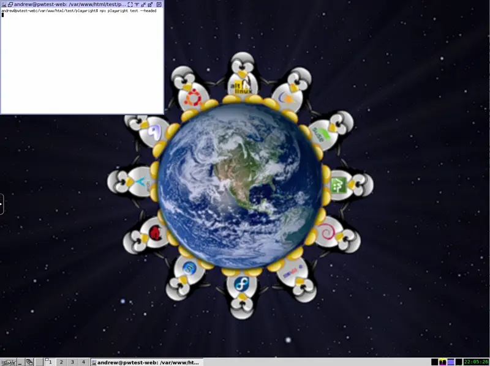

# Playwright testing packages

[](https://www.npmjs.com/package/@lullabot/playwright-drupal)
[](https://www.npmjs.com/package/@lullabot/playwright-drupal)
[](https://github.com/Lullabot/playwright-drupal/actions/workflows/test.yml)
[](https://github.com/Lullabot/playwright-drupal/blob/main/LICENSE)



This monorepo publishes two packages:

- [`@lullabot/playwright-drupal`](https://www.npmjs.com/package/@lullabot/playwright-drupal)
  integrates Playwright with Drupal and DDEV. It creates isolated SQLite sites,
  runs Drush commands against the current test site, captures PHP and browser
  errors, and applies Drupal defaults to the shared screenshot and
  accessibility helpers.
- [`@lullabot/playwright-testing`](https://www.npmjs.com/package/@lullabot/playwright-testing)
  contains framework-neutral accessibility, screenshot stabilization, visual
  comparison, and GitHub reporting utilities.

Existing Drupal imports remain supported. The Drupal package depends on and
re-exports the generic APIs, while its wrappers apply Drupal-specific axe
exclusions, toolbar settling, image recovery, and legacy screenshot thresholds.
Non-Drupal projects should install `@lullabot/playwright-testing` directly.

```console
# Drupal and DDEV integration, including the compatibility API
npm install --save-dev @lullabot/playwright-drupal

# Framework-neutral utilities
npm install --save-dev @lullabot/playwright-testing @playwright/test
```

For Drupal setup, database fixtures, and DDEV workflows, visit the
[playwright-drupal documentation](https://lullabot.github.io/playwright-drupal/latest/).
The generic package has canonical guides for
[accessibility testing](https://github.com/Lullabot/playwright-drupal/blob/main/packages/playwright-testing/docs/accessibility.md),
[screenshots and visual comparisons](https://github.com/Lullabot/playwright-drupal/blob/main/packages/playwright-testing/docs/screenshots-and-visual-comparisons.md),
and [GitHub reporting](https://github.com/Lullabot/playwright-drupal/blob/main/packages/playwright-testing/docs/github-reporting.md).

## Development

Run these commands from the repository root for both packages:

```console
npm ci
npm run lint
npm run format:check
```

Use `npm run lint:fix` to apply automatic lint fixes and `npm run format` to
format JavaScript and TypeScript. ESLint uses the upstream recommended configs,
and Prettier uses its default formatting, including semicolons and double quotes.
CI checks both. Build output and bundled agent tooling are excluded.
The lint config allows existing `any` types and fields omitted with rest
destructuring; other recommended rules retain their defaults.
