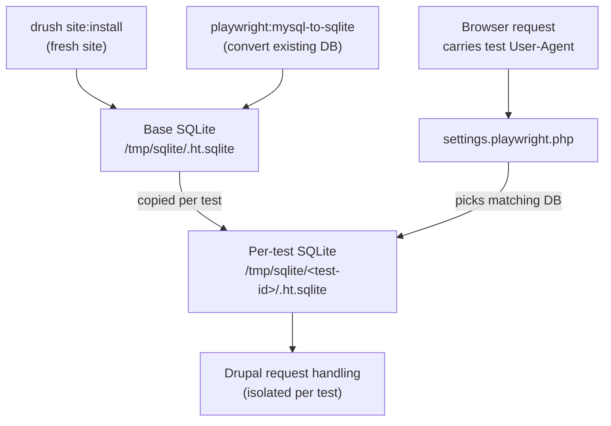

# About playwright-drupal

playwright-drupal includes an extended version of Playwright's `test` function that sets up and tears down isolated Drupal sites. Each test gets its own copy of a base [SQLite database](https://sqlite.org/), whether that database was created by a fresh site install or [converted from an existing MySQL/MariaDB database](https://github.com/techouse/mysql-to-sqlite3).

Test requests from the web browser are directed to the right database though `settings.php` additions. The library [provides a settings file](https://github.com/Lullabot/playwright-drupal/blob/main/settings/settings.playwright.php) to include from your own Drupal settings file.

Drush commands also work within each test site instance, letting tests scaffold data or make changes to the specific Drupal instance being tested without going through the administration UI.

[Task](https://taskfile.dev) is used as a task runner to install Drupal and set up the tests. This allows developers to easily run individual components of the test setup and teardown without having to step through JavaScript, or reuse them in other non-testing scenarios. Projects don't have to use Task as their primary build tool - feel free to call your own existing scripts as needed.

## Requirements

1. The Drupal site must be using [DDEV](https://ddev.com/) for development environments.
2. The Drupal site is meant to be tested after a site install or database import, like how Drupal core tests work.
3. The Playwright tests must be using `npm` as their package manager, or creating an npm-like node_modules directory. It's unclear at this moment how we could integrate yarn packages into the separate directory Playwright requires for test libraries.
4. Playwright tests must be written in TypeScript.
5. The Drupal docroot can be any folder, as long as it is specified in the `web-root` field of your `composer.json`.
