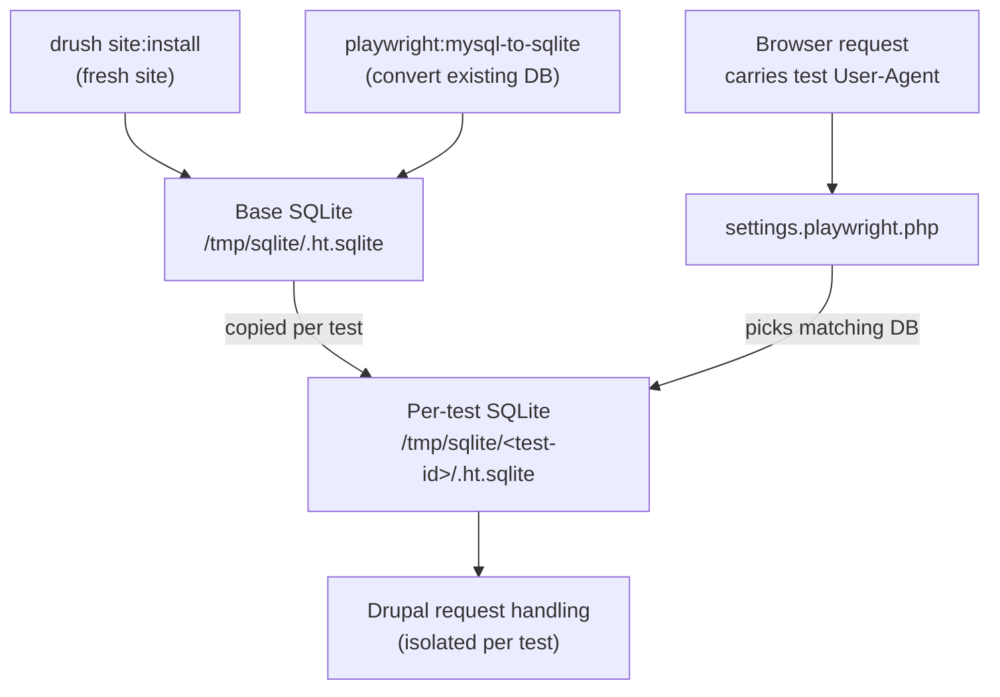

# About playwright-drupal

playwright-drupal includes an extended version of Playwright's `test` function that sets up and tears down isolated Drupal sites. Each test gets its own copy of a base [SQLite database](https://sqlite.org/), whether that database was created by a fresh site install or [converted from an existing MySQL/MariaDB database](https://github.com/techouse/mysql-to-sqlite3).

Test requests from the web browser are directed to the right database though `settings.php` additions. The library [provides a settings file](https://github.com/Lullabot/playwright-drupal/blob/main/settings/settings.playwright.php) to include from your own Drupal settings file.

Drush commands also work within each test site instance, letting tests scaffold data or make changes to the specific Drupal instance being tested without going through the administration UI.

[Task](https://taskfile.dev) is used as a task runner to install Drupal and set up the tests. This allows developers to easily run individual components of the test setup and teardown without having to step through JavaScript, or reuse them in other non-testing scenarios. Projects don't have to use Task as their primary build tool - feel free to call your own existing scripts as needed.

## Requirements

1. The Drupal site must be using [DDEV](https://ddev.com/) for development environments.
2. The Drupal site is meant to be tested after a site install or database import, like how Drupal core tests work.
3. The Playwright tests must be using `npm` as their package manager, or creating an npm-like node_modules directory. It's unclear at this moment how we could integrate yarn packages into the separate directory Playwright requires for test libraries.
4. Playwright tests must be written in TypeScript.
5. The Drupal docroot can be any folder, as long as it is specified in the `web-root` field of your `composer.json`.

## Continuous integration

playwright-drupal runs the same way in CI as it does locally: through DDEV. There is no separate "CI mode." Any CI provider that can run DDEV can run these tests, and that is the only configuration we support.

DDEV needs a Docker daemon it can talk to, which in most CI systems means either a Docker-in-Docker service or a runner/executor that exposes the host's Docker socket. DDEV publishes official setup guides and reusable configuration for the common providers:

- **GitHub Actions** — use the official [`ddev/github-action-setup-ddev`](https://github.com/ddev/github-action-setup-ddev) action, which starts your project's DDEV environment from its `.ddev` config.
- **GitLab CI** — see [Using DDEV in GitLab CI Tests](https://ddev.com/blog/ddev-in-gitlab-ci/) and the [`ddev/ddev-gitlab-ci`](https://github.com/ddev/ddev-gitlab-ci) image, which run DDEV on shared or self-hosted runners via Docker-in-Docker.
- **CircleCI** — run DDEV on CircleCI's [`machine` executor](https://circleci.com/docs/configuration-reference/#machine), which provides a full Docker host (the default `docker` executor cannot run DDEV). The DDEV community maintains a [worked example](https://github.com/orgs/ddev/discussions/3219) of this setup.

!!! warning "Acquia Code Studio"
    Acquia Code Studio is built on GitLab CI and *should* be able to run DDEV, but Acquia has placed additional restrictions on its runners that prevent the privileged Docker-in-Docker access DDEV needs. At the time of writing, DDEV (and therefore playwright-drupal) does not run in Code Studio. If you need CI for a Code Studio project, run the Playwright tests on a different provider from the list above.

### A note on non-DDEV environments

We only support running these tests through DDEV. We do not support, and will not troubleshoot, arbitrary non-DDEV CI environments — issues reporting that the tests "don't work outside of DDEV in my CI environment" will be closed as *won't fix*. This keeps the surface area small enough for our core team to maintain. If your CI can run DDEV, it can run these tests; if it can't, that is a DDEV compatibility question rather than a playwright-drupal one.
