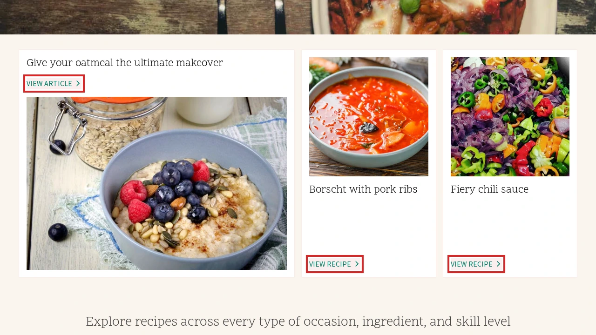
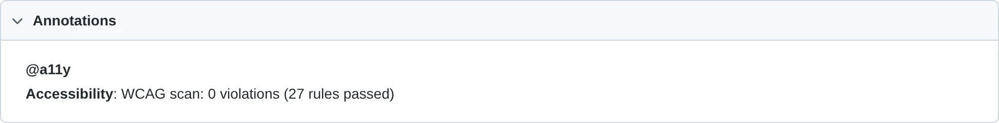
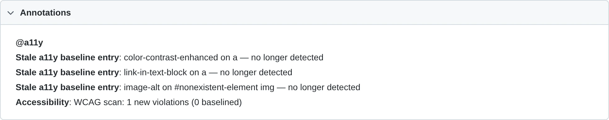
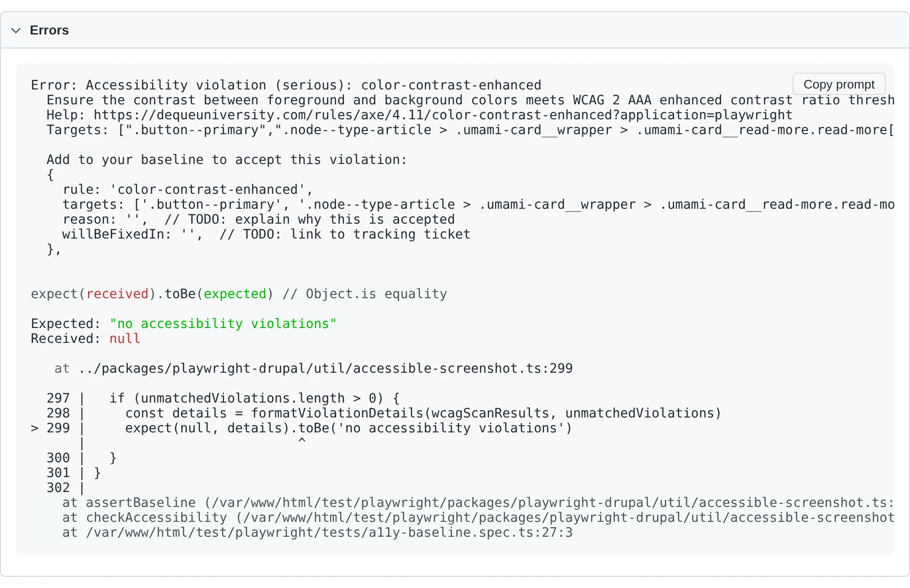
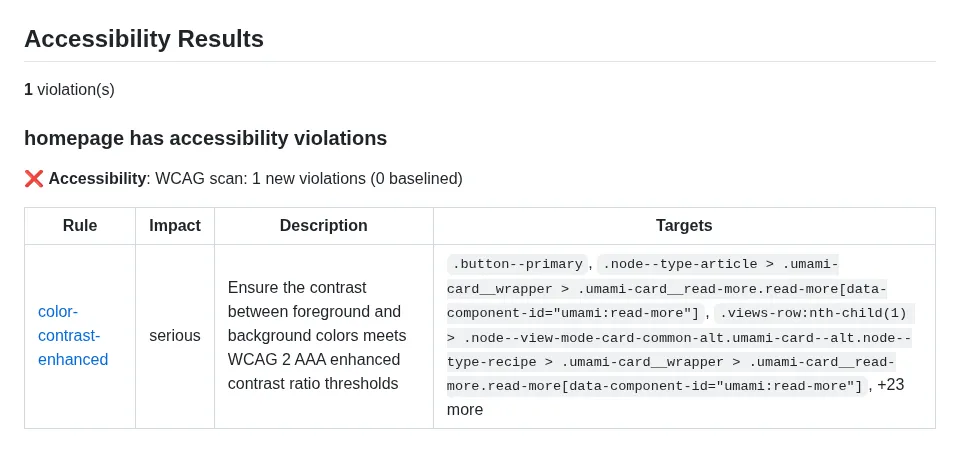

# Accessibility Tests

Two top-level helpers drive accessibility assertions: [`checkAccessibility()`](#checkaccessibility) runs axe-core scans against the current page; [`takeAccessibleScreenshot()`](#takeaccessiblescreenshot) takes a visual-diff screenshot first and then runs the same scans. Both attach axe results, a highlighted screenshot of violating elements, and annotations to the test report, and both dispatch to baseline mode by default. The [`a11y` fixture](#a11y-fixture) wraps them so tests can call `a11y.check()` / `a11y.screenshot()` without threading `testInfo` through.

```typescript
import { test, checkAccessibility, takeAccessibleScreenshot } from '@packages/playwright-drupal';

test('homepage has no a11y violations', async ({ page }, testInfo) => {
  await page.goto('/');
  await checkAccessibility(page, testInfo);
});

test('homepage screenshot + a11y', async ({ page }, testInfo) => {
  await page.goto('/');
  await takeAccessibleScreenshot(page, testInfo);
});

test('homepage via the fixture', async ({ page, a11y }) => {
  await page.goto('/');
  await a11y.check();
});
```

## Accessibility baselines

Each WCAG and best-practice scan is asserted against an on-disk JSON baseline file colocated with snapshots. The file uses an object schema with a human-readable note plus a `violations` array of accepted entries:

```json
{
  "note": "TODO: fill in reason and willBeFixedIn for each entry before committing.",
  "violations": [
    {
      "rule": "color-contrast",
      "targets": ["#footer .legal"],
      "reason": "TODO",
      "willBeFixedIn": "TODO"
    }
  ]
}
```

When you run a new test for the first time **locally**, the baseline file is auto-seeded next to where its snapshot would have been (e.g. `my-test-1.a11y-baseline.json` for WCAG, `my-test-1.a11y-baseline-best-practice.json` for best-practice). The first run passes; subsequent runs match against the file. Replace the `TODO` placeholders with a real reason and tracking ticket before committing.

When a test runs on **CI** (`process.env.CI` set) and would auto-seed a baseline file, the file is written and attached to the test report, but the test **fails** with a directive to download/commit it. This mirrors Playwright's default behaviour for missing visual snapshots and prevents new accessibility violations from silently slipping through CI.

Tests that pass `baseline:` to [`checkAccessibility()`](#checkaccessibility) (or [`a11y.check()`](#a11y-fixture)) using [`defineAccessibilityBaseline()`](#defineaccessibilitybaseline) take precedence over the on-disk JSON file — use this when you need to share a baseline across multiple tests or compute it from test data.

!!! warning "Snapshot mode (deprecated)"
    Earlier versions of this package pinned violations via Playwright's `toMatchSnapshot()` against a `.txt` snapshot in the test's `-snapshots/` directory. Tests with a committed `.txt` snapshot continue to assert against it for backwards compatibility, but snapshot mode is deprecated — new tests should use baselines, and existing tests should migrate. To migrate a test, delete its `.txt` snapshot and let the next local run seed a `.a11y-baseline.json` in its place.

## Test report integration

Accessibility results surface in the Playwright HTML report through tags, annotations, and attachments:

- **`@a11y` tag** — every test that runs an accessibility check is tagged so runs can be filtered to just a11y tests.
- **Scan summary annotations** — each scan adds an `Accessibility` annotation summarising counts (e.g. `WCAG scan: 0 new violations (2 baselined)`).
- **Baselined violation annotations** — each suppressed violation appears as a `Baselined a11y violation` annotation with its `reason` and `willBeFixedIn` link, so reviewers can see what is being waived and where the fix is tracked.
- **Stale baseline annotations** — baseline entries that no longer match any detected violation appear as `Stale a11y baseline entry` annotations so they can be cleaned up.
- **Scan result attachments** — full axe-core JSON is attached as `a11y-best-practice-scan-results` and `a11y-wcag-scan-results` for detailed inspection.
- **Violation screenshot** — when WCAG violations are detected, a full-page screenshot is attached with every violating element outlined in red. Disable via `screenshotViolations: false` in [AccessibilityOptions](#accessibilityoptions).



A passing test shows the `@a11y` tag and a scan summary:



When a baseline is in use, the report also lists baselined violations and any stale entries:



Unmatched violations fail the test with a detailed error — rule, impact, help URL, affected targets, and a copy-pasteable baseline entry you can drop straight into `.a11y-baseline.json`:



## Accessibility functions

### checkAccessibility()

`checkAccessibility(page: Page, testInfo: TestInfo, options?: AccessibilityOptions): Promise<void>`

| Parameter | Default | Description |
|---|---|---|
| `page` | *(required)* | The Playwright page object. |
| `testInfo` | *(required)* | The Playwright `TestInfo` for the current test — required for baseline-file derivation, attachments, and annotations. |
| `options` | `{}` | See [AccessibilityOptions](#accessibilityoptions). |

Runs a best-practice axe scan (unless `bestPracticeMode` is `'off'`) followed by a WCAG scan. Attaches JSON results for each scan, a highlighted screenshot of any WCAG violations, and an `@a11y` annotation to the test. Each scan dispatches independently to the right assertion mode: explicit in-code `baseline` → baseline mode; committed `.txt` snapshot on disk → snapshot mode; otherwise on-disk `.a11y-baseline.json` (seeded on first run).

### takeAccessibleScreenshot()

`takeAccessibleScreenshot(page: Page, testInfo: TestInfo, options?: ScreenshotOptions, scrollLocator?: Locator, locator?: Locator | Page): Promise<void>`

| Parameter | Default | Description |
|---|---|---|
| `page` | *(required)* | The Playwright page object. |
| `testInfo` | *(required)* | The Playwright `TestInfo` for the current test. |
| `options` | `{}` | Playwright screenshot options plus an `accessibility` field — see [ScreenshotOptions](#screenshotoptions). |
| `scrollLocator` | `undefined` | Optional locator to scroll into view before the screenshot. |
| `locator` | `page` | Optional element to screenshot. Axe still scans the whole page. |

Waits for all images and iframes to load, applies project-specific thresholds for Firefox/Safari's non-deterministic image rendering, then calls Playwright's `toHaveScreenshot()` (soft) and finally invokes [`checkAccessibility`](#checkaccessibility) with `options.accessibility`. The timeout is clamped to at least 10 seconds so slow admin forms have time to stabilise.

### a11y fixture

The `a11y` fixture exposes the two helpers above via the test context so you don't have to pass `testInfo` explicitly.

`a11y.check(options?: AccessibilityOptions): Promise<void>`

Shorthand for [`checkAccessibility(page, testInfo, options)`](#checkaccessibility).

`a11y.screenshot(options?: ScreenshotOptions, scrollLocator?: Locator, locator?: Locator | Page): Promise<void>`

Shorthand for [`takeAccessibleScreenshot(page, testInfo, options, scrollLocator, locator)`](#takeaccessiblescreenshot).

```typescript
import { test } from '@packages/playwright-drupal';

test('uses the a11y fixture', async ({ page, a11y }) => {
  await page.goto('/about');
  await a11y.screenshot({ fullPage: true });
});
```

### AccessibilityOptions

| Field | Default | Description |
|---|---|---|
| `wcagTags` | `['wcag2a', 'wcag2aa', 'wcag21a', 'wcag21aa']` | Axe tags for the WCAG scan. |
| `exclude` | `[]` | Additional CSS selectors to exclude from both scans. |
| `bestPracticeMode` | `'soft'` | `'soft'` uses `expect.soft()` so the WCAG scan still runs on failure; `'hard'` is preserved as a marker but does not change soft/hard today; `'off'` skips the best-practice scan entirely. |
| `rules` | `undefined` | Axe rule overrides, e.g. `{ 'color-contrast': { enabled: false } }`. |
| `baseline` | `undefined` | In-code baseline allowlist. When set, matching violations are suppressed and the on-disk JSON file is bypassed. Pair with [`defineAccessibilityBaseline()`](#defineaccessibilitybaseline). |
| `disableDefaultExclusions` | `false` | When `true`, removes the hard-coded Drupal exclusions (skip-link and duplicate landmarks on the best-practice scan; the `[data-drupal-media-preview="ready"]` element on the WCAG scan). |
| `screenshotViolations` | `true` | When `true`, attaches a full-page screenshot with violating elements outlined in red. |

### ScreenshotOptions

A superset of Playwright's [`toHaveScreenshot()` options](https://playwright.dev/docs/api/class-pageassertions#page-assertions-to-have-screenshot-1) (`animations`, `caret`, `fullPage`, `mask`, `maskColor`, `maxDiffPixelRatio`, `maxDiffPixels`, `omitBackground`, `scale`, `threshold`, `timeout`) plus:

| Field | Default | Description |
|---|---|---|
| `accessibility` | `undefined` | [AccessibilityOptions](#accessibilityoptions) passed through to [`checkAccessibility`](#checkaccessibility). |

## In-code baselines

Use [`defineAccessibilityBaseline()`](#defineaccessibilitybaseline) when a baseline needs to be shared across multiple tests or computed from test data. An in-code baseline takes precedence over the on-disk `.a11y-baseline.json` file.

```typescript
import { test, defineAccessibilityBaseline } from '@packages/playwright-drupal';

const sharedBaseline = defineAccessibilityBaseline([
  {
    rule: 'color-contrast',
    targets: ['#footer .legal'],
    reason: 'Brand-mandated gray; waiting on design refresh.',
    willBeFixedIn: 'https://example.com/issues/123',
  },
]);

test('about page', async ({ page, a11y }) => {
  await page.goto('/about');
  await a11y.check({ baseline: sharedBaseline });
});
```

### defineAccessibilityBaseline()

`defineAccessibilityBaseline(entries: AccessibilityBaseline): AccessibilityBaseline`

| Parameter | Default | Description |
|---|---|---|
| `entries` | *(required)* | Array of [AccessibilityBaselineEntry](#accessibilitybaselineentry) — accepted violations. |

Pass-through identity function that exists for type inference. Returns the input unchanged; its only purpose is to make TypeScript infer the array as `AccessibilityBaseline` so mis-typed entries are caught at compile time.

### AccessibilityBaselineEntry

| Field | Description |
|---|---|
| `rule` | Axe rule ID (e.g. `'color-contrast'`). |
| `targets` | CSS selectors for the elements with this violation. A violation is matched when its rule is identical and at least one normalised target selector overlaps. |
| `reason` | Why this violation is accepted. |
| `willBeFixedIn` | Link to a tracking ticket. |

**Type alias:** `AccessibilityBaseline = AccessibilityBaselineEntry[]`

### Sharing a baseline with visual diffs

The [visual-diff config](visual-comparisons.md) passed to `defineVisualDiffConfig()` accepts an `a11yBaseline` so every generated test inherits the same in-code baseline without having to thread it through each test case:

```typescript
import { defineVisualDiffConfig } from '@packages/playwright-drupal';
import { baseline } from '~/a11y-baseline';

export const config = defineVisualDiffConfig({
  name: 'Umami Visual Diffs',
  a11yBaseline: baseline,
  groups: [
    {
      name: 'Landing Pages',
      testCases: [
        { name: 'Home Page', path: '/' },
      ],
    },
  ],
});
```

## GitHub Accessibility Annotations

When running accessibility tests in CI, you can surface violations directly in GitHub workflow summaries and inline file annotations using the included composite action or CLI tool.



### Prerequisites

The JSON reporter must be enabled for the annotation tools to parse test results. This is included automatically when using `definePlaywrightDrupalConfig()` — no extra configuration needed.

### Using the Reusable Action (Recommended)

Add the following to your GitHub Actions workflow:

```yaml
- name: Run Playwright tests
  run: ddev exec npx playwright test

- name: Accessibility annotations
  if: always()
  uses: Lullabot/playwright-drupal/.github/actions/a11y-annotations@main
```

The `if: always()` ensures the annotations step runs even when the test step fails, so violations appear in the job summary regardless of overall job status.

This step will:
1. Write an accessibility summary to the workflow job summary
2. Create inline `::error` / `::warning` annotations on test files

#### Action Inputs

| Input | Default | Description |
|-------|---------|-------------|
| `report-path` | `test-results/results.json` | Path to the Playwright JSON report |
| `mode` | `all` | Output mode: `all`, `summary`, or `annotations` |

### Using the CLI Directly

For more control, use the `playwright-drupal-a11y-summary` CLI:

```yaml
- name: Accessibility summary
  if: always()
  run: ddev exec npx playwright-drupal-a11y-summary --mode=summary

- name: Accessibility annotations
  if: always()
  run: ddev exec npx playwright-drupal-a11y-summary --mode=annotations
```

#### CLI Options

| Option | Default | Description |
|--------|---------|-------------|
| `--mode=<mode>` | `summary` | Output mode: `summary` or `annotations` |
| `--report-path=<path>` | `test-results/results.json` | Path to the Playwright JSON report |
