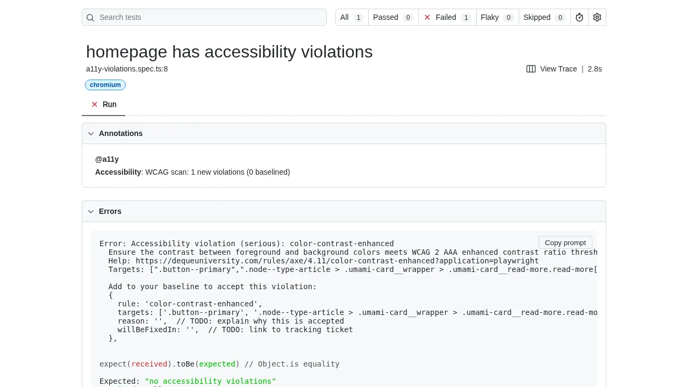
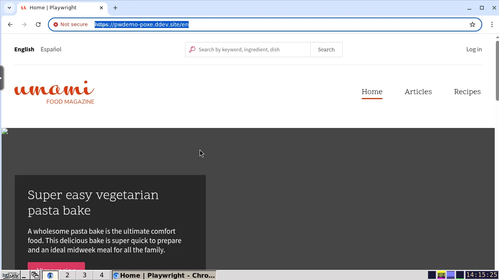

# Debugging Tests

## Capturing Traces

Traces record every step, network request, DOM snapshot, and console message from a test run, and are the best place to start when a test fails unexpectedly. To always record a trace, run tests with:

```console
ddev playwright test --trace on
```

When tests finish, the HTML report server starts inside the web container. The `ddev-playwright` addon exposes it at:

```
https://<PROJECT>.ddev.site:9324
```

Open a failing test in the report and click the trace to step through it frame-by-frame. If the report server isn't already running, start it with:

```console
ddev playwright show-report --host=0.0.0.0
```

The `--host=0.0.0.0` flag is required so the server binds to all interfaces inside the container, not just localhost.



## Running Tests in a Browser With KasmVNC

The [`ddev-playwright`](https://github.com/Lullabot/ddev-playwright/) addon ships with [KasmVNC](https://www.kasmweb.com/kasmvnc), a remote desktop accessible from your browser. This lets you see the browser Playwright is driving in a consistent environment, which is invaluable when a test behaves differently headed versus headless or when generating code with `codegen`.

Connect at:

```
https://<PROJECT>.ddev.site:8444
```

Log in with your local username and the password `secret`.



Once connected, run tests with a visible browser:

```console
# Run tests in headed mode (browser window appears in KasmVNC).
ddev playwright test --headed

# Or launch Playwright's interactive UI mode for picking and re-running tests.
ddev playwright test --ui
```

See Playwright's [Running and debugging tests](https://playwright.dev/docs/running-tests) guide for the full list of options.

## Fixing Test Flakes

Flaky tests are tests that pass most of the time but fail intermittently. To reproduce a flake, run the test many times in a row:

```console
ddev playwright test tests/my-flaky.spec.ts --repeat-each 20 --max-failures 1
```

`--repeat-each` runs each matched test the given number of times. `--max-failures 1` stops the run as soon as one iteration fails, so you don't have to wait for the remaining repetitions to finish before inspecting the failure and its trace.

Once you believe you've fixed the flake, run the same command again with a higher `--repeat-each` (and without `--max-failures`) to confirm the test is stable across many runs.

## Verbose CLI Output

By default, output from CLI commands (like drush or task) and browser web errors is captured and attached to each test result as text files. This keeps the terminal clean when running tests in parallel, since output from different workers would otherwise be interleaved.

To print CLI output inline instead, set in your DDEV shell:

```bash
export PLAYWRIGHT_DRUPAL_VERBOSE=1
```

This is useful when debugging a single test or running with `--workers=1`, where interleaved output is not a concern. The attached output files are available in the HTML test report regardless of this setting.

## Running Tests Without Isolation

There are times you may want to run Playwright without isolating test runs. Perhaps you're manually scaffolding test content by hand, before writing code to create it. Or perhaps you would like to be absolutely sure that a test passes or fails when running against mariadb.

To do this, set in your DDEV shell:

```bash
export PLAYWRIGHT_NO_TEST_ISOLATION=1
```

Consider running Playwright with `--workers=1` and with a single browser, since any changes to the database will persist.
